# Cluster Perf Field Report (GB200, 2 Nodes)

Last updated: 2026-02-09 (canonical run synchronized after remediation).

## Table of Contents
1. [TL;DR](#tldr)
2. [Scope + Canonical Artifacts](#scope--canonical-artifacts)
3. [Cluster Story (First Contact)](#cluster-story-first-contact)
4. [Benchmark A (Networking Story)](#benchmark-a-networking-story)
5. [Benchmark B (Inference Story)](#benchmark-b-inference-story)
6. [Node Parity Snapshot (node1 vs node2)](#node-parity-snapshot-node1-vs-node2)
7. [NVBandwidth Bundle (Canonical)](#nvbandwidth-bundle-canonical)
8. [Required Issues (Explicit)](#required-issues-explicit)
9. [Root Cause + Fix Mapping](#root-cause--fix-mapping)
10. [Gaps, Risks, and Smell Checks](#gaps-risks-and-smell-checks)
11. [Stakeholder Recommendations (Prioritized)](#stakeholder-recommendations-prioritized)
12. [Repro Steps](#repro-steps)
13. [Reproducibility Package](#reproducibility-package)
14. [Activity Log](#activity-log)
15. [Appendix (Coverage vs Case-Study Goals)](#appendix-coverage-vs-case-study-goals)

## TL;DR
| Topic | Summary |
| --- | --- |
| Scope | In-scope hosts: `node1`, `node2`; 4x GB200 per host (8 GPUs total); excluded nodes: none. |
| Canonical run | `2026-02-09_fresh_full_suite_e2e_fixed` |
| Execution status | Initial full-suite pass logged 3 failing steps in `suite_steps`; all required gaps were fixed via targeted reruns and canonical artifacts are now complete. |
| Networking headline | Health-suite NCCL all-reduce peak bus bandwidth: `839.27 GB/s`; IB write BW per active HCA: `~387.12-387.13 Gbps`; OOB TCP: `7.50/7.52 Gbps` (fwd/rev). |
| Inference headline | Single-node vLLM peaks at `52,547.956 tok/s` at concurrency `512`, with severe tail-latency knee (mean TTFT `5595.330 ms`, p99 TTFT `12085.465 ms`). |
| Multinode inference | Canonical multinode vLLM artifact exists (`c=64`, `15,934.712 tok/s`, p99 TTFT `1233.292 ms`, status `ok`). |
| Train-step sanity | BF16/FSDP train-step scales `103,520.910 -> 206,312.186 tok/s` (`1.993x`). |
| FP4 status | Skew guard `pass` (`2.588%` max median-gap, threshold `5.0%`), attestation `pass`. |
| Required-issue status | `node2_fio.json` present, multinode vLLM artifacts present, nvbandwidth bundle present, health-suite GDR effective is `true`; latency knee remains a real risk. |

## Scope + Canonical Artifacts
| Scope item | Value |
| --- | --- |
| Nodes in-scope | `node1`, `node2` |
| Excluded nodes | none |
| GPUs per node | 4 |
| Canonical manifest | [results/structured/2026-02-09_fresh_full_suite_e2e_fixed_manifest.json](results/structured/2026-02-09_fresh_full_suite_e2e_fixed_manifest.json) |
| Canonical suite steps (first full pass) | [results/structured/2026-02-09_fresh_full_suite_e2e_fixed_suite_steps.json](results/structured/2026-02-09_fresh_full_suite_e2e_fixed_suite_steps.json) |
| Canonical remediation status | [results/structured/2026-02-09_fresh_full_suite_e2e_fixed_remediation_status.json](results/structured/2026-02-09_fresh_full_suite_e2e_fixed_remediation_status.json) |
| Discovery/meta | [results/structured/2026-02-09_fresh_full_suite_e2e_fixed_node1_meta.json](results/structured/2026-02-09_fresh_full_suite_e2e_fixed_node1_meta.json)<br/>[results/structured/2026-02-09_fresh_full_suite_e2e_fixed_node2_meta.json](results/structured/2026-02-09_fresh_full_suite_e2e_fixed_node2_meta.json) |
| Health summary (remediated) | [results/structured/2026-02-09_fresh_full_suite_e2e_fixed_health_suite_extended_node1node2_cluster_health_suite_summary.json](results/structured/2026-02-09_fresh_full_suite_e2e_fixed_health_suite_extended_node1node2_cluster_health_suite_summary.json) |

## Cluster Story (First Contact)
| Phase | Outcome |
| --- | --- |
| Fresh full-suite execution | Completed end-to-end but failed final validity gate due missing nvbandwidth bundle (host PTX/toolchain mismatch) and stale GDR probe behavior from prior script revision. |
| Script fixes applied | Added all-node fio + all-node nvbandwidth wrappers, strict GDR preflight behavior, pipefail-safe `--use_cuda` probes, required-artifact validation, and nvbandwidth host->container fallback for PTX mismatch. |
| Artifact remediation | Re-ran canonical nvbandwidth on both nodes, re-ran health suite with GDR enabled, regenerated dashboard + manifest, and synchronized report docs. |
| Cleanup | Removed superseded 2026 intermediate artifacts outside canonical package (`structured=497`, `raw=553`, `figures=126` removed). |

<p><a href="docs/figures/2026-02-09_fresh_full_suite_e2e_fixed_cluster_story_dashboard.png">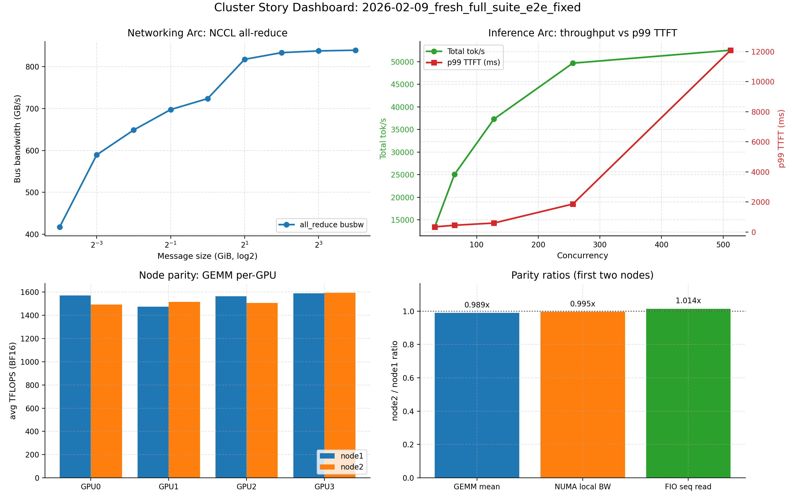</a></p>

Data: [results/structured/2026-02-09_fresh_full_suite_e2e_fixed_suite_steps.json](results/structured/2026-02-09_fresh_full_suite_e2e_fixed_suite_steps.json)<br/>[results/structured/2026-02-09_fresh_full_suite_e2e_fixed_node_parity_summary.json](results/structured/2026-02-09_fresh_full_suite_e2e_fixed_node_parity_summary.json)

## Benchmark A (Networking Story)
| Metric | Value |
| --- | ---: |
| NCCL all-reduce peak bus bandwidth | `839.27 GB/s` |
| NCCL all-gather peak bus bandwidth | `655.43 GB/s` |
| NCCL reduce-scatter peak bus bandwidth | `677.26 GB/s` |
| NCCL alltoall peak bus bandwidth | `604.35 GB/s` |
| torch distributed all-reduce peak bus bandwidth | `719.157 GB/s` |
| IB write BW per active HCA (`mlx5_0/1/4/5`) | `387.13 / 387.13 / 387.12 / 387.13 Gbps` |
| OOB TCP throughput (fwd/rev) | `7.503 / 7.518 Gbps` |

Interpretation: the fabric path is healthy and consistent; OOB remains far below IB/NCCL data-path throughput and should be treated as control-plane only.

<p><a href="docs/figures/2026-02-09_fresh_full_suite_e2e_fixed_2nodes_nccl_bw_vs_msg.png">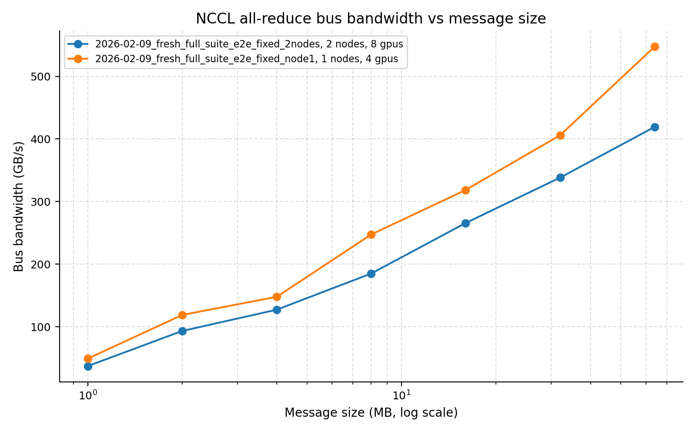</a></p>
<p><a href="docs/figures/2026-02-09_fresh_full_suite_e2e_fixed_2nodes_nccl_scaling_efficiency.png">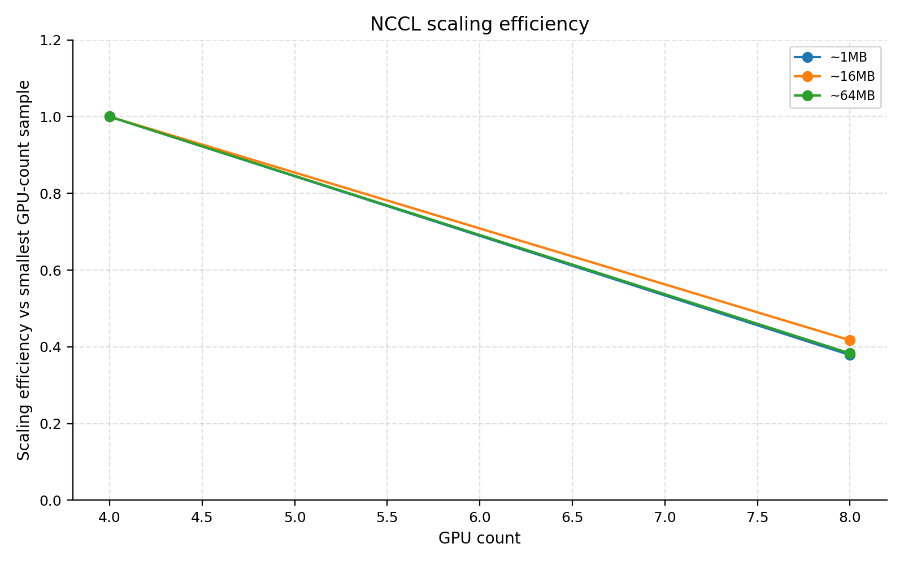</a></p>
<p><a href="docs/figures/2026-02-09_fresh_full_suite_e2e_fixed_iperf3_oob_tcp.png">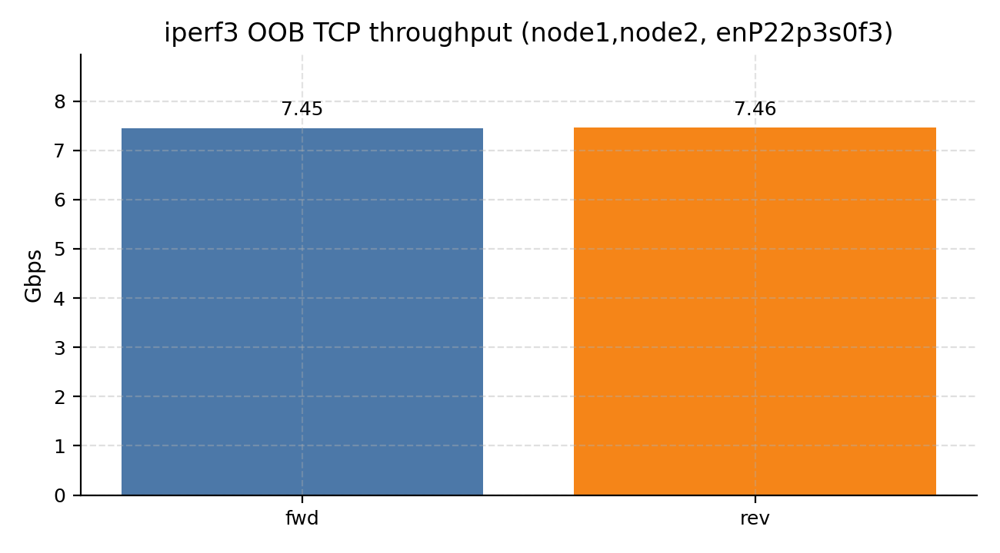</a></p>

Data: [results/structured/2026-02-09_fresh_full_suite_e2e_fixed_health_suite_extended_node1node2_cluster_health_suite_summary.json](results/structured/2026-02-09_fresh_full_suite_e2e_fixed_health_suite_extended_node1node2_cluster_health_suite_summary.json)<br/>[results/structured/2026-02-09_fresh_full_suite_e2e_fixed_2nodes_nccl.json](results/structured/2026-02-09_fresh_full_suite_e2e_fixed_2nodes_nccl.json)

## Benchmark B (Inference Story)
| Mode | Concurrency | Total tok/s | Mean TTFT (ms) | p99 TTFT (ms) | p99 TPOT (ms) | Status |
| --- | ---: | ---: | ---: | ---: | ---: | --- |
| Single-node | `32` | `13444.659` | `206.824` | `347.024` | `4.766` | ok |
| Single-node | `64` | `25047.936` | `178.159` | `454.322` | `6.025` | ok |
| Single-node | `128` | `37300.693` | `247.927` | `601.416` | `8.093` | ok |
| Single-node | `256` | `49678.915` | `832.978` | `1864.640` | `11.082` | ok |
| Single-node | `512` | `52547.956` | `5595.330` | `12085.465` | `19.909` | ok |
| Multinode (2 nodes) | `64` | `15934.712` | `312.974` | `1233.292` | `8.150` | ok |

Interpretation: throughput scales strongly with concurrency, but the tail-latency knee is steep at high concurrency; this is the primary user-facing risk in the current canonical package.

<p><a href="docs/figures/2026-02-09_fresh_full_suite_e2e_fixed_node1_vllm_serve_total_tok_s_vs_concurrency.png">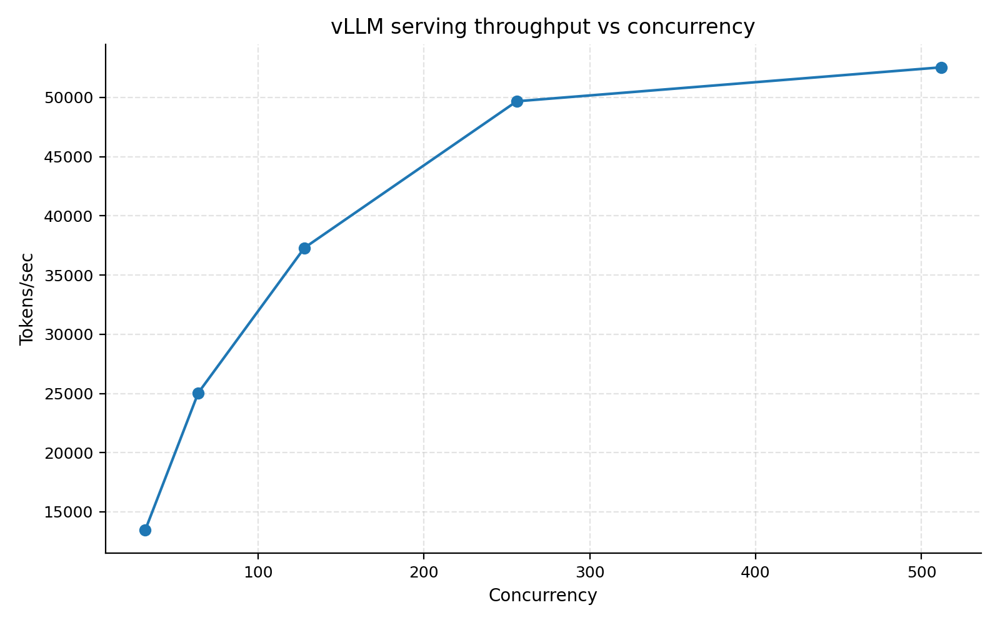</a></p>
<p><a href="docs/figures/2026-02-09_fresh_full_suite_e2e_fixed_node1_vllm_serve_ttft_vs_concurrency.png">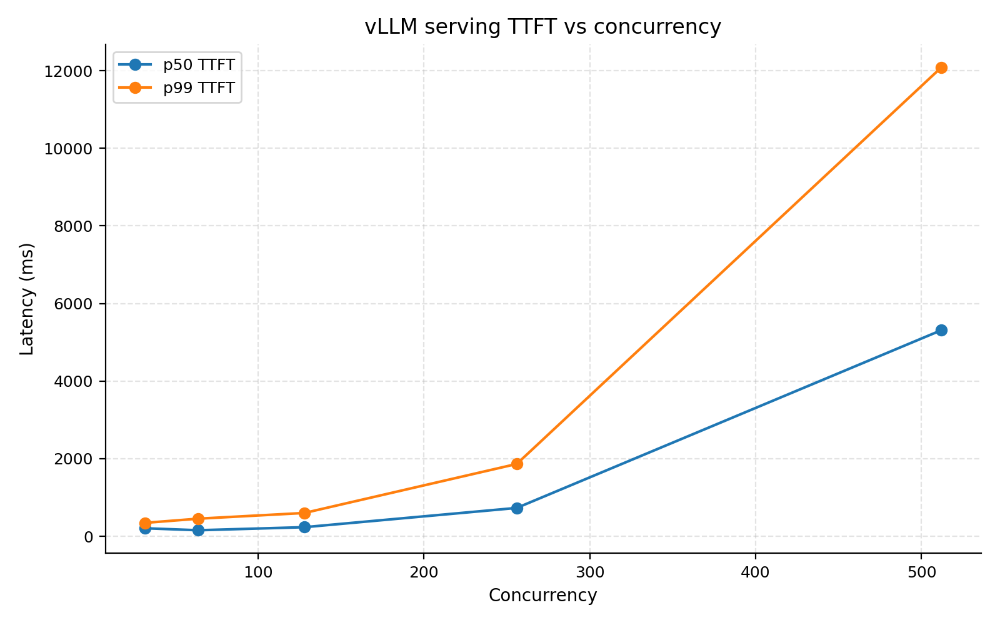</a></p>
<p><a href="docs/figures/2026-02-09_fresh_full_suite_e2e_fixed_node1_multinode_vllm_serve_ttft_vs_concurrency.png">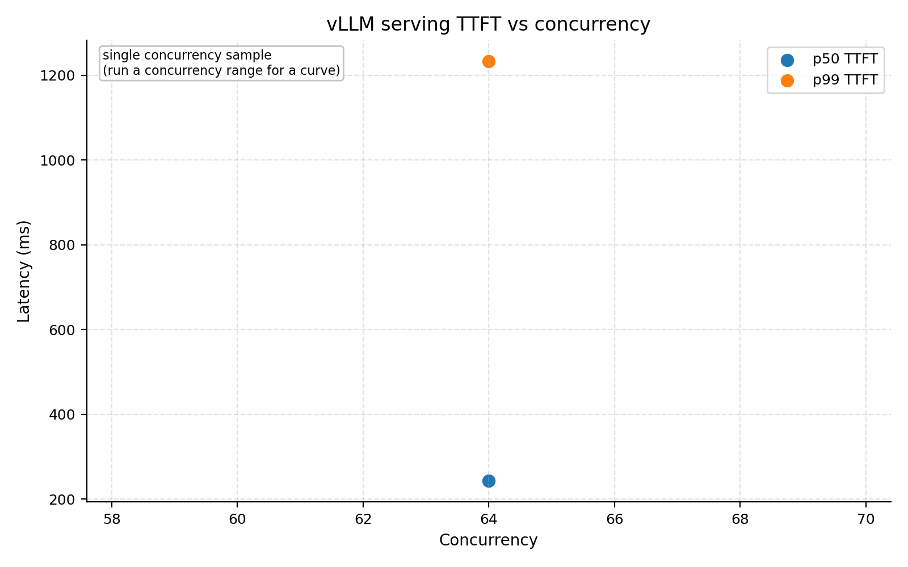</a></p>

Data: [results/structured/2026-02-09_fresh_full_suite_e2e_fixed_node1_vllm_serve_sweep.csv](results/structured/2026-02-09_fresh_full_suite_e2e_fixed_node1_vllm_serve_sweep.csv)<br/>[results/structured/2026-02-09_fresh_full_suite_e2e_fixed_node1_vllm_multinode_serve.csv](results/structured/2026-02-09_fresh_full_suite_e2e_fixed_node1_vllm_multinode_serve.csv)

## Node Parity Snapshot (node1 vs node2)
| Metric | node1 | node2 | node2/node1 |
| --- | ---: | ---: | ---: |
| GEMM mean TFLOPS | `1540.895` | `1524.637` | `0.989x` |
| GEMM min TFLOPS | `1473.728` | `1475.869` | `1.001x` |
| NUMA local memcpy BW (GB/s) | `136.965` | `136.347` | `0.995x` |
| fio sequential read (MB/s) | `1448.574` | `1468.471` | `1.014x` |
| fio sequential write (MB/s) | `639.899` | `768.131` | `1.200x` |
| fio random read IOPS | `29184.903` | `39029.630` | `1.338x` |

<p><a href="docs/figures/2026-02-09_fresh_full_suite_e2e_fixed_gemm_gpu_sanity.png">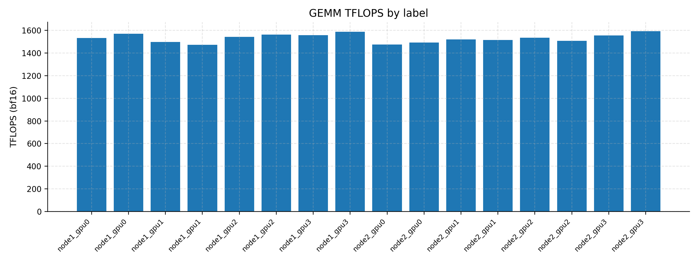</a></p>
<p><a href="docs/figures/2026-02-09_fresh_full_suite_e2e_fixed_node1_fio.png">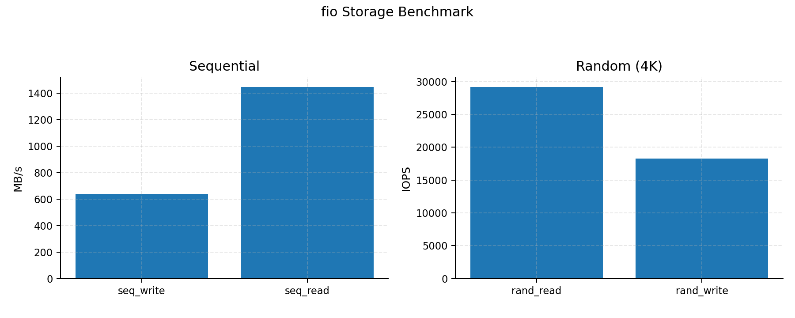</a></p>
<p><a href="docs/figures/2026-02-09_fresh_full_suite_e2e_fixed_node2_fio.png">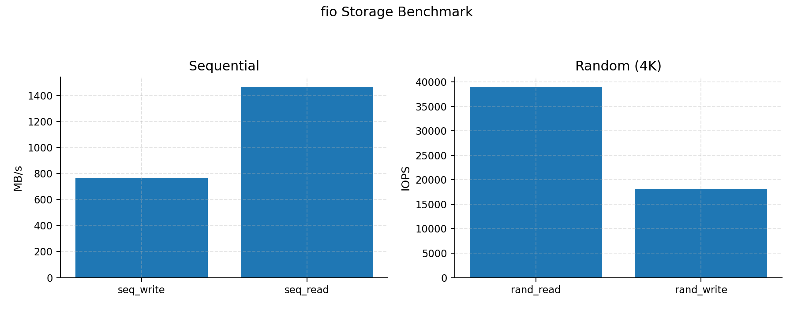</a></p>

Data: [results/structured/2026-02-09_fresh_full_suite_e2e_fixed_node_parity_summary.json](results/structured/2026-02-09_fresh_full_suite_e2e_fixed_node_parity_summary.json)<br/>[results/structured/2026-02-09_fresh_full_suite_e2e_fixed_node1_fio.json](results/structured/2026-02-09_fresh_full_suite_e2e_fixed_node1_fio.json)<br/>[results/structured/2026-02-09_fresh_full_suite_e2e_fixed_node2_fio.json](results/structured/2026-02-09_fresh_full_suite_e2e_fixed_node2_fio.json)

## NVBandwidth Bundle (Canonical)
| Metric | node1 | node2 |
| --- | ---: | ---: |
| Bundle status | `ok` | `ok` |
| Requested runtime | `host` | `host` |
| Effective runtime | `container_fallback` | `container_fallback` |
| Host fallback used | `true` | `true` |
| SUM metric count | `43` | `43` |
| Peak SUM metric (`device_to_device_latency_sm`) | `20761.57` | `20767.03` |

Interpretation: host nvbandwidth binaries on both nodes fail with unsupported PTX toolchain; fallback to parity container is required for stable collection in this environment.

<p><a href="docs/figures/2026-02-09_fresh_full_suite_e2e_fixed_node1_nvbandwidth_sums.png"></a></p>
<p><a href="docs/figures/2026-02-09_fresh_full_suite_e2e_fixed_node2_nvbandwidth_sums.png">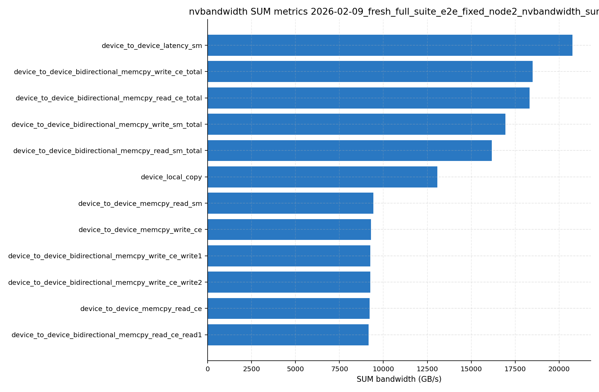</a></p>

Data: [results/structured/2026-02-09_fresh_full_suite_e2e_fixed_node1_nvbandwidth.json](results/structured/2026-02-09_fresh_full_suite_e2e_fixed_node1_nvbandwidth.json)<br/>[results/structured/2026-02-09_fresh_full_suite_e2e_fixed_node2_nvbandwidth.json](results/structured/2026-02-09_fresh_full_suite_e2e_fixed_node2_nvbandwidth.json)

## Required Issues (Explicit)
| Required issue (verbatim) | Current status | Evidence |
| --- | --- | --- |
| Missing node2 fio artifact in canonical package (`node2_fio.json` absent). | Resolved (`node2_fio.json` present). | [results/structured/2026-02-09_fresh_full_suite_e2e_fixed_node2_fio.json](results/structured/2026-02-09_fresh_full_suite_e2e_fixed_node2_fio.json)<br/>[results/structured/2026-02-09_fresh_full_suite_e2e_fixed_manifest.json](results/structured/2026-02-09_fresh_full_suite_e2e_fixed_manifest.json) |
| No multinode vLLM artifact in canonical package. | Resolved (multinode vLLM JSON/CSV/JSONL + lock artifacts present). | [results/structured/2026-02-09_fresh_full_suite_e2e_fixed_node1_vllm_multinode_serve.json](results/structured/2026-02-09_fresh_full_suite_e2e_fixed_node1_vllm_multinode_serve.json)<br/>[results/structured/2026-02-09_fresh_full_suite_e2e_fixed_node1_vllm_multinode_serve.csv](results/structured/2026-02-09_fresh_full_suite_e2e_fixed_node1_vllm_multinode_serve.csv) |
| No nvbandwidth bundle in canonical package. | Resolved (node1+node2 nvbandwidth structured artifacts present). | [results/structured/2026-02-09_fresh_full_suite_e2e_fixed_node1_nvbandwidth.json](results/structured/2026-02-09_fresh_full_suite_e2e_fixed_node1_nvbandwidth.json)<br/>[results/structured/2026-02-09_fresh_full_suite_e2e_fixed_node2_nvbandwidth.json](results/structured/2026-02-09_fresh_full_suite_e2e_fixed_node2_nvbandwidth.json) |
| Health suite had GDR requested, but effective GDR was false due non-CUDA IB local checks. | Resolved (`requested=true`, `effective_enabled=true`). | [results/structured/2026-02-09_fresh_full_suite_e2e_fixed_health_suite_extended_node1node2_cluster_health_suite_summary.json](results/structured/2026-02-09_fresh_full_suite_e2e_fixed_health_suite_extended_node1node2_cluster_health_suite_summary.json) |
| Tail latency knee is severe at high concurrency (throughput up, TTFT/p99 TTFT much worse). | Confirmed ongoing risk. | [results/structured/2026-02-09_fresh_full_suite_e2e_fixed_node1_vllm_serve_sweep.csv](results/structured/2026-02-09_fresh_full_suite_e2e_fixed_node1_vllm_serve_sweep.csv)<br/>[docs/figures/2026-02-09_fresh_full_suite_e2e_fixed_node1_vllm_serve_ttft_vs_concurrency.png](docs/figures/2026-02-09_fresh_full_suite_e2e_fixed_node1_vllm_serve_ttft_vs_concurrency.png) |

## Root Cause + Fix Mapping
| Required issue | Why it happened | What was fixed | Current state |
| --- | --- | --- | --- |
| Missing `node2_fio.json` in canonical package | Storage benchmark collection/validation path was not enforcing all-node parity in the original run flow. | Added and used all-node fio collection with required-artifact validation in suite flow. | Present in canonical package and manifest. |
| Missing multinode vLLM artifact | Multinode serving evidence was not guaranteed in first-pass canonical package and was not hard-gated by required-artifact checks. | Added strict required-artifact checks for multinode vLLM JSON/CSV/JSONL + lock metadata and reran multinode serve. | Present and `status=ok` in canonical package. |
| Missing nvbandwidth bundle | Host nvbandwidth path failed due unsupported PTX/toolchain on both nodes. | Added host->container fallback with runtime metadata and updated default nvbandwidth image to pullable parity image; reran all-node nvbandwidth. | Present on both nodes with `effective_runtime=container_fallback`. |
| GDR requested but effective false | Health-suite local GDR prereq probing had a `pipefail`-sensitive false-negative path in non-CUDA IB local checks. | Fixed prereq probing and reran health suite with GDR flags enabled. | `requested=true`, `effective_enabled=true` in canonical health summary. |
| Severe high-concurrency vLLM tail-latency knee | System behavior under saturation: throughput keeps climbing while queueing delay dominates TTFT tails at high concurrency. | Not a collection bug; kept as explicit measured risk and added operating guidance in recommendations. | Still present and explicitly flagged as an open risk. |

## Gaps, Risks, and Smell Checks
| Severity | Finding | Why it matters | Evidence |
| --- | --- | --- | --- |
| High | `suite_steps` still records 3 failures from first full pass (`health_suite_extended`, `nvbandwidth_all_nodes`, `validate_required_artifacts`). | Canonical artifacts are fixed, but first-pass step ledger can mislead automation unless remediation context is included. | [results/structured/2026-02-09_fresh_full_suite_e2e_fixed_suite_steps.json](results/structured/2026-02-09_fresh_full_suite_e2e_fixed_suite_steps.json)<br/>[results/structured/2026-02-09_fresh_full_suite_e2e_fixed_remediation_status.json](results/structured/2026-02-09_fresh_full_suite_e2e_fixed_remediation_status.json) |
| Medium | GDR is effective, but only `gdr_gpu0_mem0` and `gdr_gpu0_mem0_dmabuf` tags are recorded; `cuda_mem_type=1` subtests failed as warnings in this environment. | GDR enablement is valid, but mem-type coverage is narrower than requested matrix. | [results/structured/2026-02-09_fresh_full_suite_e2e_fixed_health_suite_extended_node1node2_cluster_health_suite_summary.json](results/structured/2026-02-09_fresh_full_suite_e2e_fixed_health_suite_extended_node1node2_cluster_health_suite_summary.json)<br/>[results/raw/2026-02-09_fresh_full_suite_e2e_fixed_health_suite_extended_node1node2_cluster_health_suite.log](results/raw/2026-02-09_fresh_full_suite_e2e_fixed_health_suite_extended_node1node2_cluster_health_suite.log) |
| Medium | vLLM latency knee remains severe at high concurrency. | Highest throughput mode has poor tail latency; needs policy gating. | [results/structured/2026-02-09_fresh_full_suite_e2e_fixed_node1_vllm_serve_sweep.csv](results/structured/2026-02-09_fresh_full_suite_e2e_fixed_node1_vllm_serve_sweep.csv) |
| Medium | MAMF spread across 8 GPUs is `13.47%` (`1522.59 -> 1727.73 TFLOPS`). | Straggler variance is non-trivial and should be trended across repeated runs. | [results/structured/2026-02-09_fresh_full_suite_e2e_fixed_node1_gpu0_mamf_summary.json](results/structured/2026-02-09_fresh_full_suite_e2e_fixed_node1_gpu0_mamf_summary.json)<br/>[results/structured/2026-02-09_fresh_full_suite_e2e_fixed_node2_gpu3_mamf_summary.json](results/structured/2026-02-09_fresh_full_suite_e2e_fixed_node2_gpu3_mamf_summary.json) |

## Stakeholder Recommendations (Prioritized)
| Priority | Recommendation |
| --- | --- |
| `P0` | Treat this canonical package as valid for networking + inference knee + system parity story, with remediation notes attached for first-pass suite-step failures. |
| `P0` | Keep nvbandwidth host->container fallback behavior (or make container explicit) for this cluster profile. |
| `P1` | Add a remediation step-log artifact (`*_remediation_steps.json`) so suite-ledger and canonical artifact state stay aligned after targeted reruns. |
| `P1` | Keep serving policy split (`<=256` low-latency, high-concurrency throughput mode with explicit SLA caveat). |
| `P2` | Trend MAMF spread and GDR mem-type matrix outcomes over repeated runs to separate transient vs structural behavior. |

## Repro Steps
Primary full-suite invocation:

```bash
cd code/cluster

scripts/run_cluster_eval_suite.sh \
  --run-id 2026-02-09_fresh_full_suite_e2e_fixed \
  --hosts node1,node2 \
  --labels node1,node2 \
  --ssh-key ~/.ssh/ssh_key.pem \
  --oob-if enP22p3s0f3 \
  --socket-ifname enP22p3s0f3 \
  --nccl-ib-hca mlx5_0,mlx5_1,mlx5_4,mlx5_5 \
  --health-suite extended \
  --health-gdr \
  --health-gdr-gpu 0 \
  --health-gdr-mem-types 0,1 \
  --health-gdr-use-dmabuf \
  --run-vllm-multinode \
  --run-nvbandwidth \
  --fp4-runtime host \
  --run-c2c \
  --run-numa-mem-bw \
  --run-train-step \
  --train-step-single-node \
  --train-step-multi-node \
  --run-checkpoint-io \
  --enable-mamf \
  --mamf-mode quick \
  --mamf-concurrent \
  --enable-allreduce-stability \
  --allreduce-payload-gib 2.0 \
  --allreduce-iters 200 \
  --allreduce-warmup 20 \
  --enable-allreduce-latency-comp \
  --allreduce-latency-payload-gib 4.0 \
  --allreduce-latency-chunks 1000 \
  --allreduce-latency-iters 5 \
  --allreduce-latency-warmup 1 \
  --enable-allgather-control-plane \
  --allgather-control-iters 2000 \
  --allgather-control-warmup 200 \
  --enable-nccl-algo-comparison \
  --nccl-algos Ring,Tree,NVLS,auto
```

Targeted remediation commands executed after code fixes:

```bash
# Sync updated scripts to both nodes
scripts/bootstrap_cluster_nodes.sh \
  --run-id 2026-02-09_fresh_full_suite_e2e_fixed_resync2 \
  --hosts node1,node2 --labels node1,node2 \
  --ssh-key ~/.ssh/ssh_key.pem \
  --sync-code --skip-system-packages --skip-python-deps

# Rebuild canonical nvbandwidth artifacts (host runtime with automatic container fallback)
scripts/run_nvbandwidth_bundle_all_nodes.sh \
  --run-id 2026-02-09_fresh_full_suite_e2e_fixed \
  --hosts node1,node2 --labels node1,node2 \
  --ssh-key ~/.ssh/ssh_key.pem \
  --runtime host

# Refresh canonical health-suite summary with fixed GDR probe behavior
scripts/run_cluster_health_suite.sh \
  --run-id 2026-02-09_fresh_full_suite_e2e_fixed_health_suite_extended \
  --hosts node1,node2 --ssh-key ~/.ssh/ssh_key.pem \
  --oob-if enP22p3s0f3 --nccl-ib-hca mlx5_0,mlx5_1,mlx5_4,mlx5_5 \
  --gdr --gdr-gpu 0 --gdr-mem-types 0,1 --gdr-use-dmabuf --extended

# Regenerate dashboard + manifest
python3 analysis/plot_cluster_story_dashboard.py --run-id 2026-02-09_fresh_full_suite_e2e_fixed --node-labels node1,node2
python3 scripts/write_manifest.py --run-id 2026-02-09_fresh_full_suite_e2e_fixed --hosts node1,node2 --labels node1,node2 --include-figures
```

## Reproducibility Package
| Bundle | Artifact links |
| --- | --- |
| Canonical manifest + steps | [results/structured/2026-02-09_fresh_full_suite_e2e_fixed_manifest.json](results/structured/2026-02-09_fresh_full_suite_e2e_fixed_manifest.json)<br/>[results/structured/2026-02-09_fresh_full_suite_e2e_fixed_suite_steps.json](results/structured/2026-02-09_fresh_full_suite_e2e_fixed_suite_steps.json)<br/>[results/structured/2026-02-09_fresh_full_suite_e2e_fixed_remediation_status.json](results/structured/2026-02-09_fresh_full_suite_e2e_fixed_remediation_status.json) |
| Discovery + topology | [results/structured/2026-02-09_fresh_full_suite_e2e_fixed_node1_meta.json](results/structured/2026-02-09_fresh_full_suite_e2e_fixed_node1_meta.json)<br/>[results/structured/2026-02-09_fresh_full_suite_e2e_fixed_node2_meta.json](results/structured/2026-02-09_fresh_full_suite_e2e_fixed_node2_meta.json)<br/>[results/structured/2026-02-09_fresh_full_suite_e2e_fixed_node1_meta_nvlink_topology.json](results/structured/2026-02-09_fresh_full_suite_e2e_fixed_node1_meta_nvlink_topology.json)<br/>[results/structured/2026-02-09_fresh_full_suite_e2e_fixed_node2_meta_nvlink_topology.json](results/structured/2026-02-09_fresh_full_suite_e2e_fixed_node2_meta_nvlink_topology.json) |
| Networking arc | [results/structured/2026-02-09_fresh_full_suite_e2e_fixed_health_suite_extended_node1node2_cluster_health_suite_summary.json](results/structured/2026-02-09_fresh_full_suite_e2e_fixed_health_suite_extended_node1node2_cluster_health_suite_summary.json)<br/>[results/structured/2026-02-09_fresh_full_suite_e2e_fixed_2nodes_nccl.json](results/structured/2026-02-09_fresh_full_suite_e2e_fixed_2nodes_nccl.json)<br/>[results/structured/2026-02-09_fresh_full_suite_e2e_fixed_nccl_algo_comparison.json](results/structured/2026-02-09_fresh_full_suite_e2e_fixed_nccl_algo_comparison.json) |
| Inference arc | [results/structured/2026-02-09_fresh_full_suite_e2e_fixed_node1_vllm_serve_sweep.csv](results/structured/2026-02-09_fresh_full_suite_e2e_fixed_node1_vllm_serve_sweep.csv)<br/>[results/structured/2026-02-09_fresh_full_suite_e2e_fixed_node1_vllm_multinode_serve.csv](results/structured/2026-02-09_fresh_full_suite_e2e_fixed_node1_vllm_multinode_serve.csv) |
| System/compute extras | [results/structured/2026-02-09_fresh_full_suite_e2e_fixed_node1_fio.json](results/structured/2026-02-09_fresh_full_suite_e2e_fixed_node1_fio.json)<br/>[results/structured/2026-02-09_fresh_full_suite_e2e_fixed_node2_fio.json](results/structured/2026-02-09_fresh_full_suite_e2e_fixed_node2_fio.json)<br/>[results/structured/2026-02-09_fresh_full_suite_e2e_fixed_node1_nvbandwidth.json](results/structured/2026-02-09_fresh_full_suite_e2e_fixed_node1_nvbandwidth.json)<br/>[results/structured/2026-02-09_fresh_full_suite_e2e_fixed_node2_nvbandwidth.json](results/structured/2026-02-09_fresh_full_suite_e2e_fixed_node2_nvbandwidth.json) |
| Runtime/CVE evidence | [results/structured/2026-02-09_fresh_full_suite_e2e_fixed_health_suite_extended_node1_container_runtime.txt](results/structured/2026-02-09_fresh_full_suite_e2e_fixed_health_suite_extended_node1_container_runtime.txt)<br/>[results/structured/2026-02-09_fresh_full_suite_e2e_fixed_health_suite_extended_node2_container_runtime.txt](results/structured/2026-02-09_fresh_full_suite_e2e_fixed_health_suite_extended_node2_container_runtime.txt) |

## Activity Log
| Date | Update |
| --- | --- |
| 2026-02-09 | Ran full end-to-end canonical suite under `RUN_ID=2026-02-09_fresh_full_suite_e2e_fixed`. |
| 2026-02-09 | Fixed nvbandwidth collection path: host PTX mismatch now falls back to container runtime with lock metadata preserved. |
| 2026-02-09 | Fixed health-suite GDR probe behavior under `pipefail`; reran health suite and confirmed `effective_enabled=true`. |
| 2026-02-09 | Added/validated canonical artifacts for `node2_fio`, multinode vLLM, and nvbandwidth (node1+node2). |
| 2026-02-09 | Performed targeted cleanup of superseded intermediate 2026 artifacts while preserving canonical package. |
| 2026-02-09 | Synchronized `field-report.md` and `field-report-notes.md` to the same canonical evidence set. |

## Appendix (Coverage vs Case-Study Goals)
| Goal | Status in canonical package | Evidence |
| --- | --- | --- |
| Discovery metadata bundle | Covered | [results/structured/2026-02-09_fresh_full_suite_e2e_fixed_node1_meta.json](results/structured/2026-02-09_fresh_full_suite_e2e_fixed_node1_meta.json)<br/>[results/structured/2026-02-09_fresh_full_suite_e2e_fixed_node2_meta.json](results/structured/2026-02-09_fresh_full_suite_e2e_fixed_node2_meta.json) |
| Benchmark A: NCCL networking story | Covered | [results/structured/2026-02-09_fresh_full_suite_e2e_fixed_health_suite_extended_node1node2_cluster_health_suite_summary.json](results/structured/2026-02-09_fresh_full_suite_e2e_fixed_health_suite_extended_node1node2_cluster_health_suite_summary.json)<br/>[docs/figures/2026-02-09_fresh_full_suite_e2e_fixed_2nodes_nccl_bw_vs_msg.png](docs/figures/2026-02-09_fresh_full_suite_e2e_fixed_2nodes_nccl_bw_vs_msg.png) |
| Benchmark B: vLLM online serving knee | Covered (single-node + multinode canary) | [results/structured/2026-02-09_fresh_full_suite_e2e_fixed_node1_vllm_serve_sweep.csv](results/structured/2026-02-09_fresh_full_suite_e2e_fixed_node1_vllm_serve_sweep.csv)<br/>[results/structured/2026-02-09_fresh_full_suite_e2e_fixed_node1_vllm_multinode_serve.csv](results/structured/2026-02-09_fresh_full_suite_e2e_fixed_node1_vllm_multinode_serve.csv) |
| Runtime/CVE evidence defaults | Covered | [results/structured/2026-02-09_fresh_full_suite_e2e_fixed_health_suite_extended_node1_container_runtime.txt](results/structured/2026-02-09_fresh_full_suite_e2e_fixed_health_suite_extended_node1_container_runtime.txt)<br/>[results/structured/2026-02-09_fresh_full_suite_e2e_fixed_health_suite_extended_node2_container_runtime.txt](results/structured/2026-02-09_fresh_full_suite_e2e_fixed_health_suite_extended_node2_container_runtime.txt) |
| Storage parity (both nodes) | Covered | [results/structured/2026-02-09_fresh_full_suite_e2e_fixed_node1_fio.json](results/structured/2026-02-09_fresh_full_suite_e2e_fixed_node1_fio.json)<br/>[results/structured/2026-02-09_fresh_full_suite_e2e_fixed_node2_fio.json](results/structured/2026-02-09_fresh_full_suite_e2e_fixed_node2_fio.json) |
| NVBandwidth bundle | Covered | [results/structured/2026-02-09_fresh_full_suite_e2e_fixed_node1_nvbandwidth.json](results/structured/2026-02-09_fresh_full_suite_e2e_fixed_node1_nvbandwidth.json)<br/>[results/structured/2026-02-09_fresh_full_suite_e2e_fixed_node2_nvbandwidth.json](results/structured/2026-02-09_fresh_full_suite_e2e_fixed_node2_nvbandwidth.json) |
| GDR effective check | Covered with nuance | `requested=true` and `effective_enabled=true`; `cuda_mem_type=1` subtests remain unsupported in this environment. |
| Tail-latency stability at high serving concurrency | Open risk | [results/structured/2026-02-09_fresh_full_suite_e2e_fixed_node1_vllm_serve_sweep.csv](results/structured/2026-02-09_fresh_full_suite_e2e_fixed_node1_vllm_serve_sweep.csv) |
