# Cluster Perf Field Report (GB200, 2 Nodes)

Last updated: 2026-02-08

Report policy: evidence links target only `results/structured/` and `docs/figures/` (trackable). `results/raw/` is gitignored and for debugging only, so this report does not link it.

Scope:
- Nodes: `node1`, `node2` only
- GPUs: 4 per node (8 total)

Methodology notes (read first):
- GPU clocks: benchmarks must lock clocks. This cluster requires passwordless `sudo` for clock locking; clocks are locked inside the harness (`lock_gpu_clocks()` via `scripts/run_with_gpu_clocks.sh`) and the run fails fast if the lock is missing.
- Do not run MPI ranks under `sudo`. Use `sudo` only for the clock lock step, not for `mpirun`/`torchrun`.
- Multi-node bootstrap is sensitive to *interface + port* choice. I used a known-good multi-node launch path (pin OpenMPI OOB + torch rendezvous to the correct interface and use explicit ports). Once ranks bootstrap, NCCL’s data plane is RDMA over InfiniBand (not TCP).

Artifacts + layout:
- Scripts: `scripts/`
- Analysis/plotting: `analysis/`
- Structured outputs: `results/structured/`
- Figures: `docs/figures/`

Quickstart (from repo root):
- One-time setup (venv + tools): `./setup.sh`
- Discovery capture (node1+node2): `scripts/run_discovery_all_nodes.sh`
- Full end-to-end suite (recommended): `scripts/run_cluster_eval_suite.sh` (see "Latest End-to-End Validation")
- New-system entrypoint with ml-engineering high-impact diagnostics: run `scripts/run_cluster_eval_suite.sh` with `--enable-mamf --enable-allreduce-stability --enable-allreduce-latency-comp --enable-allgather-control-plane --enable-nccl-algo-comparison` (example in **Repro Steps**).

## Evaluation Goals
- Capture a reproducible discovery snapshot (compute/topology, networking, storage, services) for `node1` + `node2`.
- Establish a known-good multi-node launcher recipe (interfaces + env vars) and validate it.
- Tell two benchmark arcs:
  - Benchmark A (networking): NCCL collectives scaling (single-node + 2-node).
  - Benchmark B (inference): vLLM serving throughput + tail latency vs concurrency.
- Detect and root-cause anomalies that affect researcher time-to-result (variance, mode shifts, per-GPU pathologies).

## TL;DR
- Hardware: 2 nodes (`node1`, `node2`), each with 4x `NVIDIA GB200`. Evidence: [node1_meta], [node2_meta].
- OS/toolchain: Ubuntu 24.04.3 LTS, NVIDIA driver 580.105.08, CUDA 13.0 (`nvcc` V13.0.88). Evidence: [results/structured/2026-02-08_032814_neocloud_eval_full_fixed_node1_software_versions.json](results/structured/2026-02-08_032814_neocloud_eval_full_fixed_node1_software_versions.json), [results/structured/2026-02-08_032814_neocloud_eval_full_fixed_node2_software_versions.json](results/structured/2026-02-08_032814_neocloud_eval_full_fixed_node2_software_versions.json).
- Biggest “cluster personality” item: reliable multi-node launch requires **correct network interface selection**; I achieved reliable 2-node runs by explicitly pinning OpenMPI OOB + NCCL socket bootstrap to `enP22p3s0f3` and allowlisting IB HCAs. Evidence: [health_suite_extended], [results/structured/2026-02-08_nccl_net_ib_evidence.txt](results/structured/2026-02-08_nccl_net_ib_evidence.txt).
- Critical anomaly (root-caused and cleared): `node1` physical GPU0 got stuck at **1132 MHz SM** under load, forcing NCCL into a stable “low-band” regime (~530 GB/s at 16 GiB all-reduce). A GPU reset cleared it; post-reset 2-node NCCL returns to a stable “high-band” regime (~839 GB/s at 16 GiB all-reduce across repeats). Evidence: [NCCL bimodal overlay plot](docs/figures/2026-02-07_nccl_allreduce_bimodal_overlay.png), [results/structured/2026-02-07_224500_nccl_16g_baseline_ppr4_bindnone_node1node2_cluster_health_suite_summary.json](results/structured/2026-02-07_224500_nccl_16g_baseline_ppr4_bindnone_node1node2_cluster_health_suite_summary.json), [results/structured/2026-02-07_140642_cluster_health_suite_node1node2_cluster_health_suite_summary.json](results/structured/2026-02-07_140642_cluster_health_suite_node1node2_cluster_health_suite_summary.json), [GPU0 vs GPU1 telemetry plot](docs/figures/2026-02-07_222530_gpu_gemm_telemetry_lock_node1_gpu0_vs_gpu1.png), [health suite variance plot (locked clocks)](docs/figures/2026-02-08_035722_health_suite_variance_post_eval_full_fixed_variance.png).
- One-off GEMM anomaly (diagnosed, no reset needed): `node2_gpu2` dropped to ~709 TFLOPS in one run, but recovered immediately without reset (`~1548.7 TFLOPS` on isolated rerun) and remained in-family on the clean full-suite rerun (`~1509.5 TFLOPS`, clocks locked). Inference: transient runtime contention/noise, not a persistent hardware fault. Evidence: [results/structured/2026-02-08_ssh_key_full_suite_r2_node2_gemm_gpu_sanity.csv](results/structured/2026-02-08_ssh_key_full_suite_r2_node2_gemm_gpu_sanity.csv), [results/structured/2026-02-08_node2_gpu2_diag_pre_reset_node2_gemm_gpu_sanity.csv](results/structured/2026-02-08_node2_gpu2_diag_pre_reset_node2_gemm_gpu_sanity.csv), [results/structured/2026-02-08_ssh_key_full_suite_clean_node2_gemm_gpu_sanity.csv](results/structured/2026-02-08_ssh_key_full_suite_clean_node2_gemm_gpu_sanity.csv), [results/structured/2026-02-08_node2_gpu2_diag_dmesg_xid_tail.txt](results/structured/2026-02-08_node2_gpu2_diag_dmesg_xid_tail.txt).
- Service gotcha (root-caused and cleared): when `nvidia-persistenced` is down, Docker GPU containers fail to start (`/run/nvidia-persistenced/socket` missing). When `nvidia-imex` is down, NCCL NVLS init can fail with `Cuda failure 801 'operation not supported'`. DCGM hostengine can also silently disappear due `Restart=on-abort` (clean exits do not auto-restart). Mitigation: run `scripts/preflight_cluster_services.sh` (the end-to-end suite runs this automatically and now hard-requires DCGM). Evidence: [results/structured/2026-02-08_025442_neocloud_eval_full_node1_vllm_serve_sweep_sweep_log.txt](results/structured/2026-02-08_025442_neocloud_eval_full_node1_vllm_serve_sweep_sweep_log.txt), [results/structured/2026-02-08_025442_neocloud_eval_full_health_suite_extended_node1node2_nccl_all_reduce_perf.error_excerpt.txt](results/structured/2026-02-08_025442_neocloud_eval_full_health_suite_extended_node1node2_nccl_all_reduce_perf.error_excerpt.txt), [results/structured/2026-02-08_025442_neocloud_eval_full_node1_meta.json](results/structured/2026-02-08_025442_neocloud_eval_full_node1_meta.json), [preflight_services], [preflight_dcgm_before_after].
- NVLS perf sensitivity: disabling NVLS (`NCCL_NVLS_ENABLE=0`) is a stable escape hatch for the above failure, but in this environment it reduced peak 2-node NCCL all-reduce bus bandwidth by ~17% (840.55 GB/s -> 699.63 GB/s at 16 GiB). Evidence: [results/structured/2026-02-07_140642_cluster_health_suite_node1node2_cluster_health_suite_summary.json](results/structured/2026-02-07_140642_cluster_health_suite_node1node2_cluster_health_suite_summary.json), [results/structured/2026-02-08_031531_health_suite_extended_nvls0_node1node2_cluster_health_suite_summary.json](results/structured/2026-02-08_031531_health_suite_extended_nvls0_node1node2_cluster_health_suite_summary.json), [docs/figures/2026-02-08_nvls_on_off_allreduce_busbw.png](docs/figures/2026-02-08_nvls_on_off_allreduce_busbw.png), [results/structured/2026-02-08_nvls_on_off_allreduce_busbw.json](results/structured/2026-02-08_nvls_on_off_allreduce_busbw.json).
- NVLS reliability guardrail (harness behavior, implemented): `scripts/run_cluster_health_suite.sh` retries NVLS init failures (restart `nvidia-imex` + strict preflight) up to 3 times; if it still fails, it falls back to `NCCL_NVLS_ENABLE=0` and records whether the run was degraded in `*_nvls_recovery.json`. Example artifact: [results/structured/2026-02-08_074500_nvls_recovery_smoke_node1node2_nvls_recovery.json](results/structured/2026-02-08_074500_nvls_recovery_smoke_node1node2_nvls_recovery.json).
- IB SHARP readiness (in-network reduction): SHARP user-space is installed under `/opt/mellanox/sharp` on both nodes, but `libhcoll` and `libnccl-net` are not present and `sharp_am` is not healthy by default. A forced NCCL CollNet all-reduce (forcing CollNet algos via `NCCL_ALGO=allreduce:CollnetDirect,CollnetChain` with `NCCL_COLLNET_ENABLE=1`) fails both before and after attempting to install/start `sharp_am` (NCCL warns `no algorithm/protocol available`), so I did not validate IB SHARP acceleration for NCCL on this image (evidence: [results/structured/2026-02-08_082000_ib_sharp_check_v3_ib_sharp_check.json](results/structured/2026-02-08_082000_ib_sharp_check_v3_ib_sharp_check.json)).
- Repeatability (post-fix): 3x repeats of the health suite (base + extended, clocks locked) show very low run-to-run variance for NCCL + torchdist (generally CV < 0.5%). Evidence: [results/structured/2026-02-08_035722_health_suite_variance_post_eval_full_fixed_variance.md](results/structured/2026-02-08_035722_health_suite_variance_post_eval_full_fixed_variance.md), [health suite variance plot (locked clocks)](docs/figures/2026-02-08_035722_health_suite_variance_post_eval_full_fixed_variance.png).
- Inference (vLLM serving) shows a clear latency knee: at `c=512`, mean TTFT is ~5.3s while output throughput is still rising (~27.6k output tok/s; ~55.3k total tok/s). Evidence: [results/structured/2026-02-08_032814_neocloud_eval_full_fixed_node1_vllm_serve_sweep.csv](results/structured/2026-02-08_032814_neocloud_eval_full_fixed_node1_vllm_serve_sweep.csv), [vLLM TTFT vs concurrency plot](docs/figures/2026-02-08_032814_neocloud_eval_full_fixed_node1_vllm_serve_ttft_vs_concurrency.png).
- Storage: many local NVMe devices exist but are unmounted by default; treat scratch layout as an operator decision (not a compute/network limiter). Evidence: [results/structured/2026-02-08_032814_neocloud_eval_full_fixed_node1_storage.json](results/structured/2026-02-08_032814_neocloud_eval_full_fixed_node1_storage.json), [results/structured/2026-02-08_032814_neocloud_eval_full_fixed_node2_storage.json](results/structured/2026-02-08_032814_neocloud_eval_full_fixed_node2_storage.json).
- fio is a portability fallback and currently targets `/tmp` (root filesystem), so it does not measure the unmounted NVMe pool unless you mount it and point fio at it. Evidence: [results/structured/2026-02-08_032814_neocloud_eval_full_fixed_node1_fio.json](results/structured/2026-02-08_032814_neocloud_eval_full_fixed_node1_fio.json).

Summary links (what stakeholders should click first):
- Primary run artifacts (`2026-02-08_032814_neocloud_eval_full_fixed`): [results/structured/2026-02-08_032814_neocloud_eval_full_fixed_manifest.json](results/structured/2026-02-08_032814_neocloud_eval_full_fixed_manifest.json), [results/structured/2026-02-08_032814_neocloud_eval_full_fixed_health_suite_extended_node1node2_cluster_health_suite_summary.json](results/structured/2026-02-08_032814_neocloud_eval_full_fixed_health_suite_extended_node1node2_cluster_health_suite_summary.json)
- Latest clean rerun (`2026-02-08_ssh_key_full_suite_clean`, `ssh_key.pem`, DCGM hard-required in preflight): [results/structured/2026-02-08_ssh_key_full_suite_clean_manifest.json](results/structured/2026-02-08_ssh_key_full_suite_clean_manifest.json), [results/structured/2026-02-08_ssh_key_full_suite_clean_preflight_services.json](results/structured/2026-02-08_ssh_key_full_suite_clean_preflight_services.json), [results/structured/2026-02-08_ssh_key_full_suite_clean_health_suite_extended_node1node2_cluster_health_suite_summary.json](results/structured/2026-02-08_ssh_key_full_suite_clean_health_suite_extended_node1node2_cluster_health_suite_summary.json)
- Primary plots: [docs/figures/2026-02-08_032814_neocloud_eval_full_fixed_2nodes_nccl_bw_vs_msg.png](docs/figures/2026-02-08_032814_neocloud_eval_full_fixed_2nodes_nccl_bw_vs_msg.png), [docs/figures/2026-02-08_032814_neocloud_eval_full_fixed_node1_vllm_serve_ttft_vs_concurrency.png](docs/figures/2026-02-08_032814_neocloud_eval_full_fixed_node1_vllm_serve_ttft_vs_concurrency.png), [docs/figures/2026-02-08_032814_neocloud_eval_full_fixed_iperf3_oob_tcp.png](docs/figures/2026-02-08_032814_neocloud_eval_full_fixed_iperf3_oob_tcp.png)
- Operator-state plot (non-throughput findings): [docs/figures/2026-02-08_operator_state_snapshot.png](docs/figures/2026-02-08_operator_state_snapshot.png), data [results/structured/2026-02-08_operator_state_snapshot.json](results/structured/2026-02-08_operator_state_snapshot.json)
- NVLS on/off impact plot: [docs/figures/2026-02-08_nvls_on_off_allreduce_busbw.png](docs/figures/2026-02-08_nvls_on_off_allreduce_busbw.png), data [results/structured/2026-02-08_nvls_on_off_allreduce_busbw.json](results/structured/2026-02-08_nvls_on_off_allreduce_busbw.json)
- Repeatability (3x suite repeats, clocks locked): [results/structured/2026-02-08_035722_health_suite_variance_post_eval_full_fixed_variance.md](results/structured/2026-02-08_035722_health_suite_variance_post_eval_full_fixed_variance.md), [docs/figures/2026-02-08_035722_health_suite_variance_post_eval_full_fixed_variance.png](docs/figures/2026-02-08_035722_health_suite_variance_post_eval_full_fixed_variance.png)
- NVLS/services incident evidence: NCCL failure excerpt [results/structured/2026-02-08_025442_neocloud_eval_full_health_suite_extended_node1node2_nccl_all_reduce_perf.error_excerpt.txt](results/structured/2026-02-08_025442_neocloud_eval_full_health_suite_extended_node1node2_nccl_all_reduce_perf.error_excerpt.txt), vLLM container failure log [results/structured/2026-02-08_025442_neocloud_eval_full_node1_vllm_serve_sweep_sweep_log.txt](results/structured/2026-02-08_025442_neocloud_eval_full_node1_vllm_serve_sweep_sweep_log.txt), preflight fix [results/structured/2026-02-08_032814_neocloud_eval_full_fixed_preflight_services.json](results/structured/2026-02-08_032814_neocloud_eval_full_fixed_preflight_services.json), NVLS-disabled workaround run [results/structured/2026-02-08_031531_health_suite_extended_nvls0_node1node2_cluster_health_suite_summary.json](results/structured/2026-02-08_031531_health_suite_extended_nvls0_node1node2_cluster_health_suite_summary.json)
- IB SHARP check (forced CollNet + `sharp_am` start attempt): [results/structured/2026-02-08_082000_ib_sharp_check_v3_ib_sharp_check.json](results/structured/2026-02-08_082000_ib_sharp_check_v3_ib_sharp_check.json)
- Cluster Perf evidence pack: scp provenance [results/structured/2026-02-08_031318_cluster_perf_repo_snapshot_node2_provenance.json](results/structured/2026-02-08_031318_cluster_perf_repo_snapshot_node2_provenance.json), single-node run manifest [results/structured/2026-02-08_011938_cluster_perf_node1_manifest.json](results/structured/2026-02-08_011938_cluster_perf_node1_manifest.json)

## Normal / Notable / Weird Findings (Read This First)

Legend:
- **NORMAL**: expected for GB200/Grace systems; not a bug.
- **NOTABLE**: not “wrong”, but changes bring-up, ops, or how you interpret results.
- **WEIRD**: a real anomaly (perf/stability) that needs action; evidence is linked inline (and key items have a plot).

1. **WEIRD (root-caused + cleared): NCCL “low-band” regime due to node1 physical GPU0 stuck at 1132 MHz**
I observed two distinct NCCL all-reduce regimes for the same 2-node workload. The low-band regime correlates strongly with `node1` physical GPU0 being stuck at **1132 MHz SM** under load; a GPU reset cleared it. Evidence: [results/structured/2026-02-07_224500_nccl_16g_baseline_ppr4_bindnone_node1node2_cluster_health_suite_summary.json](results/structured/2026-02-07_224500_nccl_16g_baseline_ppr4_bindnone_node1node2_cluster_health_suite_summary.json), [results/structured/2026-02-07_140642_cluster_health_suite_node1node2_cluster_health_suite_summary.json](results/structured/2026-02-07_140642_cluster_health_suite_node1node2_cluster_health_suite_summary.json).
- Overlay (low vs high): 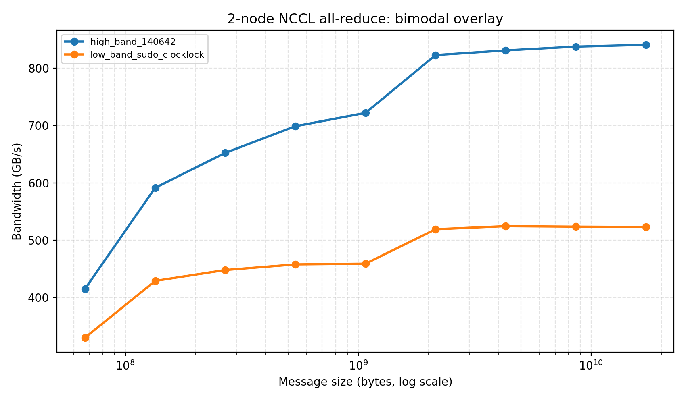
- Evidence + full writeup: see **A.4 Critical anomaly** (below) and the stable post-fix repeatability plot: 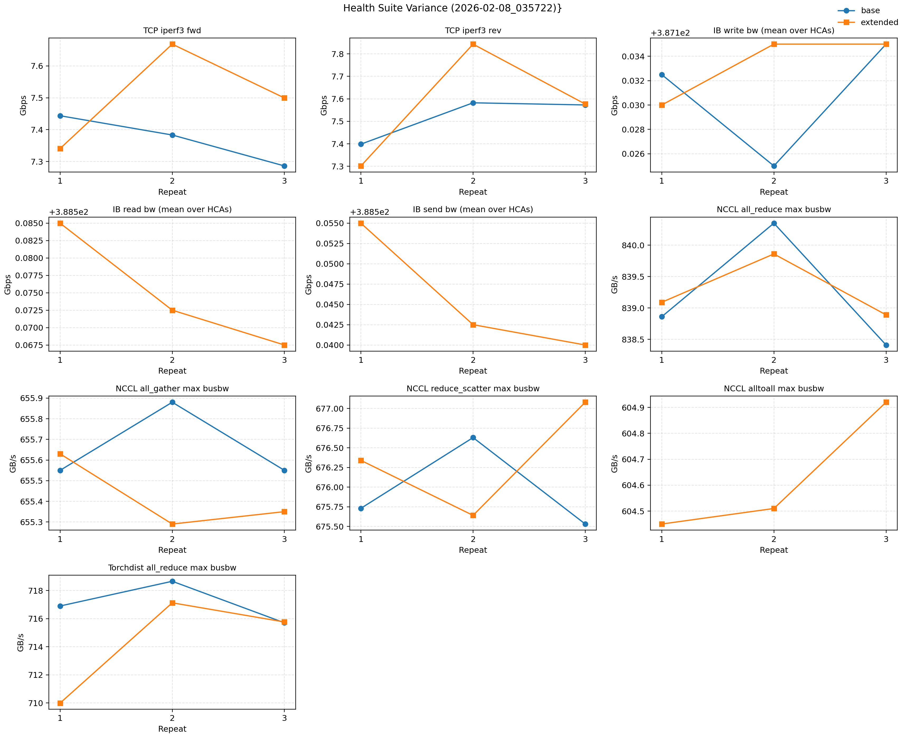
- Data anchors: [results/structured/2026-02-07_224500_nccl_16g_baseline_ppr4_bindnone_node1node2_cluster_health_suite_summary.json](results/structured/2026-02-07_224500_nccl_16g_baseline_ppr4_bindnone_node1node2_cluster_health_suite_summary.json), [results/structured/2026-02-07_140642_cluster_health_suite_node1node2_cluster_health_suite_summary.json](results/structured/2026-02-07_140642_cluster_health_suite_node1node2_cluster_health_suite_summary.json)

2. **NORMAL: Grace-Blackwell CPU/NUMA looks unlike x86**
On both nodes, `lscpu` reports Arm `aarch64` (Neoverse-V2), 2 sockets x 72 cores (144 total), and `NUMA node(s): 34`. Only NUMA nodes 0/1 have CPUs. Linux also exposes 4 ~188416 MB “memory-only” NUMA nodes (2/10/18/26) that closely match the per-GPU HBM capacity (`nvidia-smi` shows 189471 MiB per GPU) even with MIG disabled; treat these as GPU-attached memory domains and avoid them for CPU pinning. The remaining NUMA nodes are memoryless (0 MB) device proximity domains; ignore them for CPU pinning (but note they may show up in tooling output). Evidence: [results/structured/2026-02-08_035901_grace_cpu_numa_node1.txt](results/structured/2026-02-08_035901_grace_cpu_numa_node1.txt), [results/structured/2026-02-08_numactl_numa_evidence_node1.txt](results/structured/2026-02-08_numactl_numa_evidence_node1.txt), [results/structured/2026-02-08_032814_neocloud_eval_full_fixed_node1_meta.json](results/structured/2026-02-08_032814_neocloud_eval_full_fixed_node1_meta.json).
- Visualization: 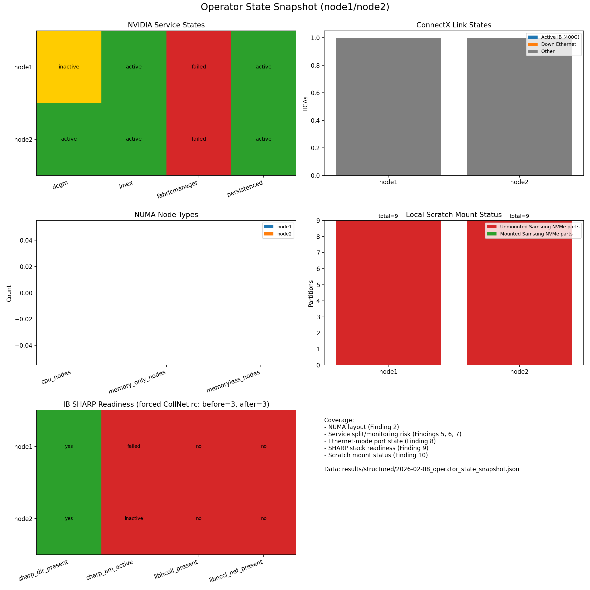
- Evidence: [results/structured/2026-02-08_035901_grace_cpu_numa_node1.txt](results/structured/2026-02-08_035901_grace_cpu_numa_node1.txt), [results/structured/2026-02-08_035901_grace_cpu_numa_node2.txt](results/structured/2026-02-08_035901_grace_cpu_numa_node2.txt), [results/structured/2026-02-08_numactl_numa_evidence_node1.txt](results/structured/2026-02-08_numactl_numa_evidence_node1.txt), [results/structured/2026-02-08_numactl_numa_evidence_node2.txt](results/structured/2026-02-08_numactl_numa_evidence_node2.txt), [results/structured/2026-02-08_032814_neocloud_eval_full_fixed_node1_meta.json](results/structured/2026-02-08_032814_neocloud_eval_full_fixed_node1_meta.json), [results/structured/2026-02-08_032814_neocloud_eval_full_fixed_node2_meta.json](results/structured/2026-02-08_032814_neocloud_eval_full_fixed_node2_meta.json)
- Structured visualization data: [results/structured/2026-02-08_operator_state_snapshot.json](results/structured/2026-02-08_operator_state_snapshot.json)
- Reference: [Grace Performance Tuning Guide (Understanding your Grace machine)](https://docs.nvidia.com/grace-perf-tuning-guide/system.html), [Grace OS Settings](https://docs.nvidia.com/grace-os-settings-ubuntu/index.html)

3. **NOTABLE: Multi-node launch is reliable when interfaces are pinned explicitly**
Two-node NCCL is reliable when OpenMPI OOB is pinned (and NCCL socket bootstrap is pinned) to the correct interface (`enP22p3s0f3` in this case). See **Golden Path: Multi-Node Launch** below. Evidence: [health_suite_extended], [results/structured/2026-02-08_nccl_net_ib_evidence.txt](results/structured/2026-02-08_nccl_net_ib_evidence.txt).
- Visualization: 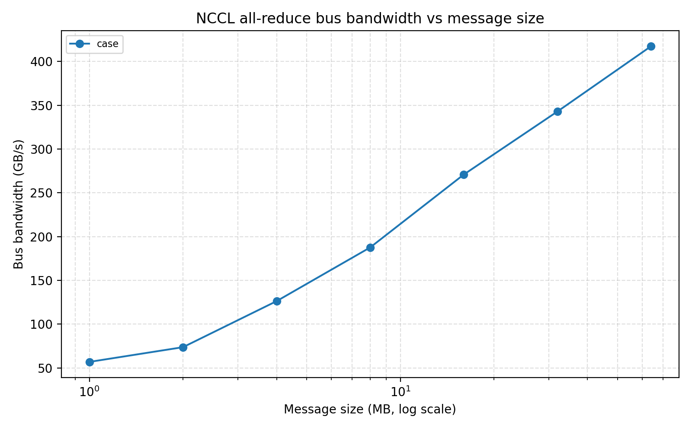
- Evidence: [health_suite_extended], [results/structured/2026-02-08_nccl_net_ib_evidence.txt](results/structured/2026-02-08_nccl_net_ib_evidence.txt)

4. **NOTABLE: OOB TCP (control plane) is an overlay-ish ~8 Gbps path with path MTU=1442**
This is not “bad”, but it matters for bootstrapping (OpenMPI OOB and torch rendezvous). Once ranks bootstrap, NCCL’s data plane is RDMA over InfiniBand (not this TCP path). Evidence: [results/structured/2026-02-08_032814_neocloud_eval_full_fixed_iperf3_oob_tcp.json](results/structured/2026-02-08_032814_neocloud_eval_full_fixed_iperf3_oob_tcp.json), [results/structured/2026-02-08_035613_mtu_oob_iface_node1.txt](results/structured/2026-02-08_035613_mtu_oob_iface_node1.txt), [results/structured/2026-02-08_035613_mtu_oob_iface_node2.txt](results/structured/2026-02-08_035613_mtu_oob_iface_node2.txt).
- OOB TCP throughput (iperf3): 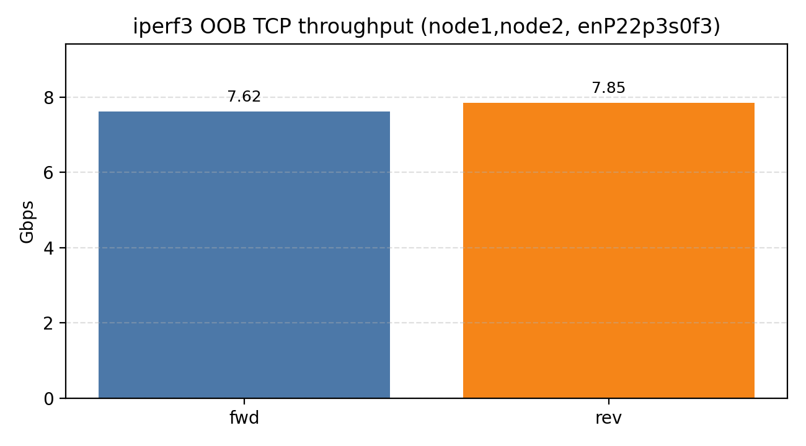
- Path MTU evidence: [results/structured/2026-02-08_035613_mtu_oob_iface_node1.txt](results/structured/2026-02-08_035613_mtu_oob_iface_node1.txt), [results/structured/2026-02-08_035613_mtu_oob_iface_node2.txt](results/structured/2026-02-08_035613_mtu_oob_iface_node2.txt)
- Suite summary containing iperf3 results: [results/structured/2026-02-08_032814_neocloud_eval_full_fixed_health_suite_extended_node1node2_cluster_health_suite_summary.json](results/structured/2026-02-08_032814_neocloud_eval_full_fixed_health_suite_extended_node1node2_cluster_health_suite_summary.json)
- Structured iperf3 summary: [results/structured/2026-02-08_032814_neocloud_eval_full_fixed_iperf3_oob_tcp.json](results/structured/2026-02-08_032814_neocloud_eval_full_fixed_iperf3_oob_tcp.json)

5. **NOTABLE: NVIDIA services split-brain (IMEX vs Fabric Manager)**
`nvidia-dcgm` is **active on `node2` but inactive on `node1`**. `nvidia-imex` is active and `nvidia-imex-ctl -q` reports `READY`. `nvidia-fabricmanager` is present but `failed` on both nodes. Evidence: [results/structured/2026-02-08_032814_neocloud_eval_full_fixed_node1_meta.json](results/structured/2026-02-08_032814_neocloud_eval_full_fixed_node1_meta.json), [results/structured/2026-02-08_032814_neocloud_eval_full_fixed_node2_meta.json](results/structured/2026-02-08_032814_neocloud_eval_full_fixed_node2_meta.json), [results/structured/2026-02-08_032559_imex_validation_node1.txt](results/structured/2026-02-08_032559_imex_validation_node1.txt), [results/structured/2026-02-08_032559_imex_validation_node2.txt](results/structured/2026-02-08_032559_imex_validation_node2.txt).
- Visualization: 
- Evidence: [results/structured/2026-02-08_032814_neocloud_eval_full_fixed_node1_meta.json](results/structured/2026-02-08_032814_neocloud_eval_full_fixed_node1_meta.json), [results/structured/2026-02-08_032814_neocloud_eval_full_fixed_node2_meta.json](results/structured/2026-02-08_032814_neocloud_eval_full_fixed_node2_meta.json)
- Evidence (IMEX domain status is `UP` across both nodes): [results/structured/2026-02-08_032559_imex_validation_node1.txt](results/structured/2026-02-08_032559_imex_validation_node1.txt), [results/structured/2026-02-08_032559_imex_validation_node2.txt](results/structured/2026-02-08_032559_imex_validation_node2.txt)
- Structured visualization data: [results/structured/2026-02-08_operator_state_snapshot.json](results/structured/2026-02-08_operator_state_snapshot.json)

6. **WEIRD: DCGM can silently disappear (Restart=on-abort), breaking monitoring**
On `node1`, DCGM (`nv-hostengine` via `nvidia-dcgm.service`) was found inactive in discovery while `node2` was active. The shipped unit is configured with `Restart=on-abort`, so if DCGM exits cleanly it will not auto-restart. This is a monitoring reliability hazard: any DCGM exporter/dashboard will go blind until someone notices. Evidence: [results/structured/2026-02-08_032814_neocloud_eval_full_fixed_node1_meta.json](results/structured/2026-02-08_032814_neocloud_eval_full_fixed_node1_meta.json), [results/structured/2026-02-08_032814_neocloud_eval_full_fixed_node2_meta.json](results/structured/2026-02-08_032814_neocloud_eval_full_fixed_node2_meta.json), [results/structured/2026-02-08_test_preflight_dcgm_before_after_node1node2_preflight_services.json](results/structured/2026-02-08_test_preflight_dcgm_before_after_node1node2_preflight_services.json)

Mitigation in this repo: `scripts/preflight_cluster_services.sh` now **hard-requires DCGM** and records `dcgm_active_before` vs `dcgm_active_after`, emitting a loud warning when it had to start DCGM.
- Visualization: 
- Evidence (preflight had to start DCGM on `node1`): [results/structured/2026-02-08_test_preflight_dcgm_before_after_node1node2_preflight_services.json](results/structured/2026-02-08_test_preflight_dcgm_before_after_node1node2_preflight_services.json)
- Evidence (latest recheck: DCGM already active on both nodes, no preflight start needed): [preflight_dcgm_recheck]
- Evidence (node1 vs node2 discovery mismatch): [results/structured/2026-02-08_032814_neocloud_eval_full_fixed_node1_meta.json](results/structured/2026-02-08_032814_neocloud_eval_full_fixed_node1_meta.json), [results/structured/2026-02-08_032814_neocloud_eval_full_fixed_node2_meta.json](results/structured/2026-02-08_032814_neocloud_eval_full_fixed_node2_meta.json)
- Structured visualization data: [results/structured/2026-02-08_operator_state_snapshot.json](results/structured/2026-02-08_operator_state_snapshot.json)

7. **WEIRD (incident, mitigated): when NVIDIA services are down, multi-node collectives and containers can fail**
In one incident window, NCCL collectives failed with `NCCL WARN Cuda failure 801 'operation not supported'` in `transport/nvls.cc` and `mpirun` aborted; in the same window, the vLLM container failed to start because `/run/nvidia-persistenced/socket` was missing on `node1`. Mitigation: enforce a strict preflight for `nvidia-persistenced` + `nvidia-imex` health (the end-to-end suite does this now). Evidence: [results/structured/2026-02-08_025442_neocloud_eval_full_health_suite_extended_node1node2_nccl_all_reduce_perf.error_excerpt.txt](results/structured/2026-02-08_025442_neocloud_eval_full_health_suite_extended_node1node2_nccl_all_reduce_perf.error_excerpt.txt), [results/structured/2026-02-08_025442_neocloud_eval_full_node1_vllm_serve_sweep_sweep_log.txt](results/structured/2026-02-08_025442_neocloud_eval_full_node1_vllm_serve_sweep_sweep_log.txt), [results/structured/2026-02-08_032814_neocloud_eval_full_fixed_preflight_services.json](results/structured/2026-02-08_032814_neocloud_eval_full_fixed_preflight_services.json).
- Visualization (NVLS perf tradeoff): 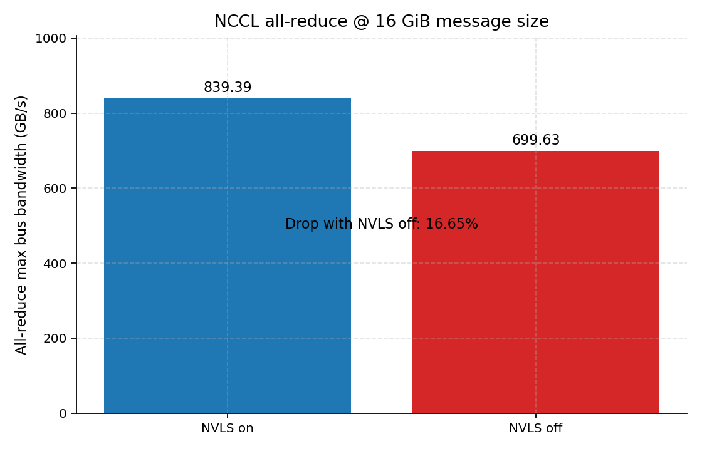
- Visualization (service state context): 
- Context: NCCL “NVLS” is **NVLink SHARP** (NVSwitch multicast/reduction offload inside the NVLink fabric), not InfiniBand SHARP (network-switch offload). It is a major contributor to peak all-reduce bandwidth on this platform.
- Context: NCCL init logs report `MNNVL 1` (Multi-Node NVLink enabled). Evidence: [results/structured/2026-02-08_032814_neocloud_eval_full_fixed_health_suite_extended_node1node2_nccl_all_reduce_perf.mnnvl_excerpt.txt](results/structured/2026-02-08_032814_neocloud_eval_full_fixed_health_suite_extended_node1node2_nccl_all_reduce_perf.mnnvl_excerpt.txt). Parsed NCCL artifact confirming both hosts + 8 ranks: [results/structured/2026-02-08_032814_neocloud_eval_full_fixed_health_suite_extended_node1node2_nccl_all_reduce_perf.json](results/structured/2026-02-08_032814_neocloud_eval_full_fixed_health_suite_extended_node1node2_nccl_all_reduce_perf.json).
- Evidence that NVLS is supported and can be active (healthy state): in the post-fix run, NCCL init reports `24 nvls channels` and prints `NVLS comm ...` lines: [results/structured/2026-02-08_032814_neocloud_eval_full_fixed_health_suite_extended_node1node2_nccl_all_reduce_perf.nvls_excerpt.txt](results/structured/2026-02-08_032814_neocloud_eval_full_fixed_health_suite_extended_node1node2_nccl_all_reduce_perf.nvls_excerpt.txt). The corresponding suite summary shows peak 2-node all-reduce busbw 839.39 GB/s at 16 GiB: [results/structured/2026-02-08_032814_neocloud_eval_full_fixed_health_suite_extended_node1node2_cluster_health_suite_summary.json](results/structured/2026-02-08_032814_neocloud_eval_full_fixed_health_suite_extended_node1node2_cluster_health_suite_summary.json).
- Clarification: the ~17% busbw drop (839 -> 700 GB/s) is the expected tradeoff when **forcing NVLS off** (`NCCL_NVLS_ENABLE=0`) as an escape hatch. The “flakey” part is NVLS init failing outright when IMEX/services are unhealthy (not that NVLS is inherently unstable when healthy). Evidence: [results/structured/2026-02-08_032814_neocloud_eval_full_fixed_health_suite_extended_node1node2_cluster_health_suite_summary.json](results/structured/2026-02-08_032814_neocloud_eval_full_fixed_health_suite_extended_node1node2_cluster_health_suite_summary.json), [results/structured/2026-02-08_031531_health_suite_extended_nvls0_node1node2_cluster_health_suite_summary.json](results/structured/2026-02-08_031531_health_suite_extended_nvls0_node1node2_cluster_health_suite_summary.json).
- Evidence of the incident trigger: during the failing window, `nvidia-imex` was `inactive` on `node1`: [results/structured/2026-02-08_025442_neocloud_eval_full_node1_meta.json](results/structured/2026-02-08_025442_neocloud_eval_full_node1_meta.json).
- NCCL failure excerpt: [results/structured/2026-02-08_025442_neocloud_eval_full_health_suite_extended_node1node2_nccl_all_reduce_perf.error_excerpt.txt](results/structured/2026-02-08_025442_neocloud_eval_full_health_suite_extended_node1node2_nccl_all_reduce_perf.error_excerpt.txt)
- vLLM container failure log: [results/structured/2026-02-08_025442_neocloud_eval_full_node1_vllm_serve_sweep_sweep_log.txt](results/structured/2026-02-08_025442_neocloud_eval_full_node1_vllm_serve_sweep_sweep_log.txt)
- Preflight fix: [results/structured/2026-02-08_032814_neocloud_eval_full_fixed_preflight_services.json](results/structured/2026-02-08_032814_neocloud_eval_full_fixed_preflight_services.json)
- NVLS-disabled fallback run (diagnostic escape hatch, not a baseline): the NCCL log shows `0 nvls channels` with `NCCL_NVLS_ENABLE=0`: [results/structured/2026-02-08_031531_health_suite_extended_nvls0_node1node2_nccl_all_reduce_perf.nvls_disabled_excerpt.txt](results/structured/2026-02-08_031531_health_suite_extended_nvls0_node1node2_nccl_all_reduce_perf.nvls_disabled_excerpt.txt). This run completed end-to-end, but peak 2-node all-reduce busbw drops to 699.63 GB/s at 16 GiB: [results/structured/2026-02-08_031531_health_suite_extended_nvls0_node1node2_cluster_health_suite_summary.json](results/structured/2026-02-08_031531_health_suite_extended_nvls0_node1node2_cluster_health_suite_summary.json).
- Provider readiness check: treat “NVLS works reliably when services are healthy” as a hard requirement. The minimal check is: (1) run `scripts/preflight_cluster_services.sh` to confirm IMEX + persistenced + DCGM are healthy (and review DCGM before/after warnings), (2) run `scripts/run_cluster_health_suite.sh` with `--extended` and without forcing `NCCL_NVLS_ENABLE=0`, and (3) confirm the NCCL log contains `NVLS comm` and a non-zero `nvls channels` count (and does not contain `transport/nvls.cc` errors). Evidence: [results/structured/2026-02-08_032814_neocloud_eval_full_fixed_preflight_services.json](results/structured/2026-02-08_032814_neocloud_eval_full_fixed_preflight_services.json), [results/structured/2026-02-08_032814_neocloud_eval_full_fixed_health_suite_extended_node1node2_nccl_all_reduce_perf.nvls_excerpt.txt](results/structured/2026-02-08_032814_neocloud_eval_full_fixed_health_suite_extended_node1node2_nccl_all_reduce_perf.nvls_excerpt.txt).
- Harness behavior (to make this easy to audit): the health suite now records an `*_nvls_recovery.json` artifact that captures NVLS init retries/resets and whether it had to fall back to `NCCL_NVLS_ENABLE=0` (example: [results/structured/2026-02-08_074500_nvls_recovery_smoke_node1node2_cluster_health_suite_summary.json](results/structured/2026-02-08_074500_nvls_recovery_smoke_node1node2_cluster_health_suite_summary.json), [results/structured/2026-02-08_074500_nvls_recovery_smoke_node1node2_nvls_recovery.json](results/structured/2026-02-08_074500_nvls_recovery_smoke_node1node2_nvls_recovery.json)).
- Structured visualization data: [results/structured/2026-02-08_nvls_on_off_allreduce_busbw.json](results/structured/2026-02-08_nvls_on_off_allreduce_busbw.json), [results/structured/2026-02-08_operator_state_snapshot.json](results/structured/2026-02-08_operator_state_snapshot.json)

8. **NOTABLE: Ethernet-mode ConnectX ports are link-down/disabled** Evidence: [results/structured/2026-02-08_ibstat_evidence_node1.txt](results/structured/2026-02-08_ibstat_evidence_node1.txt), [results/structured/2026-02-08_ibstat_evidence_node2.txt](results/structured/2026-02-08_ibstat_evidence_node2.txt).
This does not block IB/RDMA performance, but it is an operator question.
- Visualization: 
- Evidence (`ibstat` excerpt): [results/structured/2026-02-08_ibstat_evidence_node1.txt](results/structured/2026-02-08_ibstat_evidence_node1.txt), [results/structured/2026-02-08_ibstat_evidence_node2.txt](results/structured/2026-02-08_ibstat_evidence_node2.txt)
- Structured visualization data: [results/structured/2026-02-08_operator_state_snapshot.json](results/structured/2026-02-08_operator_state_snapshot.json)

9. **NOTABLE: IB SHARP (in-network reduction) userspace is present, but the stack is not currently usable via NCCL/MPI** Evidence: [results/structured/2026-02-08_082000_ib_sharp_check_v3_ib_sharp_check.json](results/structured/2026-02-08_082000_ib_sharp_check_v3_ib_sharp_check.json), [results/structured/2026-02-08_082000_ib_sharp_check_v3_nccl_collnet_all_reduce_after_start_error_excerpt.txt](results/structured/2026-02-08_082000_ib_sharp_check_v3_nccl_collnet_all_reduce_after_start_error_excerpt.txt).
The SHARP user-space stack exists (`/opt/mellanox/sharp`), but I did not observe a working end-to-end SHARP path for collectives on this image:
- No `libhcoll` (MPI HCOLL) and no `libnccl-net` plugin were found via `ldconfig` on either node.
- `sharp_am` is not healthy by default (node2 shows `inactive` and does not have the systemd unit installed by default; node1 service is present but `failed`). The shipped `sharp_daemons_setup.sh` help explicitly notes `sharp_am.service` is not started automatically and that starting it resets SHARP trees. A best-effort install/start attempt on node1 did not make the NCCL forced-CollNet test succeed.
- The forced CollNet run fails with `enqueue.cc:1859 ... no algorithm/protocol available ... NCCL_ALGO was set to allreduce:CollnetDirect,CollnetChain`, i.e., CollNet algorithms are not usable on this image even after `sharp_am` is started.
- A forced NCCL CollNet all-reduce fails (`invalid usage`) both before and after attempting to start `sharp_am`, so I did not validate SHARP acceleration for NCCL in this environment.
Visualization:
- 
Evidence (reproducible):
- Check summary: [results/structured/2026-02-08_082000_ib_sharp_check_v3_ib_sharp_check.json](results/structured/2026-02-08_082000_ib_sharp_check_v3_ib_sharp_check.json)
- Per-host stack captures: [results/structured/2026-02-08_082000_ib_sharp_check_v3_ib_sharp_stack_node1.txt](results/structured/2026-02-08_082000_ib_sharp_check_v3_ib_sharp_stack_node1.txt), [results/structured/2026-02-08_082000_ib_sharp_check_v3_ib_sharp_stack_node2.txt](results/structured/2026-02-08_082000_ib_sharp_check_v3_ib_sharp_stack_node2.txt)
- Forced CollNet failure excerpts: [results/structured/2026-02-08_082000_ib_sharp_check_v3_nccl_collnet_all_reduce_before_start_error_excerpt.txt](results/structured/2026-02-08_082000_ib_sharp_check_v3_nccl_collnet_all_reduce_before_start_error_excerpt.txt), [results/structured/2026-02-08_082000_ib_sharp_check_v3_nccl_collnet_all_reduce_after_start_error_excerpt.txt](results/structured/2026-02-08_082000_ib_sharp_check_v3_nccl_collnet_all_reduce_after_start_error_excerpt.txt)
- `sharp_am` start attempt (node1): [results/structured/2026-02-08_082000_ib_sharp_check_v3_sharp_am_start_node1.txt](results/structured/2026-02-08_082000_ib_sharp_check_v3_sharp_am_start_node1.txt)
- Structured visualization data: [results/structured/2026-02-08_operator_state_snapshot.json](results/structured/2026-02-08_operator_state_snapshot.json)
Fix path (provider-owned, not something a user should have to guess):
- Decide where `sharp_am` is supposed to run (dedicated manager node(s) vs compute nodes), ensure it is configured/healthy, and document the SHARP tenancy model.
- Provide the expected collective integration path: MPI HCOLL (`libhcoll`) for MPI collectives and/or an NCCL net plugin (`libnccl-net.so`) with SHARP support for NCCL CollNet.

10. **NOTABLE: Local scratch exists but is unmounted by default**
- Visualization: 
- Evidence: [results/structured/2026-02-08_032814_neocloud_eval_full_fixed_node1_storage.json](results/structured/2026-02-08_032814_neocloud_eval_full_fixed_node1_storage.json), [results/structured/2026-02-08_032814_neocloud_eval_full_fixed_node2_storage.json](results/structured/2026-02-08_032814_neocloud_eval_full_fixed_node2_storage.json)
- Structured visualization data: [results/structured/2026-02-08_operator_state_snapshot.json](results/structured/2026-02-08_operator_state_snapshot.json)

11. **WEIRD (transient, diagnosed): one-off `node2_gpu2` GEMM collapse did not reproduce**
In `2026-02-08_ssh_key_full_suite_r2`, `node2_gpu2` dropped to ~709 TFLOPS while peer GPUs on the same node remained ~1.5 PFLOPS. I tested it immediately with a locked isolated rerun (`2026-02-08_node2_gpu2_diag_pre_reset`) and it recovered to ~1548.7 TFLOPS without reset. A subsequent clean full-suite run (`2026-02-08_ssh_key_full_suite_clean`) again measured `node2_gpu2` at ~1509.5 TFLOPS with app clocks present. `dmesg` Xid tail capture was clean. Evidence: [results/structured/2026-02-08_ssh_key_full_suite_r2_node2_gemm_gpu_sanity.csv](results/structured/2026-02-08_ssh_key_full_suite_r2_node2_gemm_gpu_sanity.csv), [results/structured/2026-02-08_node2_gpu2_diag_pre_reset_node2_gemm_gpu_sanity.csv](results/structured/2026-02-08_node2_gpu2_diag_pre_reset_node2_gemm_gpu_sanity.csv), [results/structured/2026-02-08_ssh_key_full_suite_clean_node2_gemm_gpu_sanity.csv](results/structured/2026-02-08_ssh_key_full_suite_clean_node2_gemm_gpu_sanity.csv), [results/structured/2026-02-08_node2_gpu2_diag_dmesg_xid_tail.txt](results/structured/2026-02-08_node2_gpu2_diag_dmesg_xid_tail.txt).
- Conclusion: do **not** reset by default for this pattern; first rerun isolated under locked clocks to confirm persistence.
- Visualization: 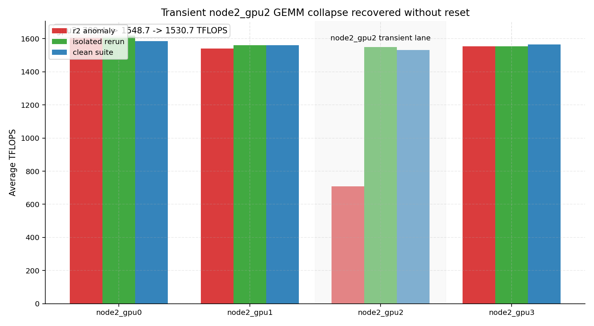
- Evidence (anomalous run): [results/structured/2026-02-08_ssh_key_full_suite_r2_node2_gemm_gpu_sanity.csv](results/structured/2026-02-08_ssh_key_full_suite_r2_node2_gemm_gpu_sanity.csv)
- Evidence (immediate recovery, no reset): [results/structured/2026-02-08_node2_gpu2_diag_pre_reset_node2_gemm_gpu_sanity.csv](results/structured/2026-02-08_node2_gpu2_diag_pre_reset_node2_gemm_gpu_sanity.csv)
- Evidence (clean suite confirmation): [results/structured/2026-02-08_ssh_key_full_suite_clean_node2_gemm_gpu_sanity.csv](results/structured/2026-02-08_ssh_key_full_suite_clean_node2_gemm_gpu_sanity.csv), [results/structured/2026-02-08_ssh_key_full_suite_clean_manifest.json](results/structured/2026-02-08_ssh_key_full_suite_clean_manifest.json)
- Evidence (error-log sanity): [results/structured/2026-02-08_node2_gpu2_diag_dmesg_xid_tail.txt](results/structured/2026-02-08_node2_gpu2_diag_dmesg_xid_tail.txt), [results/structured/2026-02-08_node2_gpu2_diag_nvidia_smi_q.txt](results/structured/2026-02-08_node2_gpu2_diag_nvidia_smi_q.txt)
- Structured visualization data: [results/structured/2026-02-08_node2_gpu2_transient_gemm_tflops.json](results/structured/2026-02-08_node2_gpu2_transient_gemm_tflops.json)

## Monitoring + Health Checks (Expectations Checklist)

This section is a **generic** monitoring + health-check expectations checklist for production GPU clusters. In this engagement I only had SSH access to 2 bare nodes (no visible provider dashboard/scheduler control plane), so many dashboard items are marked Missing/Unknown.

Interpretation notes:
- This field report is an SSH-first evaluation of **2 bare nodes** with **no detected Slurm or Kubernetes control plane**; many “dashboard” items are therefore **Missing/Unknown** because no provider monitoring surface was in-scope. Evidence: [node1_meta], [node2_meta]
- Status legend:
  - **YES**: observed + evidenced
  - **PARTIAL**: signal is measurable via CLI/scripts (and we captured evidence), but there is no operator-grade dashboard/alerting integration in-scope
  - **MISSING**: not observed / not available in-scope
  - **UNKNOWN**: not evaluated in this engagement
  - **N/A**: not applicable to the 2-node, non-NVL72 scope of this report

Evidence anchors used below:
- Discovery meta: [node1_meta], [node2_meta]
- Container/runtime: [node1_container_runtime], [node2_container_runtime]
- Active “health check” artifacts: [preflight_services], [health_suite_extended]
- DCGM preflight before/after (incident + recheck): [preflight_dcgm_before_after], [preflight_dcgm_recheck]
- NVLink throughput evidence: [nvlink_p2p_bw_curve], [nvlink_p2p_bw_matrix]
- PCIe host<->device throughput evidence: [nvbandwidth]
- Kernel/Xid evidence: [node1_dmesg_xid_tail]

### Monitoring Expectations Checklist (Dashboard)

| Item | Status | Evidence / notes |
| --- | --- | --- |
| Number of nodes, pods, workloads running | MISSING | No K8s/Slurm control plane detected in discovery. Evidence: [node1_meta], [node2_meta]. |
| Current node health status | PARTIAL | We have a strict preflight + active health suite runbook, but no provider dashboard in-scope. Evidence: [preflight_services], [health_suite_extended]. |
| Resource utilization (CPU, memory, disk, network) at cluster/node/namespace/pod levels | PARTIAL | Node-level CPU/mem/disk/net snapshots captured; no namespace/pod aggregation (no K8s). Evidence: [node1_meta], [node2_meta]. |
| Trends and summaries | PARTIAL | We generate evaluation plots (NCCL/vLLM/fio/variance), but this is not a continuous monitoring dashboard. Evidence: [health_suite_extended]. |
| Workload stability (restarts, pending pods, scaling events) | MISSING | No K8s/Slurm workload history in-scope. Evidence: [node1_meta], [node2_meta]. |
| Control plane health (API server latency, etcd performance, controller manager and scheduler metrics) | MISSING | No K8s control plane detected. Evidence: [node1_meta], [node2_meta]. |
| Slurm integration with job stats by user, type, etc. | MISSING | No Slurm control plane detected. Evidence: [node1_meta], [node2_meta]. |
| Kubernetes integration with kube-state-metrics, node-exporter, dcgm-exporter, cAdvisor | MISSING | No K8s control plane detected. Evidence: [node1_meta], [node2_meta]. |
| Resource quotas with limits and usage of GPUs for users and groups | MISSING | No Slurm/K8s quota surface in-scope. Evidence: [node1_meta], [node2_meta]. |
| Real-time GPU node availability status | PARTIAL | GPU presence is visible via node-local `nvidia-smi` discovery; no provider dashboard/scheduler surface in-scope. Evidence: [node1_meta], [node2_meta]. |
| Scheduler resource contention monitoring to respond to resource constraints | MISSING | No scheduler detected in-scope. Evidence: [node1_meta], [node2_meta]. |
| kube-prometheus-stack for kubernetes metrics | MISSING | No K8s control plane detected. Evidence: [node1_meta], [node2_meta]. |
| NVIDIA DCGM integration for comprehensive GPU monitoring (or AMD equivalent) | PARTIAL | DCGM was inconsistent across nodes (active on `node2`, inactive on `node1` in discovery). The eval harness now hard-requires DCGM and records `dcgm_active_before`/`dcgm_active_after`, warning if it had to start DCGM. Evidence: [node1_meta], [node2_meta], [preflight_dcgm_before_after], [preflight_dcgm_recheck]. |
| KV cache usage for horizontal pod autoscaling with serving: `gpu_cache_usage_perc` | MISSING | No K8s/HPA integration in-scope; vLLM sweep is bare serving, not HPA. Evidence: [node1_meta], [node2_meta]. |
| Integrated alert management and notification systems | UNKNOWN | Not evaluated (no provider dashboard/alerting surface in-scope). |
| Node-level power draw with real-time power consumption monitoring across all nodes | PARTIAL | Power is observable via `nvidia-smi`/telemetry, but there is no cluster-wide dashboard in-scope. Evidence: [node1_meta], [node2_meta]. |
| Fan speed monitoring for cooling system performance and status | UNKNOWN | Not captured in discovery outputs; not evaluated. |
| Temperature monitoring from various sensors (CPU, RAM, NIC, transceiver, other critical components) | PARTIAL | GPU temperature is observable via `nvidia-smi`/telemetry; other sensor coverage not evaluated. Evidence: [node1_meta], [node2_meta]. |
| PCIe AER rates for Advanced Error Reporting on PCIe bus health | MISSING | Not captured as a first-class signal in this eval; only GPU Xids were captured during an incident. Evidence: [node1_dmesg_xid_tail]. |
| dmesg logs monitoring via promtail for system-level message capture | PARTIAL | We captured a kernel/Xid tail during incident RCA, but there is no promtail-based pipeline in-scope. Evidence: [node1_dmesg_xid_tail]. |
| GB200 NVL72 specialized monitoring requirements for advanced GPU configurations | N/A | This eval is 4x GB200 per node (not NVL72). |
| TFLOPs estimation via `DCGM_FI_PROF_PIPE_TENSOR_ACTIVE` | MISSING | Not captured; DCGM is not consistently active across nodes and no DCGM profiling fields were collected. Evidence: [node1_meta], [node2_meta]. |
| SM Active monitoring via `DCGM_FI_PROF_SM_ACTIVE` | MISSING | Not captured. Evidence: [node1_meta], [node2_meta]. |
| SM Occupancy monitoring via `DCGM_FI_PROF_SM_OCCUPANCY` | MISSING | Not captured. Evidence: [node1_meta], [node2_meta]. |
| NCU profiling with NVIDIA Nsight Compute available for users without sudo privilege required | UNKNOWN | Not captured in discovery outputs; not evaluated in this engagement (see **Open Questions** for “profiling toolchain” follow-up). |
| NVLink/XGMI throughput for inter-GPU communication bandwidth monitoring | YES | NVLink P2P microbenchmark evidence captured. Evidence: [nvlink_p2p_bw_curve], [nvlink_p2p_bw_matrix]. |
| PCIe throughput for host CPU to GPU data transfer rates | YES | `nvbandwidth` includes host<->device memcpy tests (PCIe path). Evidence: [nvbandwidth]. |
| InfiniBand/RoCEv2 throughput for high-speed network performance between nodes | YES | ib_write_bw + NCCL 2-node sweep captured. Evidence: [health_suite_extended]. |
| User and group quotas | MISSING | No scheduler/quota surface in-scope. |
| Node availability | PARTIAL | Preflight + active health suite are the only availability signals captured in-scope. Evidence: [preflight_services], [health_suite_extended]. |
| Scheduler job history | MISSING | No scheduler detected in-scope. Evidence: [node1_meta], [node2_meta]. |
| Console, dashboard, CLI and/or API available to manage resources | PARTIAL | SSH + scripts exist; no provider monitoring dashboard/console was evaluated. |
| 24x7 support availability | UNKNOWN | Not evaluated in this engagement. |
| Process for security fixes and upgrades exists, proactive notifications are clear | UNKNOWN | Not evaluated in this engagement. |
| Integration with active and passive health check systems | PARTIAL | Active checks (suite) exist; passive monitoring/alerting pipeline not in-scope. Evidence: [health_suite_extended]. |

### Health Checks Coverage (Active Health Suite) (Quick Map)

This repo’s suite is primarily an **active** health/perf validation bundle. Coverage highlights:
- NCCL collectives (active): YES (NCCL all_reduce/all_gather/reduce_scatter/alltoall). Evidence: [health_suite_extended].
- IB/RDMA throughput (active): YES (`ib_write_bw`, plus extended perftests when enabled). Evidence: [health_suite_extended].
- Host<->device bandwidth (active): YES via `nvbandwidth` (single-node cross-check). Evidence: [nvbandwidth].
- GPU Xid/SXid log monitoring (passive): PARTIAL (incident-driven kernel tail capture, not continuous). Evidence: [node1_dmesg_xid_tail].
- DCGM background health + profiling fields (passive): MISSING/PARTIAL (DCGM not consistently active across nodes by default; and no background checks/exporters were evaluated in-scope). We now hard-require hostengine in preflight to avoid “blind” benchmark runs. Evidence: [node1_meta], [node2_meta], [preflight_dcgm_before_after], [preflight_dcgm_recheck].
- Automation (scheduled checks + auto drain/remediation): MISSING (not observed in-scope).

### What “Great” Looks Like (Operator Playbook)

In large GPU fleets, monitoring + health checks are primary reliability/TCO differentiators. Concretely, “great” operators tend to have:
- NVML-level sensor/exporter coverage beyond what “standard DCGM exporters” expose (e.g., additional thermal sensors for diagnosing subtle hardware issues).
- Fabric/exporter coverage for the interconnect (NVLink/NVSwitch and networking), plus correlation of events (Xid/SXid) across the fabric to root-cause faulty trays/cables/switch ports.
- Sustained **multi-node** active checks as part of burn-in and scheduled health checks (not just single-node stress tests), since some failures only appear under simultaneous thermal expansion + fabric load.
- Alerting that gets actionable signals (Xid/SXid, link flaps, PCIe replay/AER, thermal/power anomalies) to humans quickly (Slack/PagerDuty/etc).

[node1_meta]: results/structured/2026-02-08_032814_neocloud_eval_full_fixed_node1_meta.json
[node2_meta]: results/structured/2026-02-08_032814_neocloud_eval_full_fixed_node2_meta.json
[node1_container_runtime]: results/structured/2026-02-08_032814_neocloud_eval_full_fixed_node1_container_runtime.txt
[node2_container_runtime]: results/structured/2026-02-08_032814_neocloud_eval_full_fixed_node2_container_runtime.txt
[preflight_services]: results/structured/2026-02-08_032814_neocloud_eval_full_fixed_preflight_services.json
[preflight_dcgm_before_after]: results/structured/2026-02-08_test_preflight_dcgm_before_after_node1node2_preflight_services.json
[preflight_dcgm_recheck]: results/structured/2026-02-08_ssh_key_full_suite_clean_preflight_services.json
[health_suite_extended]: results/structured/2026-02-08_032814_neocloud_eval_full_fixed_health_suite_extended_node1node2_cluster_health_suite_summary.json
[nvlink_p2p_bw_curve]: docs/figures/2026-02-06_node1_nvlink_p2p_bw_curve.png
[nvlink_p2p_bw_matrix]: docs/figures/2026-02-06_node1_nvlink_p2p_bandwidth_matrix.png
[nvbandwidth]: results/structured/2026-02-08_011938_cluster_perf_node1_nvbandwidth.txt
[node1_dmesg_xid_tail]: results/structured/2026-02-07_232000_node1_dmesg_nvrm_xid_tail.log

## Cluster Perf Updates (Interesting Tooling Fixes)

1. Fixed P2P bandwidth tool timing bug (impossible GB/s due to bad timing)
- Symptom: `ERROR` entries + impossible bandwidth (`20536.2 GB/s` max) in the printed matrix.
- Root cause: cross-device copies were being timed incorrectly (CUDA event timing can under-measure async cross-device work), producing near-zero elapsed time and impossible GB/s.
- Fix: changed timing to wall-clock with explicit device synchronization on both src+dst devices.
- Evidence: [results/structured/2026-02-08_p2p_bandwidth_tool_before_excerpt.txt](results/structured/2026-02-08_p2p_bandwidth_tool_before_excerpt.txt), [results/structured/2026-02-08_p2p_bandwidth_tool_after_excerpt.txt](results/structured/2026-02-08_p2p_bandwidth_tool_after_excerpt.txt), 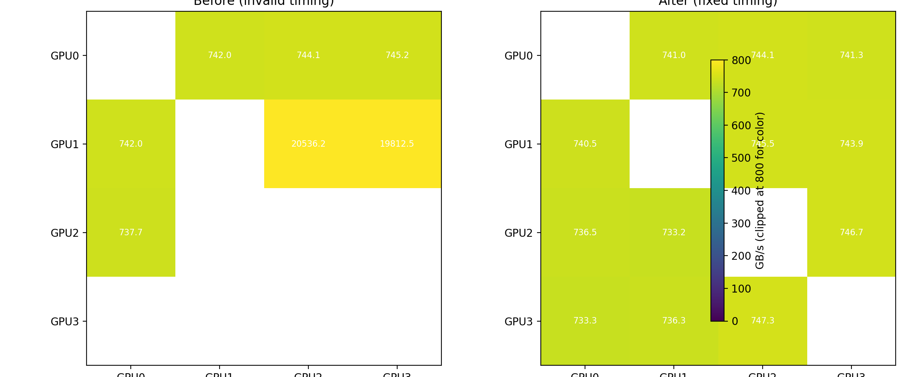
- Code: `$CLUSTER_PERF_SUITE_DIR/standalone/compute/p2p-bandwidth/p2p-bandwidth.py`

2. Fixed DeepGEMM grouped-GEMM on GB200 (UE8M0 scaling-factor path)
- Root cause: the suite used DeepGEMM’s legacy scaling-factor path (`use_ue8m0=False` + `disable_ue8m0_cast=True`), which fails on SM100/GB200 with `Unsupported architecture or scaling factor types`.
- Fix: detect Blackwell (arch>=10) and use UE8M0 scaling factors (`use_ue8m0=True`) with `disable_ue8m0_cast=False`; keep the legacy behavior for older arch. Patch: [code/cluster_perf_patches/deepgemm_gb200_grouped_gemm_ue8m0.patch](code/cluster_perf_patches/deepgemm_gb200_grouped_gemm_ue8m0.patch)
- Evidence (before failure): [results/structured/2026-02-08_deepgemm_grouped_gemm_before_excerpt.txt](results/structured/2026-02-08_deepgemm_grouped_gemm_before_excerpt.txt), [results/structured/2026-02-08_013501_grouped_gemm_torch_fp16_vs_fp8.txt](results/structured/2026-02-08_013501_grouped_gemm_torch_fp16_vs_fp8.txt)
- Evidence (after fix, locked clocks): [results/structured/2026-02-08_deepgemm_grouped_gemm_fixed_excerpt.txt](results/structured/2026-02-08_deepgemm_grouped_gemm_fixed_excerpt.txt), [results/structured/2026-02-08_075036_deepgemm_grouped_gemm_fixed_grouped_gemm_deepgemm_fixed.txt](results/structured/2026-02-08_075036_deepgemm_grouped_gemm_fixed_grouped_gemm_deepgemm_fixed.txt), [results/structured/2026-02-08_075036_deepgemm_grouped_gemm_fixed_summary.json](results/structured/2026-02-08_075036_deepgemm_grouped_gemm_fixed_summary.json), 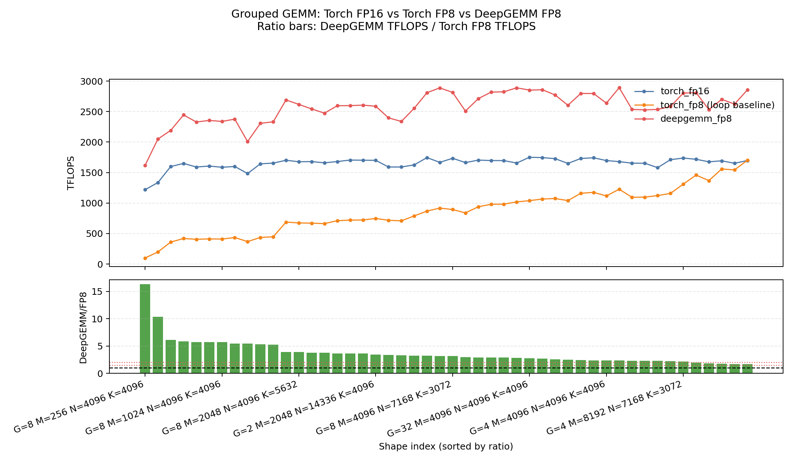, [results/structured/2026-02-08_075036_deepgemm_grouped_gemm_fixed_node1_clock_lock.json](results/structured/2026-02-08_075036_deepgemm_grouped_gemm_fixed_node1_clock_lock.json)
- Repro script (from this report package): [scripts/run_cluster_perf_grouped_gemm.sh](scripts/run_cluster_perf_grouped_gemm.sh)

3. Captured the exact Cluster Perf suite working tree from node2 (audit + reproducibility)
- Local extract: `$CLUSTER_PERF_SNAPSHOT_DIR` (created via `ssh tar (exclude .venv) + scp`; internal paths redacted)
- Provenance JSON (src/dest, hashes, git status): [results/structured/2026-02-08_031318_cluster_perf_repo_snapshot_node2_provenance.json](results/structured/2026-02-08_031318_cluster_perf_repo_snapshot_node2_provenance.json)
- Working copy used for Cluster Perf suite runs in this report (includes the fixes above): `$CLUSTER_PERF_SUITE_DIR`

## FP4 Default-On + GB Detection Validation (2026-02-08_fp4_default_on_gbdetect_local)

Scope:
- Host: `localhost` (single-node validation path)
- GPUs: 4x `NVIDIA GB200`
- Repro command:
```bash
scripts/run_cluster_eval_suite.sh \
  --run-id 2026-02-08_fp4_default_on_gbdetect_local \
  --hosts localhost \
  --primary-label localhost \
  --health-suite off \
  --model Qwen/Qwen2.5-0.5B-Instruct \
  --tp 1 \
  --isl 128 \
  --osl 128 \
  --concurrency-range "1 2" \
  --fio-runtime 5 \
  --fp4-warmup 1 \
  --fp4-iters 5 \
  --fp4-smoke-warmup 1 \
  --fp4-smoke-iters 5
```

FP4 detection + artifacts (structured):
- Manifest: [results/structured/2026-02-08_fp4_default_on_gbdetect_local_manifest.json](results/structured/2026-02-08_fp4_default_on_gbdetect_local_manifest.json)
- GB-family detection metadata: [results/structured/2026-02-08_fp4_default_on_gbdetect_local_localhost_cluster_perf_fp4_platform.json](results/structured/2026-02-08_fp4_default_on_gbdetect_local_localhost_cluster_perf_fp4_platform.json)
- FP4 smoke JSON + clock lock: [results/structured/2026-02-08_fp4_default_on_gbdetect_local_localhost_cluster_perf_fp4_smoke.json](results/structured/2026-02-08_fp4_default_on_gbdetect_local_localhost_cluster_perf_fp4_smoke.json), [results/structured/2026-02-08_fp4_default_on_gbdetect_local_localhost_cluster_perf_fp4_smoke_clock_lock.json](results/structured/2026-02-08_fp4_default_on_gbdetect_local_localhost_cluster_perf_fp4_smoke_clock_lock.json)
- Grouped GEMM summary + clock lock + plot: [results/structured/2026-02-08_fp4_default_on_gbdetect_local_localhost_cluster_perf_grouped_gemm_summary.json](results/structured/2026-02-08_fp4_default_on_gbdetect_local_localhost_cluster_perf_grouped_gemm_summary.json), [results/structured/2026-02-08_fp4_default_on_gbdetect_local_localhost_cluster_perf_grouped_gemm_clock_lock.json](results/structured/2026-02-08_fp4_default_on_gbdetect_local_localhost_cluster_perf_grouped_gemm_clock_lock.json), 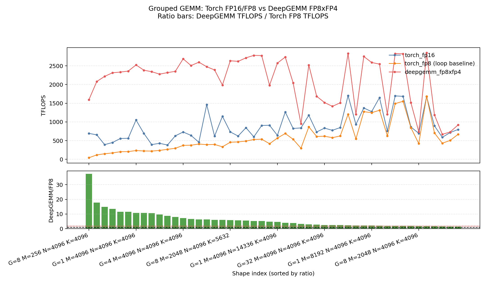

What was validated:
- GB-family detection now runs in the FP4 path and records `gb_family_detected=true`, `gb_sku=GB200`, and `selected_preset=all` when `requested_preset=auto`: [results/structured/2026-02-08_fp4_default_on_gbdetect_local_localhost_cluster_perf_fp4_platform.json](results/structured/2026-02-08_fp4_default_on_gbdetect_local_localhost_cluster_perf_fp4_platform.json)
- DeepGEMM FP8xFP4 smoke completed successfully on GB200 at locked clocks:
  - DeepGEMM FP8xFP4 avg **2100.0 TFLOPS**
  - Torch BF16 avg **812.1 TFLOPS**
  - Speedup **2.59x**
  - Evidence: [results/structured/2026-02-08_fp4_default_on_gbdetect_local_localhost_cluster_perf_fp4_smoke.json](results/structured/2026-02-08_fp4_default_on_gbdetect_local_localhost_cluster_perf_fp4_smoke.json)
- Grouped GEMM (`--preset all`, 48 shapes) completed with full DeepGEMM coverage:
  - DeepGEMM datapoints: **48/48**
  - DeepGEMM TFLOPS: **668.2 / 2347.6 / 2846.4** (min / p50 / max)
  - Speedup vs torch FP8 loop baseline: **1.38x / 4.64x / 37.50x** (min / p50 / max), **37/48 >=2x**
  - Speedup vs torch FP16: **1.02x / 2.24x / 6.07x** (min / p50 / max)
  - Evidence: [results/structured/2026-02-08_fp4_default_on_gbdetect_local_localhost_cluster_perf_grouped_gemm_summary.json](results/structured/2026-02-08_fp4_default_on_gbdetect_local_localhost_cluster_perf_grouped_gemm_summary.json), 

## FP4 Two-Node Direct Checks (2026-02-08_fp4_2nodes_gbdetect)

Scope:
- Hosts: `node1`, `node2`
- GPUs: 4x `NVIDIA GB200` per host (8 total)
- Repro command:
```bash
scripts/run_fp4_checks_all_nodes.sh \
  --run-id 2026-02-08_fp4_2nodes_gbdetect \
  --hosts node1,node2 \
  --labels node1,node2 \
  --ssh-key ~/.ssh/ssh_key.pem \
  --suite-dir /home/ubuntu/ai-performance-engineering/code/clustermax_from_node2
```

Artifacts:
- Manifest: [results/structured/2026-02-08_fp4_2nodes_gbdetect_manifest.json](results/structured/2026-02-08_fp4_2nodes_gbdetect_manifest.json)
- GB detection (node1): [results/structured/2026-02-08_fp4_2nodes_gbdetect_node1_cluster_perf_fp4_platform.json](results/structured/2026-02-08_fp4_2nodes_gbdetect_node1_cluster_perf_fp4_platform.json)
- GB detection (node2): [results/structured/2026-02-08_fp4_2nodes_gbdetect_node2_cluster_perf_fp4_platform.json](results/structured/2026-02-08_fp4_2nodes_gbdetect_node2_cluster_perf_fp4_platform.json)
- FP4 smoke (node1): [results/structured/2026-02-08_fp4_2nodes_gbdetect_node1_cluster_perf_fp4_smoke.json](results/structured/2026-02-08_fp4_2nodes_gbdetect_node1_cluster_perf_fp4_smoke.json)
- FP4 smoke (node2): [results/structured/2026-02-08_fp4_2nodes_gbdetect_node2_cluster_perf_fp4_smoke.json](results/structured/2026-02-08_fp4_2nodes_gbdetect_node2_cluster_perf_fp4_smoke.json)
- Grouped GEMM summary (node1): [results/structured/2026-02-08_fp4_2nodes_gbdetect_node1_cluster_perf_grouped_gemm_summary.json](results/structured/2026-02-08_fp4_2nodes_gbdetect_node1_cluster_perf_grouped_gemm_summary.json)
- Grouped GEMM summary (node2): [results/structured/2026-02-08_fp4_2nodes_gbdetect_node2_cluster_perf_grouped_gemm_summary.json](results/structured/2026-02-08_fp4_2nodes_gbdetect_node2_cluster_perf_grouped_gemm_summary.json)
- Grouped GEMM plots: 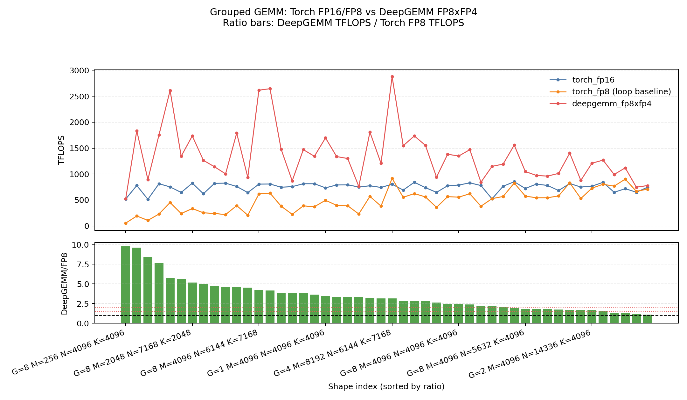, 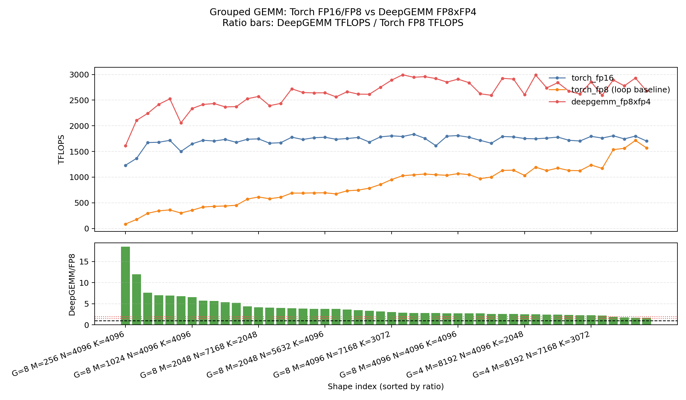

Key results:
- GB-family detection succeeded on both hosts (`gb_family_detected=true`, `gb_sku=GB200`, `requested_preset=auto`, `selected_preset=all`): [node1 platform json](results/structured/2026-02-08_fp4_2nodes_gbdetect_node1_cluster_perf_fp4_platform.json), [node2 platform json](results/structured/2026-02-08_fp4_2nodes_gbdetect_node2_cluster_perf_fp4_platform.json)
- FP4 smoke (node1): DeepGEMM **1622.8 TFLOPS**, torch BF16 **1099.9 TFLOPS**, speedup **1.48x**: [results/structured/2026-02-08_fp4_2nodes_gbdetect_node1_cluster_perf_fp4_smoke.json](results/structured/2026-02-08_fp4_2nodes_gbdetect_node1_cluster_perf_fp4_smoke.json)
- FP4 smoke (node2): DeepGEMM **1570.0 TFLOPS**, torch BF16 **1221.3 TFLOPS**, speedup **1.29x**: [results/structured/2026-02-08_fp4_2nodes_gbdetect_node2_cluster_perf_fp4_smoke.json](results/structured/2026-02-08_fp4_2nodes_gbdetect_node2_cluster_perf_fp4_smoke.json)
- Grouped GEMM coverage: DeepGEMM datapoints **48/48** on both `node1` and `node2`.
- Grouped GEMM (node1): DeepGEMM TFLOPS **521.4 / 1283.5 / 2877.6** (min/p50/max), DeepGEMM over torch FP8 **1.10x / 3.15x / 9.76x**, **35/48** shapes >=2x: [results/structured/2026-02-08_fp4_2nodes_gbdetect_node1_cluster_perf_grouped_gemm_summary.json](results/structured/2026-02-08_fp4_2nodes_gbdetect_node1_cluster_perf_grouped_gemm_summary.json)
- Grouped GEMM (node2): DeepGEMM TFLOPS **1612.8 / 2642.3 / 2993.9** (min/p50/max), DeepGEMM over torch FP8 **1.71x / 3.12x / 18.52x**, **44/48** shapes >=2x: [results/structured/2026-02-08_fp4_2nodes_gbdetect_node2_cluster_perf_grouped_gemm_summary.json](results/structured/2026-02-08_fp4_2nodes_gbdetect_node2_cluster_perf_grouped_gemm_summary.json)

## Latest End-to-End Validation (2026-02-08_032814_neocloud_eval_full_fixed)

Evaluation scope:
- Hosts: `node1`, `node2`
- GPUs: 4 per node (8 total)
- OOB interface: `enP22p3s0f3`
- NCCL bootstrap: `NCCL_SOCKET_IFNAME=enP22p3s0f3`
- IB HCA allowlist: `mlx5_0,mlx5_1,mlx5_4,mlx5_5`

One-command repro:
```bash
cd code/cluster

scripts/run_cluster_eval_suite.sh \
  --run-id 2026-02-08_032814_neocloud_eval_full_fixed \
  --hosts node1,node2 \
  --labels node1,node2 \
  --ssh-key ~/.ssh/ssh_key.pem \
  --oob-if enP22p3s0f3 \
  --socket-ifname enP22p3s0f3 \
  --nccl-ib-hca mlx5_0,mlx5_1,mlx5_4,mlx5_5 \
  --health-suite extended \
  --model openai/gpt-oss-120b \
  --tp 4 \
  --isl 1024 \
  --osl 1024 \
  --concurrency-range "32 64 128 256 512" \
  --fio-test-dir /tmp \
  --fio-runtime 30
```

Top-level artifacts:
- Manifest (full file list): [results/structured/2026-02-08_032814_neocloud_eval_full_fixed_manifest.json](results/structured/2026-02-08_032814_neocloud_eval_full_fixed_manifest.json)
- Discovery/meta: [results/structured/2026-02-08_032814_neocloud_eval_full_fixed_node1_meta.json](results/structured/2026-02-08_032814_neocloud_eval_full_fixed_node1_meta.json), [results/structured/2026-02-08_032814_neocloud_eval_full_fixed_node2_meta.json](results/structured/2026-02-08_032814_neocloud_eval_full_fixed_node2_meta.json)
- Preflight services: [results/structured/2026-02-08_032814_neocloud_eval_full_fixed_preflight_services.json](results/structured/2026-02-08_032814_neocloud_eval_full_fixed_preflight_services.json)
- Health suite summary (extended): [results/structured/2026-02-08_032814_neocloud_eval_full_fixed_health_suite_extended_node1node2_cluster_health_suite_summary.json](results/structured/2026-02-08_032814_neocloud_eval_full_fixed_health_suite_extended_node1node2_cluster_health_suite_summary.json)
- NCCL sweeps: [results/structured/2026-02-08_032814_neocloud_eval_full_fixed_node1_nccl.json](results/structured/2026-02-08_032814_neocloud_eval_full_fixed_node1_nccl.json), [results/structured/2026-02-08_032814_neocloud_eval_full_fixed_2nodes_nccl.json](results/structured/2026-02-08_032814_neocloud_eval_full_fixed_2nodes_nccl.json)
- vLLM sweep: [results/structured/2026-02-08_032814_neocloud_eval_full_fixed_node1_vllm_serve_sweep.csv](results/structured/2026-02-08_032814_neocloud_eval_full_fixed_node1_vllm_serve_sweep.csv) (and [results/structured/2026-02-08_032814_neocloud_eval_full_fixed_node1_vllm_serve_sweep.jsonl](results/structured/2026-02-08_032814_neocloud_eval_full_fixed_node1_vllm_serve_sweep.jsonl))
- GEMM sanity: [results/structured/2026-02-08_032814_neocloud_eval_full_fixed_node1_gemm_gpu_sanity.csv](results/structured/2026-02-08_032814_neocloud_eval_full_fixed_node1_gemm_gpu_sanity.csv), [results/structured/2026-02-08_032814_neocloud_eval_full_fixed_node2_gemm_gpu_sanity.csv](results/structured/2026-02-08_032814_neocloud_eval_full_fixed_node2_gemm_gpu_sanity.csv), plot [docs/figures/2026-02-08_032814_neocloud_eval_full_fixed_gemm_gpu_sanity.png](docs/figures/2026-02-08_032814_neocloud_eval_full_fixed_gemm_gpu_sanity.png)
- fio: [results/structured/2026-02-08_032814_neocloud_eval_full_fixed_node1_fio.json](results/structured/2026-02-08_032814_neocloud_eval_full_fixed_node1_fio.json), plot [docs/figures/2026-02-08_032814_neocloud_eval_full_fixed_node1_fio.png](docs/figures/2026-02-08_032814_neocloud_eval_full_fixed_node1_fio.png)

Key results:
- iperf3 (OOB TCP): 7.62 Gbps fwd, 7.85 Gbps rev. Plot: [docs/figures/2026-02-08_032814_neocloud_eval_full_fixed_iperf3_oob_tcp.png](docs/figures/2026-02-08_032814_neocloud_eval_full_fixed_iperf3_oob_tcp.png). Data: [results/structured/2026-02-08_032814_neocloud_eval_full_fixed_iperf3_oob_tcp.json](results/structured/2026-02-08_032814_neocloud_eval_full_fixed_iperf3_oob_tcp.json)
- ib_write_bw (RDMA): ~387.1 Gbps avg per active HCA (mlx5_0/1/4/5). Evidence: [results/structured/2026-02-08_032814_neocloud_eval_full_fixed_health_suite_extended_node1node2_cluster_health_suite_summary.json](results/structured/2026-02-08_032814_neocloud_eval_full_fixed_health_suite_extended_node1node2_cluster_health_suite_summary.json)
- NCCL all-reduce (8 ranks): max busbw 839.39 GB/s at 16 GiB. Evidence: [results/structured/2026-02-08_032814_neocloud_eval_full_fixed_health_suite_extended_node1node2_cluster_health_suite_summary.json](results/structured/2026-02-08_032814_neocloud_eval_full_fixed_health_suite_extended_node1node2_cluster_health_suite_summary.json)
- NCCL all-gather/reduce-scatter (8 ranks): max busbw 655.63 / 675.53 GB/s at 4 GiB. Evidence: [results/structured/2026-02-08_032814_neocloud_eval_full_fixed_health_suite_extended_node1node2_cluster_health_suite_summary.json](results/structured/2026-02-08_032814_neocloud_eval_full_fixed_health_suite_extended_node1node2_cluster_health_suite_summary.json)
- NCCL alltoall (8 ranks): max busbw 604.06 GB/s at 1 GiB. Evidence: [results/structured/2026-02-08_032814_neocloud_eval_full_fixed_health_suite_extended_node1node2_cluster_health_suite_summary.json](results/structured/2026-02-08_032814_neocloud_eval_full_fixed_health_suite_extended_node1node2_cluster_health_suite_summary.json)
- torchrun all-reduce sanity (8 ranks): max busbw 717.91 GB/s at 1 GiB. Evidence: [results/structured/2026-02-08_032814_neocloud_eval_full_fixed_health_suite_extended_node1node2_cluster_health_suite_summary.json](results/structured/2026-02-08_032814_neocloud_eval_full_fixed_health_suite_extended_node1node2_cluster_health_suite_summary.json)
- vLLM (TP=4, ISL/OSL=1024/1024): `c=32` output 6632 tok/s (mean TTFT 160 ms); `c=512` output 27641 tok/s (mean TTFT 5323 ms). Evidence: [results/structured/2026-02-08_032814_neocloud_eval_full_fixed_node1_vllm_serve_sweep.csv](results/structured/2026-02-08_032814_neocloud_eval_full_fixed_node1_vllm_serve_sweep.csv)
- GEMM BF16 sanity (16384^3): node1 mean 1547.81 TFLOPS (min 1500.34, max 1589.72), node2 mean 1564.14 TFLOPS (min 1518.85, max 1634.61). Evidence: [results/structured/2026-02-08_032814_neocloud_eval_full_fixed_node1_gemm_gpu_sanity.csv](results/structured/2026-02-08_032814_neocloud_eval_full_fixed_node1_gemm_gpu_sanity.csv), [results/structured/2026-02-08_032814_neocloud_eval_full_fixed_node2_gemm_gpu_sanity.csv](results/structured/2026-02-08_032814_neocloud_eval_full_fixed_node2_gemm_gpu_sanity.csv)
- fio (`/tmp`): seq read 1412 MB/s, seq write 728 MB/s, rand read 36.5k IOPS, rand write 17.8k IOPS. Evidence: [results/structured/2026-02-08_032814_neocloud_eval_full_fixed_node1_fio.json](results/structured/2026-02-08_032814_neocloud_eval_full_fixed_node1_fio.json)

## Previous End-to-End Validation (2026-02-08_005628_neocloud_fullstack)

Evaluation scope:
- Hosts: `node1`, `node2`
- GPUs: 4 per node (8 total)
- OOB interface: `enP22p3s0f3`
- NCCL bootstrap: `NCCL_SOCKET_IFNAME=enP22p3s0f3`
- IB HCA allowlist: `mlx5_0,mlx5_1,mlx5_4,mlx5_5`

One-command repro:
```bash
cd code/cluster

scripts/run_cluster_eval_suite.sh \
  --run-id 2026-02-08_005628_neocloud_fullstack \
  --hosts node1,node2 \
  --labels node1,node2 \
  --ssh-key ~/.ssh/ssh_key.pem \
  --oob-if enP22p3s0f3 \
  --socket-ifname enP22p3s0f3 \
  --nccl-ib-hca mlx5_0,mlx5_1,mlx5_4,mlx5_5 \
  --health-suite base
```

Top-level artifacts:
- Manifest (full file list): [results/structured/2026-02-08_005628_neocloud_fullstack_manifest.json](results/structured/2026-02-08_005628_neocloud_fullstack_manifest.json)
- Discovery/meta: [results/structured/2026-02-08_005628_neocloud_fullstack_node1_meta.json](results/structured/2026-02-08_005628_neocloud_fullstack_node1_meta.json), [results/structured/2026-02-08_005628_neocloud_fullstack_node2_meta.json](results/structured/2026-02-08_005628_neocloud_fullstack_node2_meta.json)
- Health suite summary: [results/structured/2026-02-08_005628_neocloud_fullstack_health_suite_base_node1node2_cluster_health_suite_summary.json](results/structured/2026-02-08_005628_neocloud_fullstack_health_suite_base_node1node2_cluster_health_suite_summary.json)
- NCCL sweeps: [results/structured/2026-02-08_005628_neocloud_fullstack_node1_nccl.json](results/structured/2026-02-08_005628_neocloud_fullstack_node1_nccl.json), [results/structured/2026-02-08_005628_neocloud_fullstack_2nodes_nccl.json](results/structured/2026-02-08_005628_neocloud_fullstack_2nodes_nccl.json)
- vLLM sweep: [results/structured/2026-02-08_005628_neocloud_fullstack_node1_vllm_serve_sweep.csv](results/structured/2026-02-08_005628_neocloud_fullstack_node1_vllm_serve_sweep.csv) (and [results/structured/2026-02-08_005628_neocloud_fullstack_node1_vllm_serve_sweep.jsonl](results/structured/2026-02-08_005628_neocloud_fullstack_node1_vllm_serve_sweep.jsonl))
- GEMM sanity: [results/structured/2026-02-08_005628_neocloud_fullstack_node1_gemm_gpu_sanity.csv](results/structured/2026-02-08_005628_neocloud_fullstack_node1_gemm_gpu_sanity.csv), [results/structured/2026-02-08_005628_neocloud_fullstack_node2_gemm_gpu_sanity.csv](results/structured/2026-02-08_005628_neocloud_fullstack_node2_gemm_gpu_sanity.csv)
- fio: [results/structured/2026-02-08_005628_neocloud_fullstack_node1_fio.json](results/structured/2026-02-08_005628_neocloud_fullstack_node1_fio.json)

Key results:
- iperf3 (OOB TCP): 7.70 Gbps fwd, 7.87 Gbps rev. Evidence: [results/structured/2026-02-08_005628_neocloud_fullstack_health_suite_base_node1node2_cluster_health_suite_summary.json](results/structured/2026-02-08_005628_neocloud_fullstack_health_suite_base_node1node2_cluster_health_suite_summary.json)
- ib_write_bw (RDMA): ~387.1 Gbps avg per active HCA (mlx5_0/1/4/5). Evidence: [results/structured/2026-02-08_005628_neocloud_fullstack_health_suite_base_node1node2_cluster_health_suite_summary.json](results/structured/2026-02-08_005628_neocloud_fullstack_health_suite_base_node1node2_cluster_health_suite_summary.json)
- NCCL all-reduce (8 ranks): max busbw 839.58 GB/s at 16 GiB. Evidence: [results/structured/2026-02-08_005628_neocloud_fullstack_health_suite_base_node1node2_cluster_health_suite_summary.json](results/structured/2026-02-08_005628_neocloud_fullstack_health_suite_base_node1node2_cluster_health_suite_summary.json)
- NCCL all-gather/reduce-scatter (8 ranks): mode-shift observed in this fullstack run (324/336 GB/s at 4 GiB), but a rerun returned to high band (655/676 GB/s at 4 GiB): [results/structured/2026-02-08_005628_neocloud_fullstack_health_suite_base_node1node2_cluster_health_suite_summary.json](results/structured/2026-02-08_005628_neocloud_fullstack_health_suite_base_node1node2_cluster_health_suite_summary.json), [results/structured/2026-02-08_014214_cluster_health_suite_post_reset_rerun_r1_base_node1node2_cluster_health_suite_summary.json](results/structured/2026-02-08_014214_cluster_health_suite_post_reset_rerun_r1_base_node1node2_cluster_health_suite_summary.json), [docs/figures/2026-02-08_nccl_all_gather_regime_overlay.png](docs/figures/2026-02-08_nccl_all_gather_regime_overlay.png), [docs/figures/2026-02-08_nccl_reduce_scatter_regime_overlay.png](docs/figures/2026-02-08_nccl_reduce_scatter_regime_overlay.png)
- torchrun all-reduce sanity (8 ranks): max busbw 719.72 GB/s at 1 GiB. Evidence: [results/structured/2026-02-08_005628_neocloud_fullstack_health_suite_base_node1node2_cluster_health_suite_summary.json](results/structured/2026-02-08_005628_neocloud_fullstack_health_suite_base_node1node2_cluster_health_suite_summary.json)
- vLLM (TP=4, ISL/OSL=1024/1024): `c=32` mean TTFT 200 ms and output 6853 tok/s; `c=512` mean TTFT 6215 ms (p99 14317 ms) and output 23948 tok/s. Evidence: [results/structured/2026-02-08_005628_neocloud_fullstack_node1_vllm_serve_sweep.csv](results/structured/2026-02-08_005628_neocloud_fullstack_node1_vllm_serve_sweep.csv)
- GEMM BF16 sanity (16384^3): node1 mean 1539 TFLOPS (min 1488), node2 mean 1549 TFLOPS. Evidence: [results/structured/2026-02-08_005628_neocloud_fullstack_node1_gemm_gpu_sanity.csv](results/structured/2026-02-08_005628_neocloud_fullstack_node1_gemm_gpu_sanity.csv), [results/structured/2026-02-08_005628_neocloud_fullstack_node2_gemm_gpu_sanity.csv](results/structured/2026-02-08_005628_neocloud_fullstack_node2_gemm_gpu_sanity.csv)
- fio (`/tmp`): seq read 1409 MB/s, seq write 695 MB/s, rand read 41.5k IOPS, rand write 17.9k IOPS. Evidence: [results/structured/2026-02-08_005628_neocloud_fullstack_node1_fio.json](results/structured/2026-02-08_005628_neocloud_fullstack_node1_fio.json)

Additional diagnostics (extended health suite + NVLS fallback):
- Extended suite (adds ib_read_bw, ib_send_bw, and NCCL alltoall): [results/structured/2026-02-08_031531_health_suite_extended_nvls0_node1node2_cluster_health_suite_summary.json](results/structured/2026-02-08_031531_health_suite_extended_nvls0_node1node2_cluster_health_suite_summary.json)
- This run exported `NCCL_NVLS_ENABLE=0` as a temporary workaround while chasing an intermittent NCCL NVLS error. After I root-caused this to a node-local service outage (`nvidia-imex` + `nvidia-persistenced` down on node1) and added a strict preflight, I run with NVLS enabled again; keep `NCCL_NVLS_ENABLE=0` as a last-resort escape hatch only (see Finding #6).

## Cluster Personality (What You Need To Know On Day 1)
- HPC-flavored environment: InfiniBand + multi-rail dominates the performance story; you must be explicit about interfaces. Evidence: [health_suite_extended], [results/structured/2026-02-08_nccl_net_ib_evidence.txt](results/structured/2026-02-08_nccl_net_ib_evidence.txt)
- Multi-node “golden path” exists and is reproducible via `scripts/run_cluster_health_suite.sh`. Evidence: [health_suite_extended]
- OOB/mgmt TCP path is functional but much slower than IB (order of ~8 Gbps measured; see [docs/figures/2026-02-08_032814_neocloud_eval_full_fixed_iperf3_oob_tcp.png](docs/figures/2026-02-08_032814_neocloud_eval_full_fixed_iperf3_oob_tcp.png)); treat it as control/bootstrap and set interface + port parameters explicitly for multi-node launch. Evidence: [results/structured/2026-02-08_openmpi_oob_port_params.txt](results/structured/2026-02-08_openmpi_oob_port_params.txt)
- OOB TCP path MTU is 1442 (DF ping), while the RDMA/verbs path MTU is 4096; this looks like an overlay/tunnel on the OOB network and does not cap NCCL bandwidth (see MTU section). Evidence: [results/structured/2026-02-08_035613_mtu_oob_iface_node1.txt](results/structured/2026-02-08_035613_mtu_oob_iface_node1.txt), [results/structured/2026-02-08_035613_mtu_oob_iface_node2.txt](results/structured/2026-02-08_035613_mtu_oob_iface_node2.txt), [results/structured/2026-02-08_mtu_evidence_node1.txt](results/structured/2026-02-08_mtu_evidence_node1.txt), [results/structured/2026-02-08_mtu_evidence_node2.txt](results/structured/2026-02-08_mtu_evidence_node2.txt)
- NVIDIA service reality: `nvidia-imex` is `READY` while `nvidia-fabricmanager` is `failed` on both nodes. Evidence: [node1_meta], [node2_meta]
- No active Slurm/K8s control plane detected; multi-node launch is “bring your own launcher” (OpenMPI/torchrun). Evidence: [node1_meta], [node2_meta]
- Local NVMe scratch is present but not mounted by default; multi-node workflows should assume per-node staging unless a shared filesystem is provisioned. Evidence: [results/structured/2026-02-08_032814_neocloud_eval_full_fixed_node1_storage.json](results/structured/2026-02-08_032814_neocloud_eval_full_fixed_node1_storage.json), [results/structured/2026-02-08_032814_neocloud_eval_full_fixed_node2_storage.json](results/structured/2026-02-08_032814_neocloud_eval_full_fixed_node2_storage.json)
- Several Ethernet-mode ConnectX ports are link-down/disabled on both nodes; clarify intended role (control plane, storage network, unused). Evidence: [results/structured/2026-02-08_ibstat_evidence_node1.txt](results/structured/2026-02-08_ibstat_evidence_node1.txt), [results/structured/2026-02-08_ibstat_evidence_node2.txt](results/structured/2026-02-08_ibstat_evidence_node2.txt)

## Key Figures (Clickable)
Latest end-to-end validation (`2026-02-08_032814_neocloud_eval_full_fixed`):
- NCCL bw vs msg (node1): [docs/figures/2026-02-08_032814_neocloud_eval_full_fixed_node1_nccl_bw_vs_msg.png](docs/figures/2026-02-08_032814_neocloud_eval_full_fixed_node1_nccl_bw_vs_msg.png)
- NCCL bw vs msg (2 nodes): [docs/figures/2026-02-08_032814_neocloud_eval_full_fixed_2nodes_nccl_bw_vs_msg.png](docs/figures/2026-02-08_032814_neocloud_eval_full_fixed_2nodes_nccl_bw_vs_msg.png)
- vLLM serving: TTFT vs concurrency: [docs/figures/2026-02-08_032814_neocloud_eval_full_fixed_node1_vllm_serve_ttft_vs_concurrency.png](docs/figures/2026-02-08_032814_neocloud_eval_full_fixed_node1_vllm_serve_ttft_vs_concurrency.png)
- GEMM sanity (per GPU): [docs/figures/2026-02-08_032814_neocloud_eval_full_fixed_gemm_gpu_sanity.png](docs/figures/2026-02-08_032814_neocloud_eval_full_fixed_gemm_gpu_sanity.png)
- fio baseline: [docs/figures/2026-02-08_032814_neocloud_eval_full_fixed_node1_fio.png](docs/figures/2026-02-08_032814_neocloud_eval_full_fixed_node1_fio.png)
- iperf3 OOB TCP throughput: [docs/figures/2026-02-08_032814_neocloud_eval_full_fixed_iperf3_oob_tcp.png](docs/figures/2026-02-08_032814_neocloud_eval_full_fixed_iperf3_oob_tcp.png)
- Health suite variance (3x repeats, base + extended, clocks locked): [docs/figures/2026-02-08_035722_health_suite_variance_post_eval_full_fixed_variance.png](docs/figures/2026-02-08_035722_health_suite_variance_post_eval_full_fixed_variance.png)

Root-cause / diagnostics (historical but still relevant):
- NCCL “low-band vs high-band” overlay: [docs/figures/2026-02-07_nccl_allreduce_bimodal_overlay.png](docs/figures/2026-02-07_nccl_allreduce_bimodal_overlay.png)
- NCCL impact of including `node1` physical GPU0: [docs/figures/2026-02-07_nccl_allreduce_gpu0_impact_overlay.png](docs/figures/2026-02-07_nccl_allreduce_gpu0_impact_overlay.png)
- NVLS on/off all-reduce impact: [docs/figures/2026-02-08_nvls_on_off_allreduce_busbw.png](docs/figures/2026-02-08_nvls_on_off_allreduce_busbw.png) (data [results/structured/2026-02-08_nvls_on_off_allreduce_busbw.json](results/structured/2026-02-08_nvls_on_off_allreduce_busbw.json))
- Operator-state snapshot (services + NUMA + links + SHARP + scratch): [docs/figures/2026-02-08_operator_state_snapshot.png](docs/figures/2026-02-08_operator_state_snapshot.png) (data [results/structured/2026-02-08_operator_state_snapshot.json](results/structured/2026-02-08_operator_state_snapshot.json))
- NCCL all-gather/reduce-scatter “mode shift” overlay (low-band vs rerun): [docs/figures/2026-02-08_nccl_all_gather_regime_overlay.png](docs/figures/2026-02-08_nccl_all_gather_regime_overlay.png), [docs/figures/2026-02-08_nccl_reduce_scatter_regime_overlay.png](docs/figures/2026-02-08_nccl_reduce_scatter_regime_overlay.png)
- Post-reset stability (health suite repeats): [docs/figures/2026-02-07_233200_cluster_health_suite_post_gpu0_reset_metrics.png](docs/figures/2026-02-07_233200_cluster_health_suite_post_gpu0_reset_metrics.png)
- Post-fix stability (health suite repeats, clocks locked): [results/structured/2026-02-08_035722_health_suite_variance_post_eval_full_fixed_variance.md](results/structured/2026-02-08_035722_health_suite_variance_post_eval_full_fixed_variance.md), [docs/figures/2026-02-08_035722_health_suite_variance_post_eval_full_fixed_variance.png](docs/figures/2026-02-08_035722_health_suite_variance_post_eval_full_fixed_variance.png)
- Health suite comparison (baseline vs repeat candidate): [results/structured/2026-02-08_035722_vs_032814_health_suite_extended_compare.md](results/structured/2026-02-08_035722_vs_032814_health_suite_extended_compare.md)
- GPU telemetry (node1 GPU0 vs GPU1 under lock): [docs/figures/2026-02-07_222530_gpu_gemm_telemetry_lock_node1_gpu0_vs_gpu1.png](docs/figures/2026-02-07_222530_gpu_gemm_telemetry_lock_node1_gpu0_vs_gpu1.png)
- Cluster Perf P2P tool before/after (bug fix evidence): [docs/figures/2026-02-08_p2p_bandwidth_matrix_before_after.png](docs/figures/2026-02-08_p2p_bandwidth_matrix_before_after.png)
- NVLink P2P sanity (node1): [docs/figures/2026-02-06_node1_nvlink_p2p_bandwidth_matrix.png](docs/figures/2026-02-06_node1_nvlink_p2p_bandwidth_matrix.png)

## Golden Path: Multi-Node Launch (What I Used)

Terms:
- **OOB** (OpenMPI out-of-band control channel): the TCP path OpenMPI uses to bootstrap ranks and exchange control messages (not the NCCL data plane).

Known-good multi-node recipe on this cluster:
- Pin OpenMPI OOB to `enP22p3s0f3` (`--mca oob_tcp_if_include ... --mca btl_tcp_if_include ...`).
- Pin NCCL socket bootstrap to `enP22p3s0f3` (`NCCL_SOCKET_IFNAME=enP22p3s0f3`).
- Allowlist active IB HCAs (`NCCL_IB_HCA=mlx5_0,mlx5_1,mlx5_4,mlx5_5`).
- For `torchrun`, also pin rendezvous and Gloo sockets (`--master_addr/--master_port`, `GLOO_SOCKET_IFNAME=enP22p3s0f3`).
- Evidence for this recipe on this cluster: [health_suite_extended], [results/structured/2026-02-08_nccl_net_ib_evidence.txt](results/structured/2026-02-08_nccl_net_ib_evidence.txt), [results/structured/2026-02-08_ibstat_evidence_node1.txt](results/structured/2026-02-08_ibstat_evidence_node1.txt), [results/structured/2026-02-08_ibstat_evidence_node2.txt](results/structured/2026-02-08_ibstat_evidence_node2.txt)

Torchrun rendezvous note:
- `torchrun` uses a TCP rendezvous to bootstrap ranks (default port is often 29500). On clusters with non-trivial port policy or multiple NICs, it is normal to set `--master_addr`, `--master_port`, and `GLOO_SOCKET_IFNAME` explicitly.
Why NCCL can be fast even when TCP bootstrap is slower/more fragile than the data plane:
- TCP policy plus interface/port choice matters for bootstrapping (OpenMPI OOB, torch rendezvous).
- Once ranks bootstrap successfully, NCCL’s data plane uses RDMA/IB verbs (no TCP ports in the performance path).

How this is not a contradiction (control plane vs data plane):
- Step 1 (control/bootstrap, TCP): OpenMPI OOB + torchrun rendezvous bring ranks up and exchange connection metadata. This is where interface choice and allowed TCP ports/ranges matter.
- Step 2 (data plane, RDMA): once ranks are initialized, NCCL switches to the IB network plugin and moves bulk payload over IB verbs/RDMA (not TCP).
- Evidence that NCCL is on the IB plugin and uses `enP22p3s0f3` only as OOB/bootstrap: [results/structured/2026-02-08_nccl_net_ib_evidence.txt](results/structured/2026-02-08_nccl_net_ib_evidence.txt)

## Benchmark A (Networking Story): IB + NCCL

Goal:
- Explain whether the cluster behaves like a “normal” multi-rail IB + NVLink system.
- Identify operational gotchas for 2-node bringup.
- Evidence anchors for this goal/context: [health_suite_extended], [results/structured/2026-02-08_nccl_net_ib_evidence.txt](results/structured/2026-02-08_nccl_net_ib_evidence.txt)

### A.1 One-command 2-node health suite

Repro:
```bash
cd code/cluster

SSH_KEY=~/.ssh/ssh_key.pem \
  scripts/run_cluster_health_suite.sh \
  --run-id 2026-02-08_032814_neocloud_eval_full_fixed_health_suite_extended \
  --hosts node1,node2 \
  --oob-if enP22p3s0f3 \
  --nccl-ib-hca mlx5_0,mlx5_1,mlx5_4,mlx5_5 \
  --extended
```

NVLS auditing note:
- The health suite writes a structured NVLS recovery artifact: `results/structured/<RUN_ID>_<label>_nvls_recovery.json`.
- Newer suite runs also include an `nvls` block in the suite summary JSON with `nvls.structured_json` + `nvls.degraded` (if `nvls.degraded=true`, the suite was forced to disable NVLS via `NCCL_NVLS_ENABLE=0` to complete the run). Some earlier summary JSONs predate this block, so treat `*_nvls_recovery.json` as the source of truth.

Key results (2 nodes, 8 ranks):
- OOB TCP (iperf3 over `enP22p3s0f3`): ~7.62 Gbps fwd, ~7.85 Gbps rev. Plot: [docs/figures/2026-02-08_032814_neocloud_eval_full_fixed_iperf3_oob_tcp.png](docs/figures/2026-02-08_032814_neocloud_eval_full_fixed_iperf3_oob_tcp.png). Data: [results/structured/2026-02-08_032814_neocloud_eval_full_fixed_iperf3_oob_tcp.json](results/structured/2026-02-08_032814_neocloud_eval_full_fixed_iperf3_oob_tcp.json)
- IB RDMA (ib_write_bw, RC, 1 MiB, 4 QPs, 2000 iters): ~387 Gbps per active HCA. Evidence: [results/structured/2026-02-08_032814_neocloud_eval_full_fixed_health_suite_extended_node1node2_cluster_health_suite_summary.json](results/structured/2026-02-08_032814_neocloud_eval_full_fixed_health_suite_extended_node1node2_cluster_health_suite_summary.json)
- NCCL max bus bandwidth (Evidence: [results/structured/2026-02-08_032814_neocloud_eval_full_fixed_health_suite_extended_node1node2_cluster_health_suite_summary.json](results/structured/2026-02-08_032814_neocloud_eval_full_fixed_health_suite_extended_node1node2_cluster_health_suite_summary.json)):
  - all-reduce (16 GiB): ~839.39 GB/s
  - all-gather (4 GiB): ~655.63 GB/s
  - reduce-scatter (4 GiB): ~675.53 GB/s
  - alltoall (1 GiB): ~604.06 GB/s
- torchrun all-reduce sanity max (1 GiB): ~717.91 GB/s. Evidence: [results/structured/2026-02-08_032814_neocloud_eval_full_fixed_health_suite_extended_node1node2_cluster_health_suite_summary.json](results/structured/2026-02-08_032814_neocloud_eval_full_fixed_health_suite_extended_node1node2_cluster_health_suite_summary.json)

Sanity vs “normal”:
- `ibstat` reports the active IB links are Rate=400 on mlx5_0/1/4/5, and I measured ~387 Gbps with `ib_write_bw` on each active HCA (so the RDMA path is operating close to the configured link rate): [results/structured/2026-02-08_ibstat_evidence_node1.txt](results/structured/2026-02-08_ibstat_evidence_node1.txt), [results/structured/2026-02-08_ibstat_evidence_node2.txt](results/structured/2026-02-08_ibstat_evidence_node2.txt)
- ~8 Gbps on the OOB TCP path is far below the IB data plane and is not the performance path for NCCL.

Evidence:
- Summary JSON: [results/structured/2026-02-08_032814_neocloud_eval_full_fixed_health_suite_extended_node1node2_cluster_health_suite_summary.json](results/structured/2026-02-08_032814_neocloud_eval_full_fixed_health_suite_extended_node1node2_cluster_health_suite_summary.json)
- Variance plot for the earlier unlocked-clock regime (why lock matters): 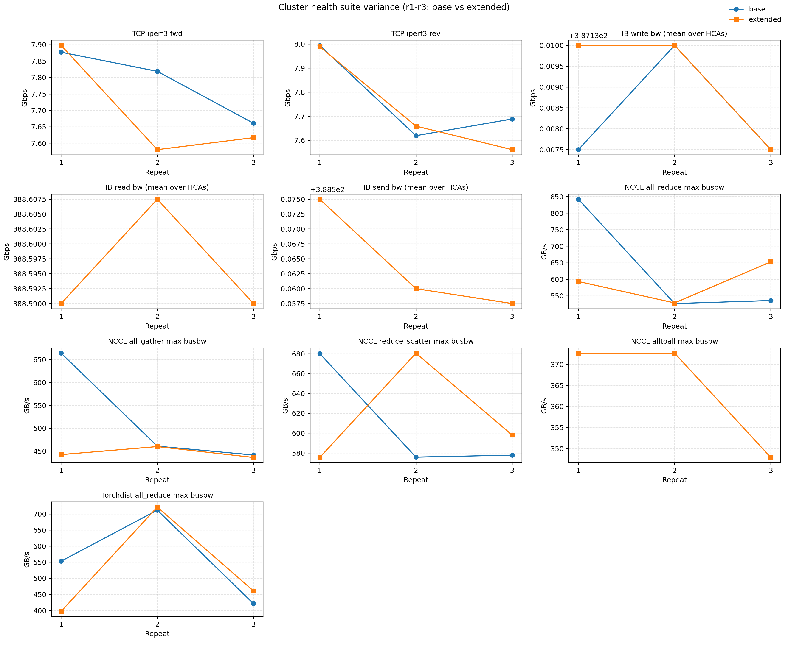
- Variance plot with clocks locked (post-fix, 3x repeats): 
- Variance report (locked clocks): [results/structured/2026-02-08_035722_health_suite_variance_post_eval_full_fixed_variance.md](results/structured/2026-02-08_035722_health_suite_variance_post_eval_full_fixed_variance.md)
- Baseline vs repeat comparison (extended suite): [results/structured/2026-02-08_035722_vs_032814_health_suite_extended_compare.md](results/structured/2026-02-08_035722_vs_032814_health_suite_extended_compare.md)

### A.1b Repeatability: 3x Suite Repeats (Base + Extended, Clocks Locked)

Repro:
```bash
cd code/cluster

scripts/run_cluster_health_suite_repeats.sh \
  --hosts node1,node2 \
  --repeats 3 \
  --mode both \
  --prefix 2026-02-08_035722_health_suite_variance_post_eval_full_fixed \
  --ssh-key ~/.ssh/ssh_key.pem \
  --oob-if enP22p3s0f3 \
  --nccl-ib-hca mlx5_0,mlx5_1,mlx5_4,mlx5_5 \
  --gpus-per-node 4
```

Artifacts:
- Repeat log (debug-only, gitignored): `results/raw/2026-02-08_035722_health_suite_variance_post_eval_full_fixed_repeats.log`
- Summary JSONs (6 runs): [results/structured/2026-02-08_035722_health_suite_variance_post_eval_full_fixed_r1_base_node1node2_cluster_health_suite_summary.json](results/structured/2026-02-08_035722_health_suite_variance_post_eval_full_fixed_r1_base_node1node2_cluster_health_suite_summary.json), [results/structured/2026-02-08_035722_health_suite_variance_post_eval_full_fixed_r1_extended_node1node2_cluster_health_suite_summary.json](results/structured/2026-02-08_035722_health_suite_variance_post_eval_full_fixed_r1_extended_node1node2_cluster_health_suite_summary.json), [results/structured/2026-02-08_035722_health_suite_variance_post_eval_full_fixed_r2_base_node1node2_cluster_health_suite_summary.json](results/structured/2026-02-08_035722_health_suite_variance_post_eval_full_fixed_r2_base_node1node2_cluster_health_suite_summary.json), [results/structured/2026-02-08_035722_health_suite_variance_post_eval_full_fixed_r2_extended_node1node2_cluster_health_suite_summary.json](results/structured/2026-02-08_035722_health_suite_variance_post_eval_full_fixed_r2_extended_node1node2_cluster_health_suite_summary.json), [results/structured/2026-02-08_035722_health_suite_variance_post_eval_full_fixed_r3_base_node1node2_cluster_health_suite_summary.json](results/structured/2026-02-08_035722_health_suite_variance_post_eval_full_fixed_r3_base_node1node2_cluster_health_suite_summary.json), [results/structured/2026-02-08_035722_health_suite_variance_post_eval_full_fixed_r3_extended_node1node2_cluster_health_suite_summary.json](results/structured/2026-02-08_035722_health_suite_variance_post_eval_full_fixed_r3_extended_node1node2_cluster_health_suite_summary.json)
- Variance report: [results/structured/2026-02-08_035722_health_suite_variance_post_eval_full_fixed_variance.md](results/structured/2026-02-08_035722_health_suite_variance_post_eval_full_fixed_variance.md)

Key results (coefficient of variation, CV%):
- Base suite: NCCL all-reduce max busbw CV 0.10%; torchdist max busbw CV 0.17%; iperf3 fwd/rev CV 0.88%/1.12%. Evidence: [results/structured/2026-02-08_035722_health_suite_variance_post_eval_full_fixed_variance.md](results/structured/2026-02-08_035722_health_suite_variance_post_eval_full_fixed_variance.md)
- Extended suite: NCCL all-reduce max busbw CV 0.05%; torchdist max busbw CV 0.43%; iperf3 fwd/rev CV 1.78%/2.92%. Evidence: [results/structured/2026-02-08_035722_health_suite_variance_post_eval_full_fixed_variance.md](results/structured/2026-02-08_035722_health_suite_variance_post_eval_full_fixed_variance.md)

Interpretation:
- With clocks locked and services healthy, NCCL + torchdist metrics are stable across repeats; most residual variance is on the OOB TCP path (iperf3), which is expected.

### A.1c IB SHARP Check (Forced CollNet)

Goal:
- Determine whether the IB fabric is SHARP-enabled and whether the software stack is wired up to use it (sharp_am + HCOLL / NCCL net plugin).

Repro:
```bash
cd code/cluster

SSH_KEY=~/.ssh/ssh_key.pem \
  scripts/check_ib_sharp.sh \
  --run-id 2026-02-08_082000_ib_sharp_check_v3 \
  --hosts node1,node2 \
  --oob-if enP22p3s0f3 \
  --nccl-ib-hca mlx5_0,mlx5_1,mlx5_4,mlx5_5 \
  --attempt-start-sharp-am \
  --sharp-am-host node1
```

Key result (this image):
- SHARP user-space is present (`/opt/mellanox/sharp`), but the forced NCCL CollNet run fails both before and after attempting to start `sharp_am`, so IB SHARP is not validated for NCCL here.

Evidence:
- Summary JSON: [results/structured/2026-02-08_082000_ib_sharp_check_v3_ib_sharp_check.json](results/structured/2026-02-08_082000_ib_sharp_check_v3_ib_sharp_check.json)
- Forced CollNet failure excerpts: [results/structured/2026-02-08_082000_ib_sharp_check_v3_nccl_collnet_all_reduce_before_start_error_excerpt.txt](results/structured/2026-02-08_082000_ib_sharp_check_v3_nccl_collnet_all_reduce_before_start_error_excerpt.txt), [results/structured/2026-02-08_082000_ib_sharp_check_v3_nccl_collnet_all_reduce_after_start_error_excerpt.txt](results/structured/2026-02-08_082000_ib_sharp_check_v3_nccl_collnet_all_reduce_after_start_error_excerpt.txt)

### A.2 NCCL all-reduce sweep (case study plots)

Repro:
```bash
cd code/cluster

# 1 node
scripts/run_nccl_all_reduce.sh \
  --run-id 2026-02-08_032814_neocloud_eval_full_fixed_node1 \
  --hosts localhost \
  --label node1

# 2 nodes
scripts/run_nccl_all_reduce.sh \
  --run-id 2026-02-08_032814_neocloud_eval_full_fixed_2nodes \
  --hosts node1,node2 \
  --label node1node2 \
  --ssh-key ~/.ssh/ssh_key.pem \
  --oob-if enP22p3s0f3 \
  --socket-ifname enP22p3s0f3 \
  --nccl-ib-hca mlx5_0,mlx5_1,mlx5_4,mlx5_5
```

Artifacts:
- [results/structured/2026-02-08_032814_neocloud_eval_full_fixed_node1_nccl.json](results/structured/2026-02-08_032814_neocloud_eval_full_fixed_node1_nccl.json)
- [results/structured/2026-02-08_032814_neocloud_eval_full_fixed_2nodes_nccl.json](results/structured/2026-02-08_032814_neocloud_eval_full_fixed_2nodes_nccl.json)

Plots:
- 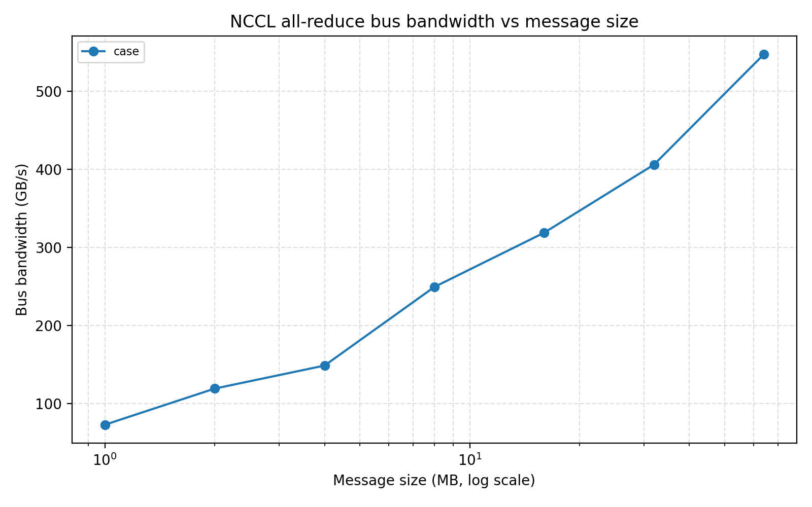
- 
- 
- 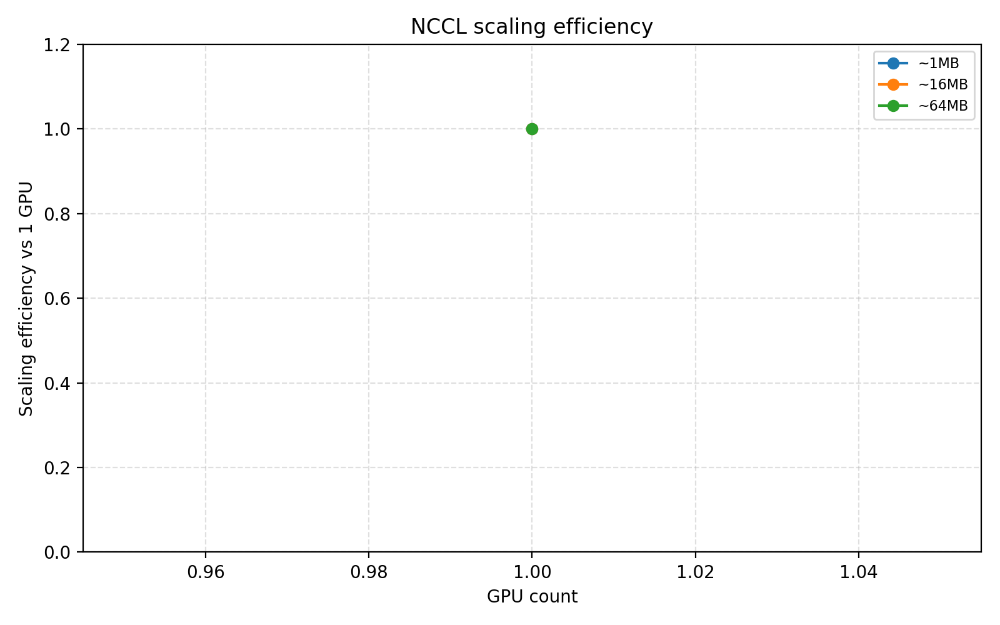

### A.3 MTU looks “weird but probably fine” (why)

Observation:
- OOB TCP interface (`enP22p3s0f3`) reports MTU=1500, but DF pings show path MTU=1442 between nodes.
- IP-over-IB netdev MTU is ~2044 on `ibP*`.
- RDMA path MTU is 4096 (from verbs device info).
- Evidence for observation block: [results/structured/2026-02-08_035613_mtu_oob_iface_node1.txt](results/structured/2026-02-08_035613_mtu_oob_iface_node1.txt), [results/structured/2026-02-08_035613_mtu_oob_iface_node2.txt](results/structured/2026-02-08_035613_mtu_oob_iface_node2.txt), [results/structured/2026-02-08_mtu_evidence_node1.txt](results/structured/2026-02-08_mtu_evidence_node1.txt), [results/structured/2026-02-08_mtu_evidence_node2.txt](results/structured/2026-02-08_mtu_evidence_node2.txt)

Interpretation:
- NCCL uses RDMA/verbs for the data plane, so the OOB/path MTU and IPoIB netdev MTU are not expected to cap NCCL bandwidth.
- The OOB MTU/path MTU mostly affects OpenMPI bootstrap, `ssh`, and `iperf3` on the OOB interface. The path MTU=1442 suggests overlay/tunnel overhead; it is worth flagging as an operator note but it is not the NCCL bottleneck.
- I did not try changing MTU sizes. On this cluster, `enP22p3s0f3` reports `maxmtu 1500` (so you cannot enable jumbo frames locally), and changing MTU on a management interface risks breaking SSH. Recommendation: do not tune MTU as a performance lever for NCCL; revisit only if you are debugging bootstrap reliability or large TCP transfers on the OOB network. Evidence: [results/structured/2026-02-08_035613_mtu_oob_iface_node1.txt](results/structured/2026-02-08_035613_mtu_oob_iface_node1.txt), [results/structured/2026-02-08_035613_mtu_oob_iface_node2.txt](results/structured/2026-02-08_035613_mtu_oob_iface_node2.txt), [results/structured/2026-02-08_mtu_evidence_node1.txt](results/structured/2026-02-08_mtu_evidence_node1.txt), [results/structured/2026-02-08_mtu_evidence_node2.txt](results/structured/2026-02-08_mtu_evidence_node2.txt), [results/structured/2026-02-08_nccl_net_ib_evidence.txt](results/structured/2026-02-08_nccl_net_ib_evidence.txt)

Evidence:
- OOB MTU/path MTU evidence: [results/structured/2026-02-08_035613_mtu_oob_iface_node1.txt](results/structured/2026-02-08_035613_mtu_oob_iface_node1.txt), [results/structured/2026-02-08_035613_mtu_oob_iface_node2.txt](results/structured/2026-02-08_035613_mtu_oob_iface_node2.txt)
- IPoIB MTU=2044 (node1/node2) and verbs `active_mtu=4096` (mlx5_0/1/4/5): [results/structured/2026-02-08_mtu_evidence_node1.txt](results/structured/2026-02-08_mtu_evidence_node1.txt), [results/structured/2026-02-08_mtu_evidence_node2.txt](results/structured/2026-02-08_mtu_evidence_node2.txt)
- NCCL is using the IB plugin (verbs/RDMA data plane) and uses `enP22p3s0f3` as its OOB/bootstrap interface: [results/structured/2026-02-08_nccl_net_ib_evidence.txt](results/structured/2026-02-08_nccl_net_ib_evidence.txt)

### A.4 Critical anomaly (diagnosed + cleared): NCCL “low-band” regime

What happened (and why it matters):
- I observed two performance regimes for the same 2-node workload:
  - High-band: ~840 GB/s at 16 GiB all-reduce
  - Low-band: ~530 GB/s at 16 GiB all-reduce
- The low-band regime strongly correlated with `node1` physical GPU0 being stuck at **1132 MHz SM** under load.
- The telemetry showed GPU0 sustaining high utilization and high power while holding the low SM clock, without SW power cap / thermal slowdown flags in the sampled `clocks_event_reasons` fields (the only reason consistently marked `Active` in this capture was `gpu_idle`). This looks like a stuck clock/policy state (cleared by GPU reset), not a normal “power cap” behavior.
- Evidence for summary block: [results/structured/2026-02-07_140642_cluster_health_suite_node1node2_cluster_health_suite_summary.json](results/structured/2026-02-07_140642_cluster_health_suite_node1node2_cluster_health_suite_summary.json), [results/structured/2026-02-07_224500_nccl_16g_baseline_ppr4_bindnone_node1node2_cluster_health_suite_summary.json](results/structured/2026-02-07_224500_nccl_16g_baseline_ppr4_bindnone_node1node2_cluster_health_suite_summary.json), [results/structured/2026-02-07_222530_gpu_gemm_telemetry_lock_node1_node1_gpu0_telemetry.csv](results/structured/2026-02-07_222530_gpu_gemm_telemetry_lock_node1_node1_gpu0_telemetry.csv), [results/structured/2026-02-07_222530_gpu_gemm_telemetry_lock_node1_node1_gpu1_telemetry.csv](results/structured/2026-02-07_222530_gpu_gemm_telemetry_lock_node1_node1_gpu1_telemetry.csv)

Evidence (plots + structured results):
- Low vs high regime overlay: 
- Including vs excluding `node1` physical GPU0: 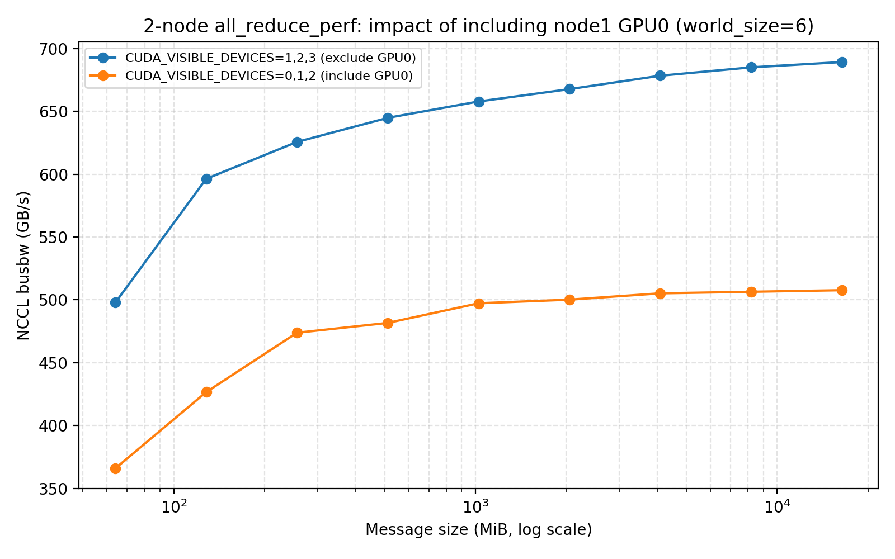
- Telemetry confirming stuck SM clock: 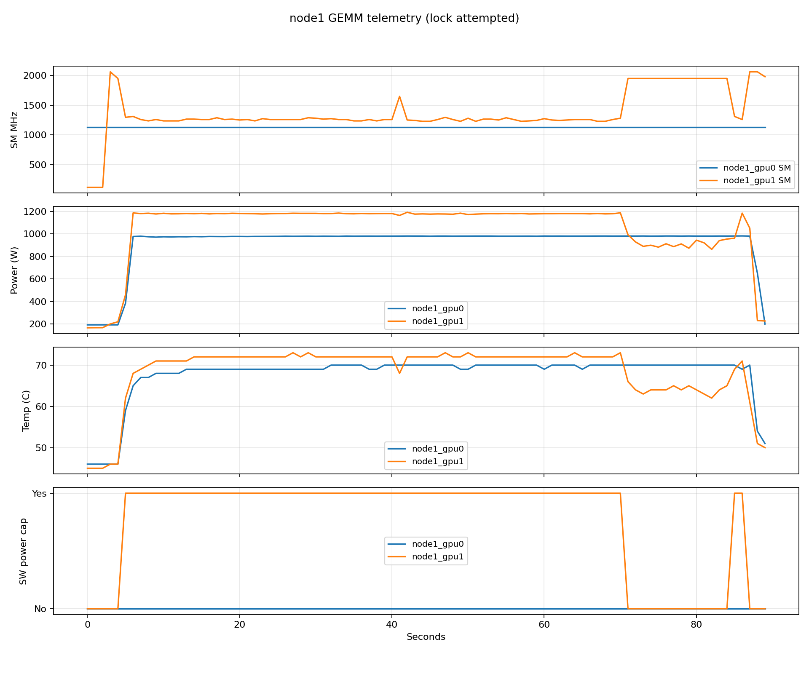
- Telemetry data (for the plot above): [results/structured/2026-02-07_222530_gpu_gemm_telemetry_lock_node1_node1_gpu0_telemetry.csv](results/structured/2026-02-07_222530_gpu_gemm_telemetry_lock_node1_node1_gpu0_telemetry.csv), [results/structured/2026-02-07_222530_gpu_gemm_telemetry_lock_node1_node1_gpu1_telemetry.csv](results/structured/2026-02-07_222530_gpu_gemm_telemetry_lock_node1_node1_gpu1_telemetry.csv)
- High-band summary: [results/structured/2026-02-07_140642_cluster_health_suite_node1node2_cluster_health_suite_summary.json](results/structured/2026-02-07_140642_cluster_health_suite_node1node2_cluster_health_suite_summary.json)
- Low-band summary: [results/structured/2026-02-07_224500_nccl_16g_baseline_ppr4_bindnone_node1node2_cluster_health_suite_summary.json](results/structured/2026-02-07_224500_nccl_16g_baseline_ppr4_bindnone_node1node2_cluster_health_suite_summary.json)

Evidence (load-bearing for the RCA):
- Kernel log tail showing repeated Xid 31 MMU faults on node1 GPU0 PCI address (`00000008:01:00.0`):
  - [results/structured/2026-02-07_232000_node1_dmesg_nvrm_xid_tail.log](results/structured/2026-02-07_232000_node1_dmesg_nvrm_xid_tail.log)
- `nvidia-smi -q` snapshots (GPU0 vs GPU1) taken while the stuck-clock condition was present:
  - [results/structured/2026-02-07_231900_node1_gpu0_nvidia-smi-q.txt](results/structured/2026-02-07_231900_node1_gpu0_nvidia-smi-q.txt)
  - [results/structured/2026-02-07_231900_node1_gpu1_nvidia-smi-q.txt](results/structured/2026-02-07_231900_node1_gpu1_nvidia-smi-q.txt)
- GPU reset attempt logs (stop services, reset GPU0, restart services):
  - [results/structured/2026-02-07_232200_gpu0_reset_attempt_nvidia-smi_gpu_reset.txt](results/structured/2026-02-07_232200_gpu0_reset_attempt_nvidia-smi_gpu_reset.txt)
  - [results/structured/2026-02-07_232200_gpu0_reset_attempt_post_start_status.txt](results/structured/2026-02-07_232200_gpu0_reset_attempt_post_start_status.txt)

Resolution (what returned the cluster to stable high-band):
- A GPU reset cleared the stuck-clock state on `node1` physical GPU0.
- Post-reset, 16 GiB all-reduce returns to ~839 GB/s and is stable across repeats.
- Evidence:
  - Post-reset repeats plot: 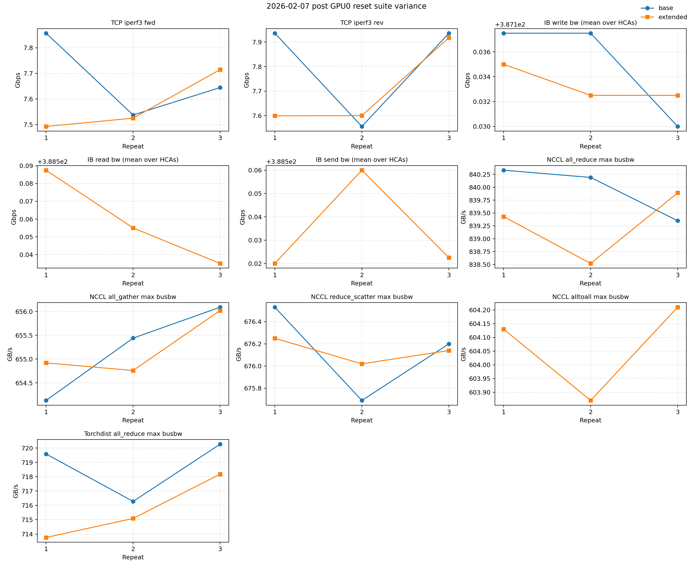
  - Post-reset variance markdown: [results/structured/2026-02-07_233200_cluster_health_suite_post_gpu0_reset_variance.md](results/structured/2026-02-07_233200_cluster_health_suite_post_gpu0_reset_variance.md)

Additional anomaly (investigated + cleared): all-gather / reduce-scatter “mode shift”
- I observed a case where **all-reduce stayed high** (~840 GB/s at 16 GiB) but **all-gather/reduce-scatter were ~2x lower** at 4 GiB (~324/336 GB/s) in the `2026-02-08_005628_neocloud_fullstack` suite run.
- A same-day rerun (same configuration) returned all-gather/reduce-scatter to the expected high band (~655/676 GB/s at 4 GiB).
- Evidence:
  - Low run summary: [results/structured/2026-02-08_005628_neocloud_fullstack_health_suite_base_node1node2_cluster_health_suite_summary.json](results/structured/2026-02-08_005628_neocloud_fullstack_health_suite_base_node1node2_cluster_health_suite_summary.json)
  - Rerun summary: [results/structured/2026-02-08_014214_cluster_health_suite_post_reset_rerun_r1_base_node1node2_cluster_health_suite_summary.json](results/structured/2026-02-08_014214_cluster_health_suite_post_reset_rerun_r1_base_node1node2_cluster_health_suite_summary.json)
  - Overlays: 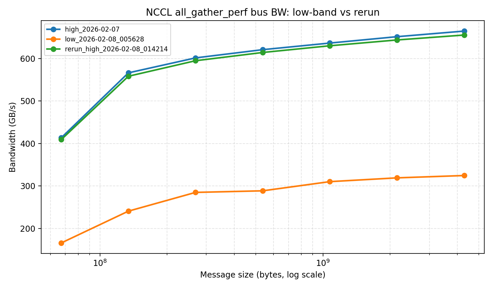, 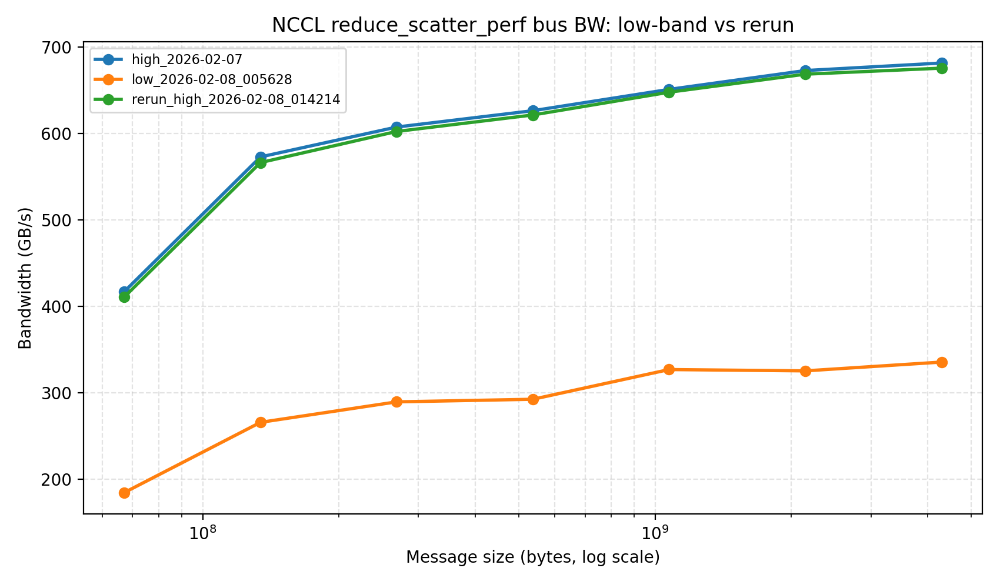

### A.5 “Is this NUMA pinning?” (answer: no)

I varied OpenMPI mapping/binding while in the low-band regime; 16 GiB all-reduce stayed ~529 GB/s within noise:
- Baseline (ppr:4:node, bind none): [results/structured/2026-02-07_224500_nccl_16g_baseline_ppr4_bindnone_node1node2_cluster_health_suite_summary.json](results/structured/2026-02-07_224500_nccl_16g_baseline_ppr4_bindnone_node1node2_cluster_health_suite_summary.json)
- Reordered device mapping: [results/structured/2026-02-07_225000_nccl_16g_reorder_1230_ppr4_bindnone_node1node2_cluster_health_suite_summary.json](results/structured/2026-02-07_225000_nccl_16g_reorder_1230_ppr4_bindnone_node1node2_cluster_health_suite_summary.json)
- Socket binding (ppr:2:socket, bind socket): [results/structured/2026-02-07_225200_nccl_16g_bind_socket_ppr2socket_node1node2_cluster_health_suite_summary.json](results/structured/2026-02-07_225200_nccl_16g_bind_socket_ppr2socket_node1node2_cluster_health_suite_summary.json)
- Clock ramp baseline: [results/structured/2026-02-07_225600_nccl_16g_baseline_ramp_ppr4_bindnone_node1node2_cluster_health_suite_summary.json](results/structured/2026-02-07_225600_nccl_16g_baseline_ramp_ppr4_bindnone_node1node2_cluster_health_suite_summary.json)

Note: `numactl -H` reports 34 NUMA nodes, but only nodes 0/1 have CPUs; the rest are memory-only NUMA nodes. For CPU pinning you still care about CPU NUMA 0/1, and binding changes did not recover performance while GPU0 was stuck: [results/structured/2026-02-08_numactl_numa_evidence_node1.txt](results/structured/2026-02-08_numactl_numa_evidence_node1.txt), [results/structured/2026-02-08_numactl_numa_evidence_node2.txt](results/structured/2026-02-08_numactl_numa_evidence_node2.txt)

### A.6 NCCL debug verbosity guidance

- Keep NCCL debug minimal during sweeps. Our scripts default to `NCCL_DEBUG=INFO` and `NCCL_DEBUG_SUBSYS=INIT`.
- If diagnosing interface selection or RDMA behavior, temporarily add subsystems like `NET,ENV` and treat those runs as diagnostic-only (not performance baselines).

## Benchmark B (Inference Story): vLLM Online Serving Concurrency Sweep

Goal:
- Characterize serving throughput and tail latency vs concurrency, and identify the knee where latency becomes pathological.

Config:
- Model: `openai/gpt-oss-120b`
- TP: 4
- ISL/OSL: 1024/1024
- Concurrency sweep: 32, 64, 128, 256, 512

Repro:
```bash
cd code/cluster

scripts/repro/run_vllm_serve_sweep_container.sh \
  --run-id 2026-02-08_032814_neocloud_eval_full_fixed \
  --label node1 \
  --model openai/gpt-oss-120b \
  --tp 4 \
  --isl 1024 \
  --osl 1024 \
  --concurrency-range "32 64 128 256 512" \
  --port 8888
```

Artifacts:
- [results/structured/2026-02-08_032814_neocloud_eval_full_fixed_node1_vllm_serve_sweep.csv](results/structured/2026-02-08_032814_neocloud_eval_full_fixed_node1_vllm_serve_sweep.csv)
- [results/structured/2026-02-08_032814_neocloud_eval_full_fixed_node1_vllm_serve_sweep.jsonl](results/structured/2026-02-08_032814_neocloud_eval_full_fixed_node1_vllm_serve_sweep.jsonl)
- Clock lock evidence (required): [results/structured/2026-02-08_032814_neocloud_eval_full_fixed_node1_vllm_serve_sweep_clock_lock.json](results/structured/2026-02-08_032814_neocloud_eval_full_fixed_node1_vllm_serve_sweep_clock_lock.json)

Plots:
- 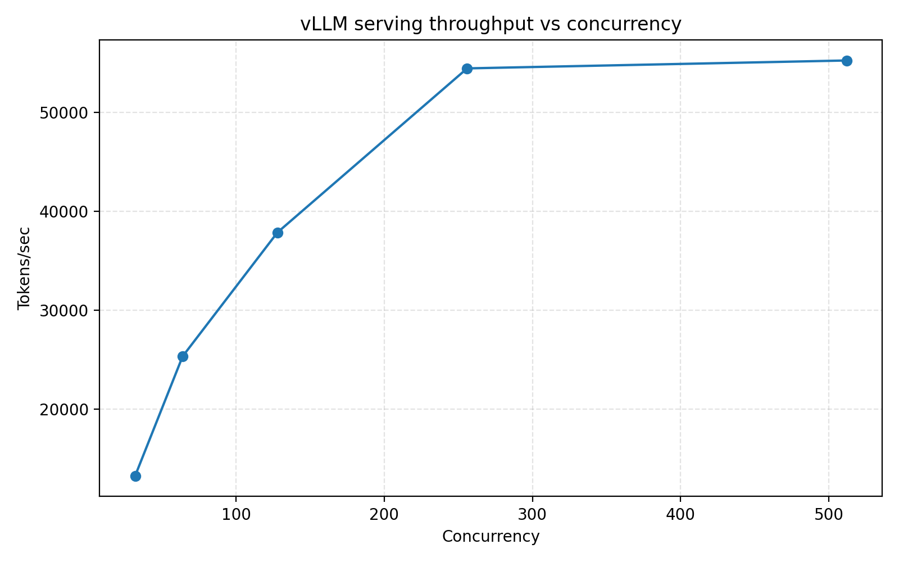
- 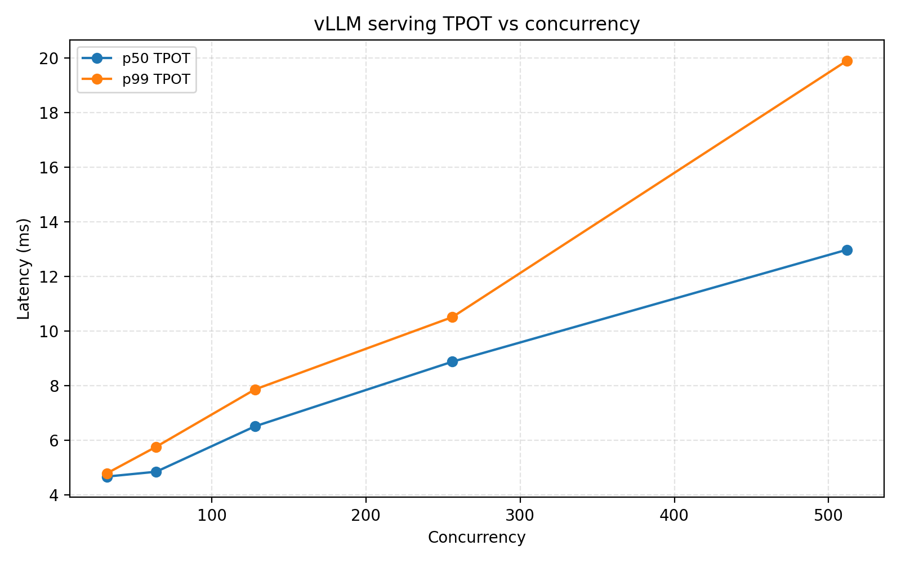
- 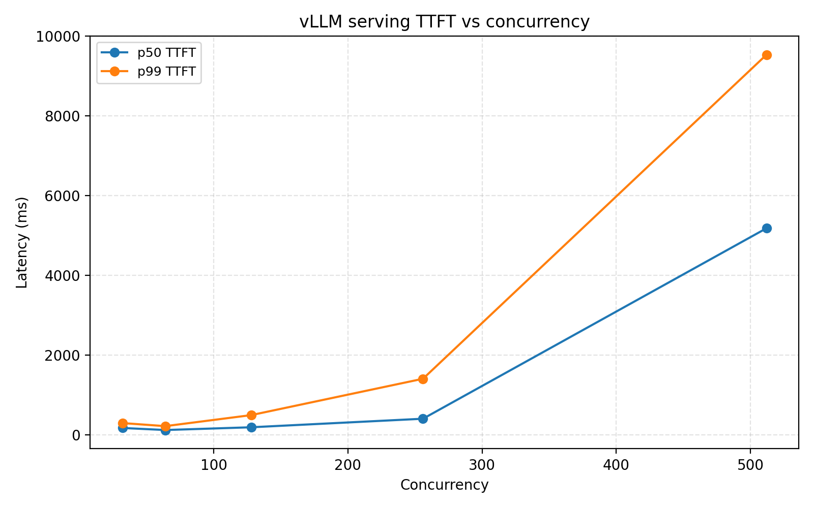

Key result:
- Throughput rises steadily with concurrency, but TTFT has a sharp knee:
  - `c=64`: mean TTFT ~123 ms
  - `c=256`: mean TTFT ~464 ms
  - `c=512`: mean TTFT ~5.3 s
- Evidence: [results/structured/2026-02-08_032814_neocloud_eval_full_fixed_node1_vllm_serve_sweep.csv](results/structured/2026-02-08_032814_neocloud_eval_full_fixed_node1_vllm_serve_sweep.csv), [docs/figures/2026-02-08_032814_neocloud_eval_full_fixed_node1_vllm_serve_ttft_vs_concurrency.png](docs/figures/2026-02-08_032814_neocloud_eval_full_fixed_node1_vllm_serve_ttft_vs_concurrency.png)

## Supporting: Compute Sanity (BF16 GEMM, per GPU)

Goal:
- Detect per-GPU deltas under locked clocks.

Repro:
```bash
cd code/cluster

scripts/run_gemm_sanity_all_nodes.sh \
  --run-id 2026-02-08_032814_neocloud_eval_full_fixed \
  --hosts node1,node2 \
  --labels node1,node2 \
  --ssh-key ~/.ssh/ssh_key.pem
```

Artifacts:
- [results/structured/2026-02-08_032814_neocloud_eval_full_fixed_node1_gemm_gpu_sanity.csv](results/structured/2026-02-08_032814_neocloud_eval_full_fixed_node1_gemm_gpu_sanity.csv)
- [results/structured/2026-02-08_032814_neocloud_eval_full_fixed_node2_gemm_gpu_sanity.csv](results/structured/2026-02-08_032814_neocloud_eval_full_fixed_node2_gemm_gpu_sanity.csv)

Plot:
- 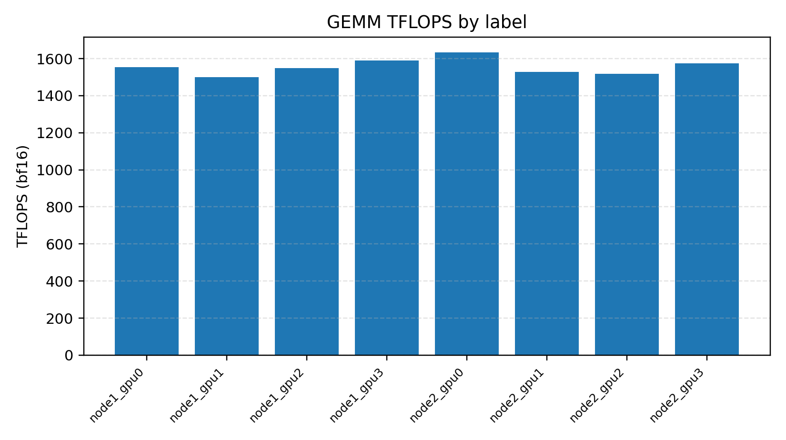

Post-reset sanity (node1 + node2; includes app/current clocks per GPU):
- [results/structured/2026-02-07_235200_gemm_node1node2_post_gpu0_reset_node1.csv](results/structured/2026-02-07_235200_gemm_node1node2_post_gpu0_reset_node1.csv)
- [results/structured/2026-02-07_235200_gemm_node1node2_post_gpu0_reset_node2.csv](results/structured/2026-02-07_235200_gemm_node1node2_post_gpu0_reset_node2.csv)
- Plot: 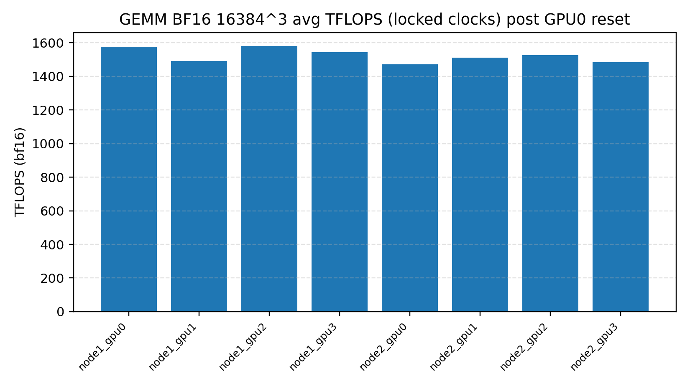

Interpretation:
- For this “sanity check” workload, node-level mean BF16 GEMM throughput matches closely across nodes (within ~1% on the latest suite run; node2 slightly higher), and per-GPU spread under SW power cap is expected. Use larger deltas (or persistent clock/power differences) as a signal to investigate. Evidence: [results/structured/2026-02-08_032814_neocloud_eval_full_fixed_node1_gemm_gpu_sanity.csv](results/structured/2026-02-08_032814_neocloud_eval_full_fixed_node1_gemm_gpu_sanity.csv), [results/structured/2026-02-08_032814_neocloud_eval_full_fixed_node2_gemm_gpu_sanity.csv](results/structured/2026-02-08_032814_neocloud_eval_full_fixed_node2_gemm_gpu_sanity.csv), [docs/figures/2026-02-08_032814_neocloud_eval_full_fixed_gemm_gpu_sanity.png](docs/figures/2026-02-08_032814_neocloud_eval_full_fixed_gemm_gpu_sanity.png)

## Supporting: Storage (fio) and why it is a “fallback”

Why fio is here:
- If inference/training benchmarks are blocked (egress, model downloads, container policy), fio gives a portable baseline of local filesystem I/O.
- fio is not a baseline-vs-optimized speedup story; it is a “what does local disk look like” sanity check.

Repro:
```bash
cd code/cluster

scripts/run_fio_bench.sh \
  --run-id 2026-02-08_032814_neocloud_eval_full_fixed \
  --label node1 \
  --test-dir /tmp \
  --runtime 30
```

Artifacts:
- [results/structured/2026-02-08_032814_neocloud_eval_full_fixed_node1_fio.json](results/structured/2026-02-08_032814_neocloud_eval_full_fixed_node1_fio.json)

Plot:
- 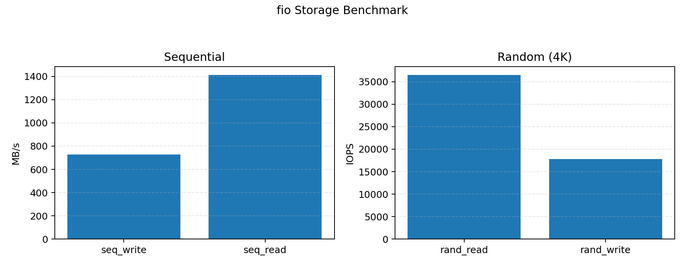

## Suggested NVMe Mount Strategy (Training + Inference)

Reality check (shared FS):
- I did not observe any managed shared filesystem mounts in discovery (`mount`/`df` show only local ext4 + tmpfs): [results/structured/2026-02-08_032814_neocloud_eval_full_fixed_node1_storage.json](results/structured/2026-02-08_032814_neocloud_eval_full_fixed_node1_storage.json), [results/structured/2026-02-08_032814_neocloud_eval_full_fixed_node2_storage.json](results/structured/2026-02-08_032814_neocloud_eval_full_fixed_node2_storage.json)

Observed per-node NVMe layout (important):
- Root filesystem (`/`) is on a 4T “BlueField NVMe SNAP Controller” device.
- There is a large pool of **unmounted** Samsung NVMe devices (ext4 partitions present but not mounted by default):
  - 8x ~3.5T `SAMSUNG MZTL23T8HCLS-00A07`
  - 1x ~1.7T `SAMSUNG MZ1L21T9HCLS-00A07`
- Evidence (`lsblk`): [results/structured/2026-02-08_032814_neocloud_eval_full_fixed_node1_storage.json](results/structured/2026-02-08_032814_neocloud_eval_full_fixed_node1_storage.json), [results/structured/2026-02-08_032814_neocloud_eval_full_fixed_node2_storage.json](results/structured/2026-02-08_032814_neocloud_eval_full_fixed_node2_storage.json)

Assumption:
- You will stage the same datasets and model weights to both nodes (local-only; no shared FS by default).

Scratch performance (measured, read-only, safe probes):
- I ran read-only `fio` directly against raw block devices (no mount changes) to estimate scratch potential.
- Single Samsung ~3.5T NVMe (sample `nvme0n1`) achieves:
  - seqread (1 MiB): ~6.63 GiB/s
  - randread (4 KiB): ~0.865 MIOPS (p99 clat ~0.6-0.9 ms)
- Single Samsung ~1.7T NVMe (sample `nvme2n1`/`nvme1n1`) achieves:
  - seqread (1 MiB): ~5.13 GiB/s
  - randread (4 KiB): ~0.82 MIOPS
- Evidence + summary: [results/structured/2026-02-08_042500_scratch_nvme_readonly_summary.json](results/structured/2026-02-08_042500_scratch_nvme_readonly_summary.json), 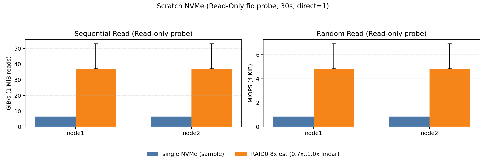
- Raw fio JSONs:
  - node1: [results/structured/2026-02-08_042500_scratch_nvme_readonly_node1_nvme0n1_seqread.json](results/structured/2026-02-08_042500_scratch_nvme_readonly_node1_nvme0n1_seqread.json), [results/structured/2026-02-08_042500_scratch_nvme_readonly_node1_nvme0n1_randread4k.json](results/structured/2026-02-08_042500_scratch_nvme_readonly_node1_nvme0n1_randread4k.json)
  - node2: [results/structured/2026-02-08_042500_scratch_nvme_readonly_node2_nvme0n1_seqread.json](results/structured/2026-02-08_042500_scratch_nvme_readonly_node2_nvme0n1_seqread.json), [results/structured/2026-02-08_042500_scratch_nvme_readonly_node2_nvme0n1_randread4k.json](results/structured/2026-02-08_042500_scratch_nvme_readonly_node2_nvme0n1_randread4k.json)

Recommendation (what I’d do for training + inference):
- Create a single `/scratch` per node as **RAID0 across the 8 equal-size ~3.5T Samsung drives**, and format as XFS (simple + fast).
  - Using the measured single-drive numbers, a simple linear estimate for 8-drive RAID0 is ~53 GiB/s seqread and ~6.9 MIOPS randread; a conservative planning range is **~37-53 GiB/s** and **~4.8-6.9 MIOPS** (details in the summary JSON): [results/structured/2026-02-08_042500_scratch_nvme_readonly_summary.json](results/structured/2026-02-08_042500_scratch_nvme_readonly_summary.json)
- Keep the smaller ~1.7T Samsung NVMe as a separate mount (e.g., `/scratch-small`) for caches/logs, or leave it unused until the provider blesses a policy; mixing uneven drive sizes into a single RAID0 often wastes capacity or complicates layout.
- Stage per-node datasets/weights to `/scratch` and treat checkpoints as “sync to durable store periodically”.

Pros / cons (quantified):
- Pros: one mount point; scratch pool capacity ~28T per node (8x3.5T) plus optional extra ~1.7T (see `lsblk` evidence above); sequential read headroom **tens of GiB/s** vs the current `/tmp` baseline (~1.4 GB/s seq read): [results/structured/2026-02-08_032814_neocloud_eval_full_fixed_node1_fio.json](results/structured/2026-02-08_032814_neocloud_eval_full_fixed_node1_fio.json)
- Cons: RAID0 failure domain is “any single drive kills the volume” (acceptable only if scratch is explicitly ephemeral); requires a provider-blessed mount script/policy.

Staging overhead (if you replicate data node1<->node2):
- The measured OOB TCP path is **~7.62–7.85 Gbps** in the latest health suite (about **~0.89–0.91 GiB/s** in the idealized `Gbps -> GiB/s` conversion), so copying **1 TiB** node-to-node is on the order of **~19 minutes** best-case (and 10 TiB is hours). Evidence: [results/structured/2026-02-08_032814_neocloud_eval_full_fixed_health_suite_extended_node1node2_cluster_health_suite_summary.json](results/structured/2026-02-08_032814_neocloud_eval_full_fixed_health_suite_extended_node1node2_cluster_health_suite_summary.json)

Operator questions (still required):
- Are the unmounted NVMe devices intended as ephemeral local scratch (safe to use and expected to be wiped), or are they reserved/managed?
- Is there a provider-blessed mount script (RAID/XFS options, fstrim policy, monitoring, failure handling)?

## GPU Health Snapshot (ECC/Row Remap/Page Retirement)

What I observed:
- Volatile Uncorr ECC (from `nvidia-smi`): 0 on all GPUs.
- Row remapper: 0 correctable/uncorrectable, pending=No, failure=No.
- Page retirement counters: **N/A on both nodes** via NVML query (treat as “unsupported/unavailable reporting”, not “zero”).
- Evidence for observation block: [node1_meta], [node2_meta], [results/structured/2026-02-08_page_retirement_query_node1.csv](results/structured/2026-02-08_page_retirement_query_node1.csv), [results/structured/2026-02-08_page_retirement_query_node2.csv](results/structured/2026-02-08_page_retirement_query_node2.csv)

Evidence:
- [results/structured/2026-02-08_page_retirement_query_node1.csv](results/structured/2026-02-08_page_retirement_query_node1.csv)
- [results/structured/2026-02-08_page_retirement_query_node2.csv](results/structured/2026-02-08_page_retirement_query_node2.csv)
- `nvidia-smi` (Volatile Uncorr ECC column): [node1_meta], [node2_meta].

Significance:
- This is primarily an **observability gap** (NVML is not exposing retired-page counters here), not an immediate “GPU is broken” signal by itself.
- For future cluster bringup, always record which NVML health counters are supported (ECC, row remap, retired pages) and ask ops what they use operationally to detect memory degradation if retired pages are unavailable.

## NVLink P2P Sanity + Tooling Notes

NVLink sanity (independent P2P microbenchmark sweep on node1):
- Bandwidth matrix: 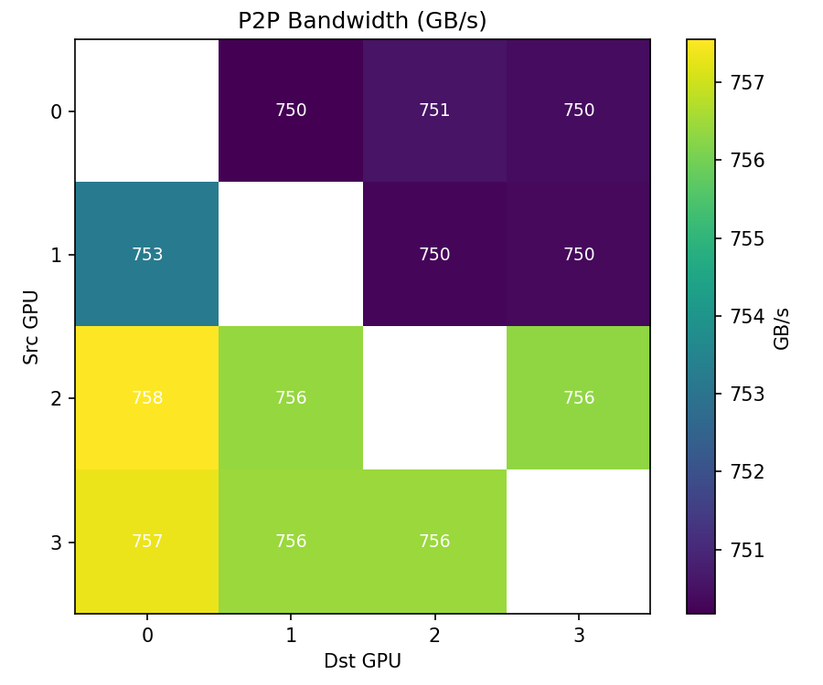
- Latency matrix: 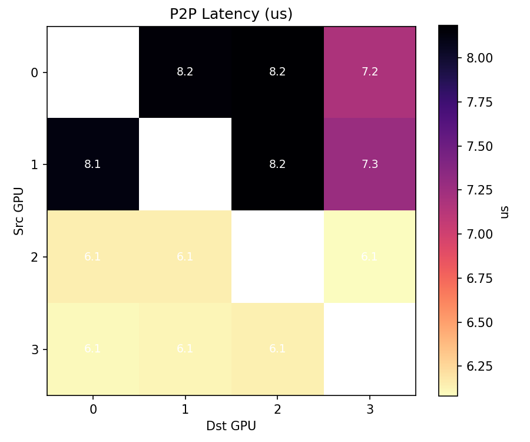
- Curves: [docs/figures/2026-02-06_node1_nvlink_p2p_bw_curve.png](docs/figures/2026-02-06_node1_nvlink_p2p_bw_curve.png), [docs/figures/2026-02-06_node1_nvlink_p2p_lat_curve.png](docs/figures/2026-02-06_node1_nvlink_p2p_lat_curve.png)
- Data: [results/structured/2026-02-06_node1_nvlink_p2p_sweep.csv](results/structured/2026-02-06_node1_nvlink_p2p_sweep.csv), [results/structured/2026-02-06_node1_nvlink_p2p_results.csv](results/structured/2026-02-06_node1_nvlink_p2p_results.csv)

Tooling anomalies (not cluster health signals by themselves):
- Cluster Perf P2P bandwidth tool bug (fixed; important stakeholder note). Symptom: `ERROR` entries + impossible bandwidth (`20536.2 GB/s` max) in the printed matrix. Root cause: cross-device copies were being timed incorrectly (CUDA event timing can under-measure async cross-device work), producing near-zero elapsed time and impossible GB/s. Fix: changed timing to wall-clock with explicit device synchronization on both src+dst devices.
- Evidence (P2P tool bug): [results/structured/2026-02-08_p2p_bandwidth_tool_before_excerpt.txt](results/structured/2026-02-08_p2p_bandwidth_tool_before_excerpt.txt), [results/structured/2026-02-08_p2p_bandwidth_tool_after_excerpt.txt](results/structured/2026-02-08_p2p_bandwidth_tool_after_excerpt.txt), , `$CLUSTER_PERF_SUITE_DIR/standalone/compute/p2p-bandwidth/p2p-bandwidth.py`
- Grouped-GEMM DeepGEMM backend (GB200). Status: **fixed** (UE8M0 scaling-factor path).
  - Root cause: DeepGEMM fails on SM100/GB200 if invoked with the legacy scaling-factor settings (`use_ue8m0=False` + `disable_ue8m0_cast=True`), yielding `Unsupported architecture or scaling factor types`.
  - Fix: select UE8M0 scaling (`use_ue8m0=True` + `disable_ue8m0_cast=False`) on arch>=10; keep legacy behavior for older arch. Patch: [code/cluster_perf_patches/deepgemm_gb200_grouped_gemm_ue8m0.patch](code/cluster_perf_patches/deepgemm_gb200_grouped_gemm_ue8m0.patch)
- Quantification (why this matters): with DeepGEMM enabled, we now get **48/48** DeepGEMM datapoints on `--preset all` and it is materially faster than the torch loop baselines:
  - DeepGEMM FP8: **1618.5–2891.5 TFLOPS** (p50 **2597.1**)
  - Speedup vs `torch_fp8` loop baseline: p50 **3.15x** (min **1.68x**, max **16.33x**); **43/48 shapes >=2x**
  - Speedup vs `torch_fp16`: p50 **1.55x** (min **1.33x**, max **1.74x**)
  - Evidence: [results/structured/2026-02-08_075036_deepgemm_grouped_gemm_fixed_summary.json](results/structured/2026-02-08_075036_deepgemm_grouped_gemm_fixed_summary.json), 
- Before fix (stakeholder visibility): DeepGEMM produced **0 valid datapoints** across **48 shapes**. The fallback `torch_fp8` baseline was highly shape-sensitive and often much slower than FP16 for small-M shapes. Evidence: [results/structured/2026-02-08_deepgemm_grouped_gemm_before_excerpt.txt](results/structured/2026-02-08_deepgemm_grouped_gemm_before_excerpt.txt), [results/structured/2026-02-08_013501_grouped_gemm_torch_fp16_vs_fp8_summary.json](results/structured/2026-02-08_013501_grouped_gemm_torch_fp16_vs_fp8_summary.json), 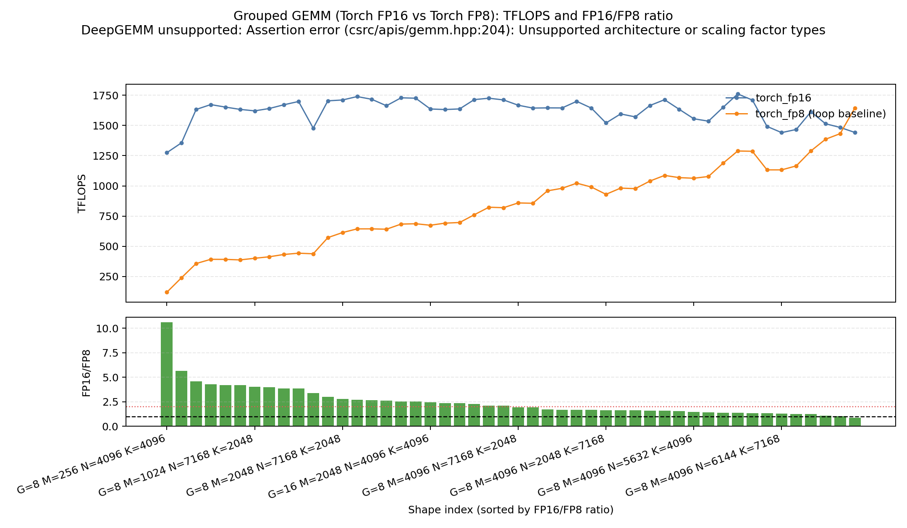
- Evidence (after fix, full log + clock lock): [results/structured/2026-02-08_075036_deepgemm_grouped_gemm_fixed_grouped_gemm_deepgemm_fixed.txt](results/structured/2026-02-08_075036_deepgemm_grouped_gemm_fixed_grouped_gemm_deepgemm_fixed.txt), [results/structured/2026-02-08_075036_deepgemm_grouped_gemm_fixed_node1_clock_lock.json](results/structured/2026-02-08_075036_deepgemm_grouped_gemm_fixed_node1_clock_lock.json)

Cluster Perf notes (not evidence links):
- Networking notes (IMEX port + multi-node bringup): `$CLUSTER_PERF_SUITE_DIR/standalone/docs/gb200-networking.md`

P2P microbenchmark sources (for reproducibility and potential Cluster Perf uplift):
- `scripts/benchmarks/p2p_bw_latency.cu`
- `scripts/benchmarks/run_p2p_sweep.sh`
- `scripts/benchmarks/plot_p2p_sweep.py`

## Cluster Perf Cross-Check (Single Node, node1)

Provenance:
- Working copy used for Cluster Perf suite runs in this report: `$CLUSTER_PERF_SUITE_DIR` (snapshot dir: `$CLUSTER_PERF_SNAPSHOT_DIR`; provenance JSON: [results/structured/2026-02-08_031318_cluster_perf_repo_snapshot_node2_provenance.json](results/structured/2026-02-08_031318_cluster_perf_repo_snapshot_node2_provenance.json))

Goal:
- Independently validate single-node (4-GPU) compute + NVLink P2P + collectives + storage + inference using the Cluster Perf standalone suite (containerized).

Run ID:
- `2026-02-08_011938_cluster_perf_node1` (node1 only; clocks locked via `scripts/run_with_gpu_clocks.sh`)
- Manifest (file hashes + artifact counts): [results/structured/2026-02-08_011938_cluster_perf_node1_manifest.json](results/structured/2026-02-08_011938_cluster_perf_node1_manifest.json)

Compute suite artifacts:
- GEMM: [results/structured/2026-02-08_011938_cluster_perf_node1_gemm_bench.txt](results/structured/2026-02-08_011938_cluster_perf_node1_gemm_bench.txt)
- MAMF: [results/structured/2026-02-08_011938_cluster_perf_node1_mamf_finder.txt](results/structured/2026-02-08_011938_cluster_perf_node1_mamf_finder.txt)
- P2P bandwidth: [results/structured/2026-02-08_011938_cluster_perf_node1_p2p_bandwidth.txt](results/structured/2026-02-08_011938_cluster_perf_node1_p2p_bandwidth.txt)
- nvbandwidth: [results/structured/2026-02-08_011938_cluster_perf_node1_nvbandwidth.txt](results/structured/2026-02-08_011938_cluster_perf_node1_nvbandwidth.txt)
- Clock-lock evidence: [results/structured/2026-02-08_011938_cluster_perf_node1_compute_clock_lock.json](results/structured/2026-02-08_011938_cluster_perf_node1_compute_clock_lock.json)

Networking suite artifacts:
- torch allreduce bench: [results/structured/2026-02-08_011938_cluster_perf_node1_torch_allreduce_bench.txt](results/structured/2026-02-08_011938_cluster_perf_node1_torch_allreduce_bench.txt)
- NCCL stability bench: [results/structured/2026-02-08_011938_cluster_perf_node1_nccl_stability_bench.txt](results/structured/2026-02-08_011938_cluster_perf_node1_nccl_stability_bench.txt)
- Clock-lock evidence: [results/structured/2026-02-08_011938_cluster_perf_node1_networking_clock_lock.json](results/structured/2026-02-08_011938_cluster_perf_node1_networking_clock_lock.json)

Storage suite artifacts:
- fio summary: [results/structured/2026-02-08_011938_cluster_perf_node1_fio_summary.txt](results/structured/2026-02-08_011938_cluster_perf_node1_fio_summary.txt)
- fio JSONs: [results/structured/2026-02-08_011938_cluster_perf_node1_fio_seq_read.json](results/structured/2026-02-08_011938_cluster_perf_node1_fio_seq_read.json), [results/structured/2026-02-08_011938_cluster_perf_node1_fio_seq_write.json](results/structured/2026-02-08_011938_cluster_perf_node1_fio_seq_write.json), [results/structured/2026-02-08_011938_cluster_perf_node1_fio_rand_read.json](results/structured/2026-02-08_011938_cluster_perf_node1_fio_rand_read.json), [results/structured/2026-02-08_011938_cluster_perf_node1_fio_rand_write.json](results/structured/2026-02-08_011938_cluster_perf_node1_fio_rand_write.json)

Inference suite artifacts:
- vLLM quick bench: [results/structured/2026-02-08_011938_cluster_perf_node1_vllm_quick.txt](results/structured/2026-02-08_011938_cluster_perf_node1_vllm_quick.txt) (plus [results/structured/2026-02-08_011938_cluster_perf_node1_vllm_quick.json](results/structured/2026-02-08_011938_cluster_perf_node1_vllm_quick.json))
- vLLM server log: [results/structured/2026-02-08_011938_cluster_perf_node1_vllm_quick_server.log](results/structured/2026-02-08_011938_cluster_perf_node1_vllm_quick_server.log)
- Clock-lock evidence: [results/structured/2026-02-08_011938_cluster_perf_node1_vllm_clock_lock.json](results/structured/2026-02-08_011938_cluster_perf_node1_vllm_clock_lock.json)

Key cross-check results (node1, 4 GPUs):
- NVLink P2P: 734.5-744.8 GB/s (avg 740.6 GB/s). Evidence: [results/structured/2026-02-08_011938_cluster_perf_node1_p2p_bandwidth.txt](results/structured/2026-02-08_011938_cluster_perf_node1_p2p_bandwidth.txt)
- torch allreduce (4 ranks): max busbw 677.46 GB/s at 16 GiB. Evidence: [results/structured/2026-02-08_011938_cluster_perf_node1_torch_allreduce_bench.txt](results/structured/2026-02-08_011938_cluster_perf_node1_torch_allreduce_bench.txt)
- vLLM quick (TP=4, ISL/OSL=512/256, conc=16): mean TTFT 93.86 ms, output 3794.68 tok/s. Evidence: [results/structured/2026-02-08_011938_cluster_perf_node1_vllm_quick.json](results/structured/2026-02-08_011938_cluster_perf_node1_vllm_quick.json)
- fio quick (`/tmp`): seq read 1423 MB/s, seq write 764 MB/s, rand read 52.1k IOPS, rand write 16.7k IOPS. Evidence: [results/structured/2026-02-08_011938_cluster_perf_node1_fio_summary.txt](results/structured/2026-02-08_011938_cluster_perf_node1_fio_summary.txt)

## Tool/Runtime Parity (node1 + node2)

Observed versions:
- NVIDIA driver: 580.105.08 (evidence: [results/structured/2026-02-08_032814_neocloud_eval_full_fixed_node1_software_versions.json](results/structured/2026-02-08_032814_neocloud_eval_full_fixed_node1_software_versions.json), [results/structured/2026-02-08_032814_neocloud_eval_full_fixed_node2_software_versions.json](results/structured/2026-02-08_032814_neocloud_eval_full_fixed_node2_software_versions.json))
- CUDA: 13.0 (`nvcc` V13.0.88) (evidence: [results/structured/2026-02-08_032814_neocloud_eval_full_fixed_node1_software_versions.json](results/structured/2026-02-08_032814_neocloud_eval_full_fixed_node1_software_versions.json), [results/structured/2026-02-08_032814_neocloud_eval_full_fixed_node2_software_versions.json](results/structured/2026-02-08_032814_neocloud_eval_full_fixed_node2_software_versions.json))
- OpenMPI: 4.1.6 (evidence: [results/structured/2026-02-08_032814_neocloud_eval_full_fixed_node1_software_versions.json](results/structured/2026-02-08_032814_neocloud_eval_full_fixed_node1_software_versions.json), [results/structured/2026-02-08_032814_neocloud_eval_full_fixed_node2_software_versions.json](results/structured/2026-02-08_032814_neocloud_eval_full_fixed_node2_software_versions.json))
- Python (system): 3.12.3 (evidence: [results/structured/2026-02-08_032814_neocloud_eval_full_fixed_node1_software_versions.json](results/structured/2026-02-08_032814_neocloud_eval_full_fixed_node1_software_versions.json), [results/structured/2026-02-08_032814_neocloud_eval_full_fixed_node2_software_versions.json](results/structured/2026-02-08_032814_neocloud_eval_full_fixed_node2_software_versions.json))
- PyTorch (venv `env/venv`): 2.9.1+cu130 (torch reports NCCL 2.27.7; system `libnccl2` is 2.28.9) (evidence: [results/structured/2026-02-08_032814_neocloud_eval_full_fixed_node1_software_versions.json](results/structured/2026-02-08_032814_neocloud_eval_full_fixed_node1_software_versions.json), [results/structured/2026-02-08_032814_neocloud_eval_full_fixed_node2_software_versions.json](results/structured/2026-02-08_032814_neocloud_eval_full_fixed_node2_software_versions.json))
- fio: 3.36 (evidence: [results/structured/2026-02-08_042500_scratch_nvme_readonly_node1_fio_version.txt](results/structured/2026-02-08_042500_scratch_nvme_readonly_node1_fio_version.txt), [results/structured/2026-02-08_042500_scratch_nvme_readonly_node2_fio_version.txt](results/structured/2026-02-08_042500_scratch_nvme_readonly_node2_fio_version.txt))
- Docker: 29.2.0 (evidence: [results/structured/2026-02-08_032814_neocloud_eval_full_fixed_node1_container_runtime.txt](results/structured/2026-02-08_032814_neocloud_eval_full_fixed_node1_container_runtime.txt), [results/structured/2026-02-08_032814_neocloud_eval_full_fixed_node2_container_runtime.txt](results/structured/2026-02-08_032814_neocloud_eval_full_fixed_node2_container_runtime.txt))
- NVIDIA container toolkit: 1.18.2-1 (evidence: [results/structured/2026-02-08_032814_neocloud_eval_full_fixed_node1_container_runtime.txt](results/structured/2026-02-08_032814_neocloud_eval_full_fixed_node1_container_runtime.txt), [results/structured/2026-02-08_032814_neocloud_eval_full_fixed_node2_container_runtime.txt](results/structured/2026-02-08_032814_neocloud_eval_full_fixed_node2_container_runtime.txt))
- Security: CVE-2025-23266 ("NVIDIAScape") check: **PASS** on node1 + node2 (nvidia-container-toolkit 1.18.2-1, Docker default runtime `runc`; GPU Operator namespace not present). Evidence: [results/structured/2026-02-08_nvidiascape_check_node1_container_runtime.txt](results/structured/2026-02-08_nvidiascape_check_node1_container_runtime.txt), [results/structured/2026-02-08_nvidiascape_check_node2_container_runtime.txt](results/structured/2026-02-08_nvidiascape_check_node2_container_runtime.txt)

Containers / orchestration reality:
- `containerd` is active, and CRI is disabled (`disabled_plugins = ["cri"]`): [results/structured/2026-02-08_032814_neocloud_eval_full_fixed_node1_container_runtime.txt](results/structured/2026-02-08_032814_neocloud_eval_full_fixed_node1_container_runtime.txt), [results/structured/2026-02-08_032814_neocloud_eval_full_fixed_node2_container_runtime.txt](results/structured/2026-02-08_032814_neocloud_eval_full_fixed_node2_container_runtime.txt)
- `ubuntu` is in the `docker` group on both nodes (no `sudo docker` required for the vLLM container sweep): [results/structured/2026-02-08_032814_neocloud_eval_full_fixed_node1_container_runtime.txt](results/structured/2026-02-08_032814_neocloud_eval_full_fixed_node1_container_runtime.txt), [results/structured/2026-02-08_032814_neocloud_eval_full_fixed_node2_container_runtime.txt](results/structured/2026-02-08_032814_neocloud_eval_full_fixed_node2_container_runtime.txt)
- No active Slurm/K8s control plane detected (services/CLIs absent or inactive in discovery captures).

Discovery captures:
- Node1: [results/structured/2026-02-08_032814_neocloud_eval_full_fixed_node1_meta.json](results/structured/2026-02-08_032814_neocloud_eval_full_fixed_node1_meta.json)
- Node2: [results/structured/2026-02-08_032814_neocloud_eval_full_fixed_node2_meta.json](results/structured/2026-02-08_032814_neocloud_eval_full_fixed_node2_meta.json)

## What “Normal” Means Here (Operational Definition)
For this case study, I call the system “normal” when:
- Repeated runs of the same workload under strict clock lock show low variance (no unexplained “mode shifts”).
- Collectives + launch are reproducible using the documented “golden path” (explicit OpenMPI OOB interface + NCCL socket bootstrap pinning + NCCL IB HCA allowlist).
- No sustained `clocks_event_reasons` flags other than expected **SW power cap** during heavy kernels (no HW thermal slowdown / HW power brake).
- No recurring NVRM Xids during routine benchmarking.
- Node-to-node compute deltas are explainable by per-GPU binning/efficiency (a few percent), not by configuration differences or a single pathological GPU.

## Implications For Small AI Teams
- You can get strong single-node multi-GPU performance quickly, but multi-node requires a published “golden path” (explicit interface pinning + allowed port/range reality).
- Serving workloads need explicit concurrency caps if TTFT matters; throughput alone will look great while user-facing latency degrades sharply.
- A per-GPU sanity gate is worth it: one misbehaving GPU can dominate multi-GPU collectives.
- Multi-node storage should assume explicit staging unless a shared filesystem is provisioned.

## Repro Steps (Runbook)

1. Setup (node1):
```bash
cd code/cluster
./setup.sh
```

2. Recommended end-to-end suite (node1 orchestrates node2 over SSH):
```bash
cd code/cluster

scripts/run_cluster_eval_suite.sh \
  --run-id 2026-02-08_032814_neocloud_eval_full_fixed \
  --hosts node1,node2 \
  --labels node1,node2 \
  --ssh-key ~/.ssh/ssh_key.pem \
  --oob-if enP22p3s0f3 \
  --socket-ifname enP22p3s0f3 \
  --nccl-ib-hca mlx5_0,mlx5_1,mlx5_4,mlx5_5 \
  --health-suite extended \
  --model openai/gpt-oss-120b \
  --tp 4 \
  --isl 1024 \
  --osl 1024 \
  --concurrency-range "32 64 128 256 512" \
  --fio-test-dir /tmp \
  --fio-runtime 30
```

2b. New-system entrypoint (same suite + high-impact ml-engineering diagnostics):
```bash
cd code/cluster

scripts/run_cluster_eval_suite.sh \
  --run-id 2026-02-08_new_system_eval \
  --hosts node1,node2 \
  --labels node1,node2 \
  --ssh-key ~/.ssh/ssh_key.pem \
  --oob-if enP22p3s0f3 \
  --socket-ifname enP22p3s0f3 \
  --nccl-ib-hca mlx5_0,mlx5_1,mlx5_4,mlx5_5 \
  --health-suite extended \
  --enable-mamf --mamf-mode quick --mamf-concurrent \
  --enable-allreduce-stability --allreduce-payload-gib 2.0 --allreduce-iters 200 \
  --enable-allreduce-latency-comp --allreduce-latency-payload-gib 4.0 --allreduce-latency-chunks 1000 \
  --enable-allgather-control-plane --allgather-control-iters 2000 --allgather-control-warmup 200 \
  --enable-nccl-algo-comparison --nccl-algos Ring,Tree,NVLS,auto \
  --model openai/gpt-oss-120b \
  --tp 4 \
  --isl 1024 \
  --osl 1024 \
  --concurrency-range "32 64 128 256 512" \
  --fio-test-dir /tmp \
  --fio-runtime 30
```

2c. Smoke validation run (single node, all high-impact flags enabled):
```bash
cd code/cluster

scripts/run_cluster_eval_suite.sh \
  --run-id 2026-02-08_smoke_high_impact_local_v2 \
  --hosts localhost \
  --labels node1 \
  --disable-fp4 \
  --health-suite off \
  --model Qwen/Qwen2.5-0.5B-Instruct \
  --tp 2 \
  --isl 128 \
  --osl 128 \
  --concurrency-range "1 2" \
  --fio-runtime 10 \
  --enable-mamf --mamf-mode quick --mamf-concurrent \
  --enable-allreduce-stability --allreduce-payload-gib 0.5 --allreduce-iters 40 --allreduce-warmup 5 \
  --enable-allreduce-latency-comp --allreduce-latency-payload-gib 1.0 --allreduce-latency-chunks 128 --allreduce-latency-iters 3 --allreduce-latency-warmup 1 \
  --enable-allgather-control-plane --allgather-control-iters 500 --allgather-control-warmup 50 \
  --enable-nccl-algo-comparison --nccl-algos Ring,Tree,NVLS,auto
```

Smoke-run evidence (data + figures):
- MAMF: 1688.56 TFLOPS best shape 18688x4096x4096. Data: [results/structured/2026-02-08_smoke_high_impact_local_v2_node1_gpu0_mamf_summary.json](results/structured/2026-02-08_smoke_high_impact_local_v2_node1_gpu0_mamf_summary.json). Figure: [docs/figures/2026-02-08_smoke_high_impact_local_v2_mamf_straggler.png](docs/figures/2026-02-08_smoke_high_impact_local_v2_mamf_straggler.png).
- All-gather control-plane: `all_gather_object` mean 17.405 ms vs `all_reduce_tensor` mean 3.863 ms (4.51x slower). Data: [results/structured/2026-02-08_smoke_high_impact_local_v2_allgather_control_plane.json](results/structured/2026-02-08_smoke_high_impact_local_v2_allgather_control_plane.json). Figure: [docs/figures/2026-02-08_smoke_high_impact_local_v2_allgather_control_plane.png](docs/figures/2026-02-08_smoke_high_impact_local_v2_allgather_control_plane.png).
- All-reduce stability (targeted recovery rerun, 2 GPUs, 64 MiB payload): mean 225.07 GBps, CV 98.56% (high jitter under concurrent background load). Data: [results/structured/2026-02-08_smoke_high_impact_local_v2_allreduce_stability.json](results/structured/2026-02-08_smoke_high_impact_local_v2_allreduce_stability.json). Figure: [docs/figures/2026-02-08_smoke_high_impact_local_v2_allreduce_stability.png](docs/figures/2026-02-08_smoke_high_impact_local_v2_allreduce_stability.png).
- All-reduce latency comparison (targeted recovery rerun, 2 GPUs, 128 MiB total): 1x-large busbw 387.75 GBps vs many-small 54.43 GBps (7.12x bandwidth ratio; 27.36x duration ratio). Data: [results/structured/2026-02-08_smoke_high_impact_local_v2_allreduce_latency_comp.json](results/structured/2026-02-08_smoke_high_impact_local_v2_allreduce_latency_comp.json). Figure: [docs/figures/2026-02-08_smoke_high_impact_local_v2_allreduce_latency_comp.png](docs/figures/2026-02-08_smoke_high_impact_local_v2_allreduce_latency_comp.png).
- NCCL algorithm comparison (targeted recovery rerun, 2 GPUs, 1MiB-1GiB): peak busbw Ring 355.68 GBps, Tree 344.10 GBps, auto 277.65 GBps, NVLS 151.02 GBps. Data: [results/structured/2026-02-08_smoke_high_impact_local_v2_nccl_algo_comparison.json](results/structured/2026-02-08_smoke_high_impact_local_v2_nccl_algo_comparison.json), [results/structured/2026-02-08_smoke_high_impact_local_v2_nccl_algo_ring.json](results/structured/2026-02-08_smoke_high_impact_local_v2_nccl_algo_ring.json), [results/structured/2026-02-08_smoke_high_impact_local_v2_nccl_algo_tree.json](results/structured/2026-02-08_smoke_high_impact_local_v2_nccl_algo_tree.json), [results/structured/2026-02-08_smoke_high_impact_local_v2_nccl_algo_nvls.json](results/structured/2026-02-08_smoke_high_impact_local_v2_nccl_algo_nvls.json), [results/structured/2026-02-08_smoke_high_impact_local_v2_nccl_algo_auto.json](results/structured/2026-02-08_smoke_high_impact_local_v2_nccl_algo_auto.json). Figure: [docs/figures/2026-02-08_smoke_high_impact_local_v2_nccl_algo_comparison.png](docs/figures/2026-02-08_smoke_high_impact_local_v2_nccl_algo_comparison.png).
- Suite status for this smoke run is FAILED because non-high-impact `vllm_serve_sweep` failed (engine init), and the first in-suite all-reduce stability/latency steps failed under stale background vLLM GPU pressure. Evidence: [results/raw/2026-02-08_smoke_high_impact_local_v2_suite/vllm_serve_sweep.log](results/raw/2026-02-08_smoke_high_impact_local_v2_suite/vllm_serve_sweep.log), [results/raw/2026-02-08_smoke_high_impact_local_v2_suite/allreduce_stability.log](results/raw/2026-02-08_smoke_high_impact_local_v2_suite/allreduce_stability.log), [results/raw/2026-02-08_smoke_high_impact_local_v2_suite/allreduce_latency_comp.log](results/raw/2026-02-08_smoke_high_impact_local_v2_suite/allreduce_latency_comp.log).
- Manifest (figures included): [results/structured/2026-02-08_smoke_high_impact_local_v2_manifest.json](results/structured/2026-02-08_smoke_high_impact_local_v2_manifest.json).
- Reference integrity check (2026-02-08): local artifact links in this report were validated on disk (`checked=188`, `missing=0`); reference-style link targets were also validated (`ref_defs=12`, `missing_ref_targets=0`).

3. Diagnostic-only: extended health suite with NVLS disabled (if you see `transport/nvls.cc` 801 errors and cannot fix IMEX):
```bash
cd code/cluster

SSH_KEY=~/.ssh/ssh_key.pem \
  scripts/run_cluster_health_suite.sh \
  --run-id 2026-02-08_031531_health_suite_extended_nvls0 \
  --hosts node1,node2 \
  --oob-if enP22p3s0f3 \
  --nccl-ib-hca mlx5_0,mlx5_1,mlx5_4,mlx5_5 \
  --extended \
  --nccl-nvls-enable 0
```
Note: `--nccl-nvls-enable 0` disables NCCL NVLink SHARP (NVLS). It can salvage a run when the fabric/services are unhealthy, but it reduced peak 2-node all-reduce busbw by ~17% in this environment (840.55 GB/s -> 699.63 GB/s at 16 GiB). Use it only as a last-resort escape hatch. Evidence: [results/structured/2026-02-07_140642_cluster_health_suite_node1node2_cluster_health_suite_summary.json](results/structured/2026-02-07_140642_cluster_health_suite_node1node2_cluster_health_suite_summary.json), [results/structured/2026-02-08_031531_health_suite_extended_nvls0_node1node2_cluster_health_suite_summary.json](results/structured/2026-02-08_031531_health_suite_extended_nvls0_node1node2_cluster_health_suite_summary.json), [results/structured/2026-02-08_nvls_on_off_allreduce_busbw.json](results/structured/2026-02-08_nvls_on_off_allreduce_busbw.json)
As of 2026-02-08, `scripts/run_cluster_health_suite.sh` will also retry NVLS init failures (restart IMEX + strict preflight) and record whether it had to fall back to NVLS-disabled mode in `*_nvls_recovery.json`; prefer that path unless you are explicitly measuring the degraded NVLS-off state.

4. Cluster Perf compute cross-check (single node, node1; clocks locked via harness):
`CLUSTER_PERF_SUITE_DIR=/path/to/cluster_perf_suite RUN_ID=2026-02-08_011938_cluster_perf_node1 LABEL=compute scripts/run_with_gpu_clocks.sh -- bash -lc 'cd $CLUSTER_PERF_SUITE_DIR/standalone/compute && ./run-all-benchmarks.sh --quick'`

5. Cluster Perf networking cross-check (single node, node1; clocks locked via harness):
`CLUSTER_PERF_SUITE_DIR=/path/to/cluster_perf_suite RUN_ID=2026-02-08_011938_cluster_perf_node1 LABEL=networking scripts/run_with_gpu_clocks.sh -- bash -lc 'cd $CLUSTER_PERF_SUITE_DIR/standalone/networking && ./run-all-networking-benchmarks.sh --quick allreduce nccl'`

6. Cluster Perf vLLM quick cross-check (single node, node1; clocks locked via harness):
`CLUSTER_PERF_SUITE_DIR=/path/to/cluster_perf_suite RUN_ID=2026-02-08_011938_cluster_perf_node1 LABEL=vllm scripts/run_with_gpu_clocks.sh -- bash -lc 'cd $CLUSTER_PERF_SUITE_DIR/standalone/inference/vllm && ./run-vllm-bench.sh --quick --tp 4 --port 8899 --model openai/gpt-oss-120b'`

7. Cluster Perf fio quick cross-check (single node, node1):
`CLUSTER_PERF_SUITE_DIR=/path/to/cluster_perf_suite bash -lc 'cd $CLUSTER_PERF_SUITE_DIR/standalone/storage/fio && ./run-fio-bench.sh --quick --test-dir /tmp'`

## Open Questions (Follow-ups)
- Multi-node golden path: publish the recommended launch recipe (interfaces, any allowed TCP ports/ranges constraints, and recommended NCCL env vars).
- Publish a recommended port plan for OpenMPI and torchrun (even if ports are unrestricted, this reduces bring-up guesswork).
- OpenMPI knobs you can use (if needed) to constrain/control ports: [results/structured/2026-02-08_openmpi_oob_port_params.txt](results/structured/2026-02-08_openmpi_oob_port_params.txt)
- NVLink SHARP / NCCL NVLS: confirm NVLS is intended to be supported and stable on this offering (and if so, publish the expected fabric services state, any partitioning/multicast-slot constraints, and the recommended driver/NCCL versions and env vars).
- InfiniBand SHARP (in-network reduction): clarify whether SHARP is enabled on the IB fabric and, if so, provide the provider’s “how to use it” path (which nodes run the SHARP aggregation manager, required env vars, and how multi-tenancy is handled). I added `scripts/check_ib_sharp.sh` to make this reproducible; on this image the SHARP user-space stack is present under `/opt/mellanox/sharp`, but `libhcoll`/`libnccl-net` are absent and a forced NCCL CollNet test fails (before and after attempting to start `sharp_am`): [results/structured/2026-02-08_082000_ib_sharp_check_v3_ib_sharp_check.json](results/structured/2026-02-08_082000_ib_sharp_check_v3_ib_sharp_check.json).
- Profiling toolchain: confirm Nsight Compute (`ncu`) + Nsight Systems (`nsys`) are installed and on PATH for non-root users, and ensure performance counters are accessible without sudo (avoid `ERR_NVGPUCTRPERM`).
- DCGM reliability policy: `nvidia-dcgm` used `Restart=on-abort` on both nodes, and `node1` was observed inactive in discovery while `node2` stayed active. Decide whether this is intentional; if not, consider a service policy that restarts on broader failure modes (or provide an explicit rationale for keeping `on-abort`) and document the expected DCGM exporter/dashboard path.
- Scratch NVMe strategy: decide whether the many unmounted ext4 NVMe partitions are intended for user workloads and whether they are ephemeral vs durable.
- Scratch option A (simple): mount each device under `/scratch/nvme<N>` and shard datasets/cache by rank/job.
- Scratch option B (single big volume): RAID0/LVM stripe across non-root NVMe devices and mount as `/scratch` (then stage datasets + weights per node).
- Scratch option C (managed storage): keep local NVMe unmounted/reserved and provide a shared filesystem instead (then document expected throughput/IOPS and caching behavior).
- Storage evidence (unmounted ext4 partitions on both nodes): [results/structured/2026-02-08_032814_neocloud_eval_full_fixed_node1_storage.json](results/structured/2026-02-08_032814_neocloud_eval_full_fixed_node1_storage.json), [results/structured/2026-02-08_032814_neocloud_eval_full_fixed_node2_storage.json](results/structured/2026-02-08_032814_neocloud_eval_full_fixed_node2_storage.json)
- fio methodology question: this fio baseline targets `/tmp` (on `/`), so it does not measure the unmounted NVMe pool; publish the blessed scratch mount so I can benchmark the real data path.
- Ethernet ports: explain why Ethernet-mode ConnectX ports (mlx5_2/3/6/7) are disabled and whether they are supposed to be used (control plane, storage network, etc).
- If intentionally unused (IB-only design), consider disabling/renaming/documenting them to reduce operator confusion.
- If intended to be used, publish the interface naming + routing/MTU/VLAN conventions (and whether they carry storage traffic).
- GPU health observability: clarify whether retired-page counters are expected to be available on this platform/driver and, if not, what the preferred GPU memory degradation signal is.
- Evidence (retired pages counters are N/A on both nodes): [results/structured/2026-02-08_page_retirement_query_node1.csv](results/structured/2026-02-08_page_retirement_query_node1.csv), [results/structured/2026-02-08_page_retirement_query_node2.csv](results/structured/2026-02-08_page_retirement_query_node2.csv)
- GPU incident RCA: provide an RCA for the `node1` GPU0 “stuck at 1132 MHz SM” incident (and whether a GPU reset is expected/acceptable remediation). If this can recur, treat as an availability risk (policy/firmware/hardware).

## Extending Cluster Perf (Recommendations)

This case study exposed a few areas where the Cluster Perf suite would benefit from first-class workflows:
- A “golden path” multi-node launcher that requires `--oob-if` and exports `NCCL_SOCKET_IFNAME/GLOO_SOCKET_IFNAME/NCCL_IB_HCA` explicitly (and validates them).
- A GB200-specific “fabric readiness” check that treats `nvidia-imex` `READY` as the primary signal (and records Fabric Manager failure state as an operator insight).
- A per-GPU clock/throughput sanity gate that flags “one GPU stuck at low SM clock” as a hard health issue.
- P2P matrix tool hardening: treat `ERROR` entries as invalid output (no impossible bandwidth printed).
- DeepGEMM grouped-GEMM should be treated as a first-class GB200 compute benchmark (MoE-ish kernel backend gap finder). The suite needed a UE8M0 scaling-factor fix to run on GB200 (patch: [code/cluster_perf_patches/deepgemm_gb200_grouped_gemm_ue8m0.patch](code/cluster_perf_patches/deepgemm_gb200_grouped_gemm_ue8m0.patch); evidence: [results/structured/2026-02-08_075036_deepgemm_grouped_gemm_fixed_summary.json](results/structured/2026-02-08_075036_deepgemm_grouped_gemm_fixed_summary.json)).
- FP4/NVFP4 coverage is now integrated into the suite path (default-on) with explicit GB-family detection and structured metadata (`*_cluster_perf_fp4_platform.json`) plus FP8xFP4 smoke + grouped benchmark outputs. Evidence: [results/structured/2026-02-08_fp4_default_on_gbdetect_local_localhost_cluster_perf_fp4_platform.json](results/structured/2026-02-08_fp4_default_on_gbdetect_local_localhost_cluster_perf_fp4_platform.json), [results/structured/2026-02-08_fp4_default_on_gbdetect_local_localhost_cluster_perf_fp4_smoke.json](results/structured/2026-02-08_fp4_default_on_gbdetect_local_localhost_cluster_perf_fp4_smoke.json), [results/structured/2026-02-08_fp4_default_on_gbdetect_local_localhost_cluster_perf_grouped_gemm_summary.json](results/structured/2026-02-08_fp4_default_on_gbdetect_local_localhost_cluster_perf_grouped_gemm_summary.json), . Next step if deeper FP4 coverage is needed: add dedicated cuBLASLt/CUTLASS FP4 benchmark variants for direct kernel-level comparison.
- Repo benchmarks that could be reused as future Cluster Perf “compute depth” options (repo-relative; outside `code/cluster/`): `../labs/blackwell_matmul/optimized_blackwell_matmul_tcgen05.py`, `../labs/fullstack_cluster/capstone_extension_tcgen05.py`

## Gap Analysis: ml-engineering Cross-Reference

Cross-referencing our harness against [stas00/ml-engineering](https://github.com/stas00/ml-engineering) (open ML engineering reference) revealed six high-impact benchmarks that were missing. All six are now implemented:

**1. MAMF Finder (Maximum Achievable Matmul FLOPS)** -- Scans matmul shapes to find the TRUE achievable TFLOPS ceiling per GPU (not theoretical peak). Gives a realistic optimization target (MAMFU replaces MFU). With `--concurrent`, detects GPU stragglers. Scripts: `scripts/mamf_finder.py`, `scripts/run_mamf_finder_all_nodes.sh`, `analysis/plot_mamf.py`.

**2. All-Reduce Stability Profiling** -- Profiles a single large payload over many iterations to detect per-iteration bandwidth jitter. In this cluster’s post-fix repeats, key collective CV values were well below 2% (e.g., NCCL all-reduce max busbw CV 0.05%-0.10%). Detects transient congestion and bimodal distributions. Scripts: `scripts/allreduce_stability_bench.py`, `scripts/run_allreduce_stability.sh`, `analysis/plot_allreduce_stability.py`. Evidence: [results/structured/2026-02-08_035722_health_suite_variance_post_eval_full_fixed_variance.md](results/structured/2026-02-08_035722_health_suite_variance_post_eval_full_fixed_variance.md)

**3. NCCL Algorithm Comparison (Ring vs Tree vs NVLS)** -- Forces each algorithm via `NCCL_ALGO` to reveal if auto-selection is optimal and where crossover points are. Scripts: `scripts/run_nccl_algo_comparison.sh`, `analysis/plot_nccl_algo_comparison.py`.

**4. All-Reduce Latency Comparison (1x Large vs Many Small)** -- Quantifies fragmentation penalty by comparing one large all-reduce vs many smaller reductions with equivalent total payload. Scripts: `scripts/allreduce_latency_comp.py`, `scripts/run_allreduce_latency_comp.sh`, `analysis/plot_allreduce_latency_comp.py`. Implementation evidence: [scripts/allreduce_latency_comp.py](scripts/allreduce_latency_comp.py), [scripts/run_allreduce_latency_comp.sh](scripts/run_allreduce_latency_comp.sh), [analysis/plot_allreduce_latency_comp.py](analysis/plot_allreduce_latency_comp.py)

**5. All-Gather Control-Plane Comparison** -- Measures `all_gather_object` vs tensor collectives (`all_gather`, `all_reduce`) for completion signaling latency, exposing app-level synchronization overhead that can dominate short-step workloads. Scripts: `scripts/allgather_control_plane_bench.py`, `scripts/run_allgather_control_plane.sh`, `analysis/plot_allgather_control_plane.py`.

**6. Concurrent GPU Straggler Detection** -- Runs GEMM on all GPUs simultaneously (not sequentially) to find the straggler that sets training pace. Enhanced: `scripts/run_gemm_sanity_all_nodes.sh --concurrent`.

Coverage status against high-impact `ml-engineering` benchmark set:

| ml-engineering item | Local status | Local entrypoint |
|---|---|---|
| `compute/accelerator/benchmarks/mamf-finder.py` | Implemented | `scripts/run_mamf_finder_all_nodes.sh` |
| `network/benchmarks/all_reduce_bench.py` (payload sweep) | Implemented (NCCL-native) | `scripts/run_nccl_all_reduce.sh` and `scripts/run_cluster_health_suite.sh` |
| `network/benchmarks/all_reduce_bench.py --profile_stability` | Implemented | `scripts/run_allreduce_stability.sh` |
| NCCL algorithm forcing (`NCCL_ALGO=...`) | Implemented | `scripts/run_nccl_algo_comparison.sh` |
| `network/benchmarks/all_reduce_latency_comp.py` | Implemented | `scripts/run_allreduce_latency_comp.sh` |
| `all_gather_object_vs_all_reduce.py`, `all_gather_object_vs_all_gather.py` | Implemented | `scripts/run_allgather_control_plane.sh` |

### Items evaluated but NOT added (lower impact for this cluster)

| Item | ml-engineering Reference | Rationale |
|------|--------------------------|-----------|
| Storage usability perception test | Storage README | Our nodes use local NVMe; only relevant for shared FS |
| PCI ACS check | Network README | GB200 uses NVLink-C2C not PCIe for GPU comms |
| `NCCL_IB_QPS_PER_CONNECTION` tuning | Network benchmarks | Requires >64 GPU scale testing |
| IB Adaptive Routing check | Network README | Partially covered by IB SHARP check |
